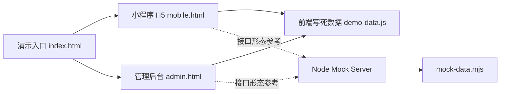

# 01-用户准入与资料认证初始化静态 Demo 技术方案

## 1. 背景与目标

本 Demo 面向“生辰 bobo_demo”的用户准入与资料认证初始化流程，目标是用最小成本表达业务闭环，让产品、设计、研发、运营能一眼理解：

- 新用户从登录到资料初始化的关键步骤。
- 实名认证、头像审核、学历认证三重认证的状态关系。
- 未满足准入条件时，小程序如何拦截并引导补全。
- 管理后台如何查看用户画像、处理审核队列、配置准入规则。

本次交付为独立静态 Demo，不进入正式工程链路，不要求真实接口、数据库和登录态。

## 2. 架构选择

采用“静态前端 + 轻量 Mock 后端”：



选择原因：

- 静态页面可直接打开，适合快速评审与离线演示。
- Node Mock Server 零依赖，便于展示后端接口边界。
- Demo 数据和正式工程解耦，不影响现有 Java、React、Taro 项目。
- 管理后台与小程序 H5 共用同一套业务数据语义，避免演示口径不一致。

## 3. 目录与职责

```text
bobo_demo/frontend/
  index.html
  admin.html
  mobile.html
  assets/demo.css
  assets/demo.js
  mock/demo-data.js

bobo_demo/backend/
  mock-server.mjs
  mock-data.mjs
  api-contract.md

bobo_demo/README.md
bobo_demo/技术方案.md
bobo_demo/验收报告.md
bobo_demo/截图证据/
```

前端职责：

- 负责所有页面展示、流程切换和弹层交互。
- 默认使用 `frontend/mock/demo-data.js` 的写死数据。
- 不请求真实服务，不依赖构建工具。

后端职责：

- 用 `mock-server.mjs` 表达接口 URL、请求方式和响应结构。
- 用 `mock-data.mjs` 维护与前端语义一致的 mock 数据。
- 只提供只读接口和模拟动作接口，不做状态持久化。

## 4. 页面范围

### 4.1 总入口

`frontend/index.html` 展示四个入口：

- 小程序 H5 演示
- 管理后台演示
- 接口契约
- 技术方案

入口页同时展示核心链路摘要、准入规则摘要和 Demo 运行方式。

### 4.2 小程序 H5

`frontend/mobile.html` 使用手机外框表达小程序体验，覆盖：

- 登录态初始化
- 性别与生日引导
- 身份选择
- 学历选择
- 现居地
- 基本资料补全
- 添加头像
- 自我介绍
- 头像、实名、学历三重认证
- 实名认证页
- 学历认证页
- 未达准入条件时的拦截页
- 编辑资料总页
- 基础资料编辑页
- 扩展资料页面组

交互重点是“资料缺口 -> 认证状态 -> 准入判断 -> 下一步动作”。

### 4.3 管理后台

`frontend/admin.html` 覆盖：

- App 用户卡片列表
- 用户画像抽屉
- 头像审核队列
- 实名审核队列
- 学历审核队列
- 资料图片审核队列
- 开放性文字审核队列
- 准入配置面板
- 变更日志抽屉
- 审核通过、驳回、保存配置等模拟动作

后台 UI 以高密度信息和状态对照为主，避免营销化布局。

## 5. 数据模型

### 5.1 用户画像

核心字段：

- `id`：用户编号
- `nickname`：昵称
- `gender`：性别
- `age`：年龄
- `city`：城市
- `identity`：身份类型
- `status`：准入状态
- `avatarStatus`：头像审核状态
- `realNameStatus`：实名审核状态
- `educationStatus`：学历认证状态
- `profileScore`：资料完整度
- `riskTags`：风险标签
- `timeline`：关键行为轨迹

### 5.2 审核队列

核心字段：

- `id`：审核单编号
- `type`：审核类型，支持 `avatar`、`realName`、`education`
- `userId`：用户编号
- `userName`：用户昵称
- `status`：审核状态
- `submittedAt`：提交时间
- `summary`：材料摘要
- `signals`：审核信号

### 5.3 准入配置

核心字段：

- `minAge`：最低年龄
- `requiredIdentity`：是否要求身份选择
- `requiredAvatar`：是否要求头像通过
- `requiredRealName`：是否要求实名通过
- `requiredEducation`：是否要求学历认证
- `profileScoreThreshold`：资料完整度阈值
- `blockedActions`：未准入时限制的动作

## 6. Mock 接口

接口定义详见 `backend/api-contract.md`。

本 Demo 提供：

- `GET /api/admin/users`
- `GET /api/admin/users/:id`
- `GET /api/admin/audits?type=avatar|realName|education`
- `GET /api/admin/access-config`
- `GET /api/miniapp/profile`
- `GET /api/miniapp/verification/status`
- `POST /api/demo/action`

`POST /api/demo/action` 用于模拟审核通过、驳回、保存配置、导入导出等动作，固定返回成功结果，不写入真实状态。

## 7. 运行方式

前端静态页：

```text
打开 bobo_demo/frontend/index.html
```

Mock 后端：

```bash
node bobo_demo/backend/mock-server.mjs
```

默认端口为 `18081`，可通过 `PORT` 环境变量覆盖。

## 8. 验收方式

静态闭环验收：

```bash
node bobo_demo/verify-demo.mjs
```

验收范围：

- 文件齐全：前端、后端、接口契约、README、技术方案。
- 证据齐全：验收报告与三张关键截图。
- 页面覆盖：移动端 16 个页面 ID、管理后台 7 个页面 ID。
- 交互闭环：移动端准入进度、三重认证状态、核心缺口、后台画像抽屉、审核详情、配置保存、变更日志。
- 安全边界：无外部远程链接、无密钥特征、资源均为相对路径。

## 9. 边界与限制

- 不接入正式 Spring Boot 后端。
- 不接入 MySQL、Redis、对象存储或第三方实名认证服务。
- 不实现真实登录、鉴权、权限校验和审计日志。
- 不实现真实审核状态持久化。
- 不复用正式管理后台或小程序代码，避免对正式工程产生副作用。
- 该 Demo 只用于需求评审、交互沟通和接口边界对齐，不作为生产实现。

## 10. 后续落地建议

正式开发时建议保持现有 Spacetime 架构：

- 后端：Java 21、Spring Boot 3.4、MyBatis-Plus、MySQL、Redis。
- 分层：`Controller -> Service -> ServiceImpl -> DAO -> DAOImpl -> Mapper`。
- 管理后台 API 继续使用现有 RBAC 与 `@RequirePermission`。
- 小程序、管理后台不要互相引用，共享逻辑下沉到 `common`。
- 前端接口放入正式 `frontend/src/api/`，路由放入 `frontend/src/router/`。
