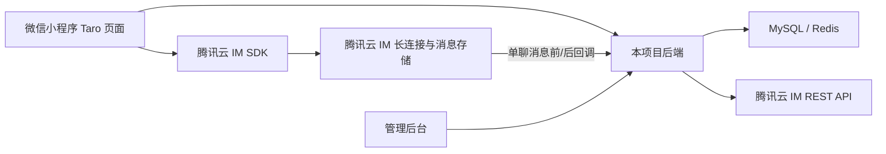
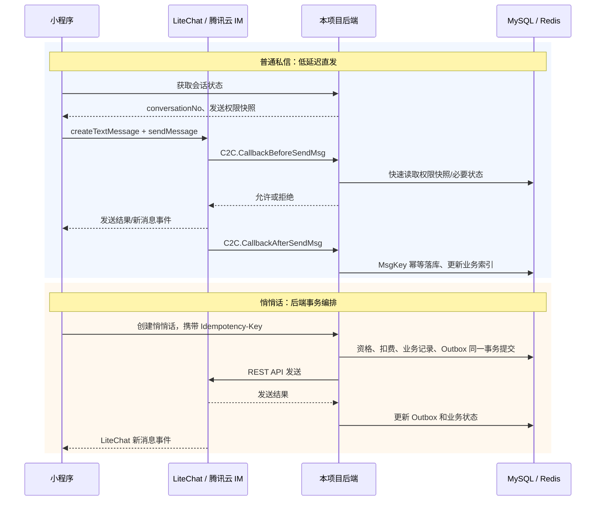

# 腾讯云 IM 聊天接入技术方案

> **需求确认更新（2026-08-07）**：普通私信和悄悄话均通过腾讯云 TIM 收发，平台与 TIM 云端审核均不对本期日常消息执行发送前文本内容审核。普通私信由 LiteChat SDK 直发并由消息前回调校验业务权限；悄悄话由后端完成准入、扣费、状态和幂等后通过 TIM REST 投递。日常私信、悄悄话申请和回复的完整明文同时归档到 `app_message_record.content_text`，普通后台接口不返回该字段。举报调用平台 PRD-05 接口，TIM 消息编号仅用于定位被举报消息。

> **一致性复核（2026-08-07）**：字段级接口、表结构、状态机和交付边界统一以
> `docs/技术方案/2026-07-31-消息、私信与通知中心-tcdesign.md` 与
> `docs/技术方案/2026-07-31-消息、私信与通知中心-mobile-api-handoff.md` 为唯一实施口径。
> 2026-07-14 的消息 15 稿契约仅保留为历史设计记录，不得继续实施。

## 1. 结论

本项目采用方案一，并将技术选型锁定为：**腾讯云即时通信 IM SDK V4 `@tencentcloud/lite-chat` 标准版 + Taro 自绘聊天 UI + 本项目后端业务控制层**。

| 决策项 | 最终选择 |
|---|---|
| 客户端 SDK | `@tencentcloud/lite-chat` V4 标准版默认入口 |
| POC 固定版本 | `4.4.2`，通过 POC 后以精确版本写入 `package.json` 和锁文件，不使用 `latest` 或范围版本 |
| SDK 入口 | `import TencentCloudChat from '@tencentcloud/lite-chat'` |
| UI 方案 | 不接入 TUIKit，消息列表、聊天气泡、输入区和业务卡片全部使用 Taro 真实组件绘制 |
| 实时通道与云端漫游 | 腾讯云 IM |
| 业务规则与后台查询 | 本项目 Spring Boot 后端、MySQL 和 Redis |
| 普通私信发送 | 小程序 LiteChat 直发，单聊消息前回调做最终授权，消息后回调幂等同步必要映射 |
| 悄悄话 | 后端完成事务和业务校验后，通过 IM REST API 发送，并使用 Outbox 补偿 |
| 官方助手与系统消息 | 使用平台 HTTP API 和本地表，不作为 TIM 私信会话 |

小程序不直接保存腾讯云 `SecretKey`，而是登录本项目后从后端获取 `UserID + UserSig`，再初始化并登录 IM SDK。普通私信由小程序通过 IM SDK 直发，由腾讯云 IM 的“发单聊消息之前回调”作为最终业务拦截点；悄悄话由本项目后端完成扣费和状态编排后通过 TIM REST 发送。两条日常消息链路均显式跳过 TIM 云端内容审核。官方助手与系统消息继续走平台接口，不进入 TIM 私信会话。

这里的 LiteChat 是**无 UI 的通信 SDK**，不是聊天页面组件库。聊天页面不采用腾讯云默认 UI。当前项目是 Taro 4.1.9，并已有蓝湖风格的消息页面，因此使用 LiteChat 提供连接、收发、历史、会话和已读能力，页面样式继续由项目自绘。

## 2. 现状与范围

截至 2026-08-07，当前仓库仍未形成可联调的 TIM 实现：

- `miniapp/src/pages/chat/index.tsx` 中的消息列表由 `verifiedRows`、`unverifiedRows` 硬编码生成。
- `miniapp/package.json` 当前没有腾讯云 IM、TUIKit 或 `@tencentcloud/lite-chat` 依赖。
- 工作区存在未提交的消息 Controller、Service、DAO、实体和 SQL 草稿，但仍采用平台 HTTP 普通私信、
  本地正文与本地已读游标，没有 UserSig、TIM Provider 和回调闭环；该草稿不符合本方案，不能视为完成。
- PRD-03 的业务和技术通道均已确认；消息数据不依赖应用层 KMS，TIM 外部资源、代码实现和真实联调按本方案推进。

本方案覆盖：

1. 小程序 IM 登录、会话列表、私信、悄悄话、已读和消息状态展示。
2. 后端 UserSig 签发、IM 回调、业务鉴权、消息同步、通知和审计。
3. 管理后台的消息互动统计、聊天元数据查询、举报上下文和规则配置。
4. 自绘聊天 UI 与腾讯云消息能力的边界。

本文件描述完整端到端接入方式；当前约定的代码交付范围不包含小程序前端实现。第 5、8 节作为移动端
团队对接要求，第 6、7 节由本仓库后端与管理后台承接。

本期不包含：图片、语音、视频/通话、撤回、输入中状态、群聊和完整人工客服 IM 工作台。

## 3. 方案比较

### 3.1 方案 A：LiteChat V4 标准版 + 项目自绘 UI（采用）

- 优点：可完整复用当前 Taro、React、蓝湖页面和现有组件；业务状态可以直接映射为项目自己的输入框禁用态、女性保护提示、悄悄话卡片和失效态。
- 缺点：需要自己实现消息气泡、会话列表、分页、发送失败重试、已读提示和自定义消息渲染。
- 适用性：最符合当前项目的视觉还原和业务状态要求。

### 3.2 方案 B：直接采用 TUIKit

- 优点：腾讯云提供会话、聊天、历史消息、搜索等通用 UI，基础能力交付速度快。
- 缺点：默认视觉与当前设计稿不一致；自定义业务状态仍需包裹或扩展；官方原生小程序 TUIKit 文档说明其使用 WebView 渲染，暂不支持 Skyline；当前项目还需验证 Taro 4.1.9 的构建和运行兼容性。
- 适用性：可用于独立 POC 或通用聊天页验证，不作为当前首版最终 UI 方案。

### 3.3 方案 C：项目自建 WebSocket 和消息存储

- 优点：协议、数据和 UI 完全自主。
- 缺点：需要自行承担长连接、断线重连、历史消息、未读数、消息漫游、消息投递、风控和扩容，重复建设 IM 基础设施。
- 适用性：不采用。

### 3.4 LiteChat 版本和功能档位选择

腾讯云 IM SDK V4 使用 `@tencentcloud/lite-chat` 包，并提供不同入口。当前需求不能只看包体积选择档位：

| 档位 | 入口 | 当前需求匹配度 | 结论 |
|---|---|---|---|
| 基础版 | `@tencentcloud/lite-chat/basic` | 只有初始化、登录、文本/自定义消息等基础能力，不包含会话列表、历史消息和已读回执 | 不采用 |
| 标准版 | `@tencentcloud/lite-chat` | 包含会话、历史消息、未读、已读回执、文本和自定义消息，覆盖 PRD-03 | **采用** |
| 专业版 | `@tencentcloud/lite-chat/professional` | 增加好友、黑名单、关注者、会话分组等社交关系能力 | 不采用，项目已有自己的匹配、关注、拉黑和处罚模型 |

不继续使用 V3 `@tencentcloud/chat`。腾讯官方已将 V4 定义为新架构并建议使用最新稳定版本；后续新能力也以 V4 为基础。版本升级必须经过微信开发者工具构建、真机回归、包体积对比和消息协议兼容测试，不能自动跟随 npm `latest`。

## 4. 总体架构



职责边界：

| 能力 | 腾讯云 IM | 本项目后端 | 小程序 | 管理后台 |
|---|---|---|---|---|
| 长连接、在线收发 | 负责 | 不重复建设 | 调用 SDK | 不直接依赖 |
| 消息漫游和历史拉取 | 负责移动端云端历史 | 在消息主表保存完整明文归档、业务会话和 TIM 映射，普通接口不返回正文 | 展示 TIM 分页历史 | 仅在有效举报案件查看独立冻结证据 |
| UserSig | 不暴露 SecretKey | 生成和签发 | 获取并使用 | 不处理 |
| 匹配、认证、女性保护 | 不负责 | 最终裁决 | 预检查和展示 | 查看规则状态 |
| 悄悄话扣费和退款 | 不负责 | 事务、幂等、补偿 | 发起操作 | 查询流水 |
| 拉黑、封禁、会话失效 | 提供消息拦截能力 | 保存业务状态并通过回调拦截 | 展示失效态 | 配置和处理处罚 |
| 举报、审计、内容追溯 | 提供消息标识用于定位 | PRD-05 接口创建案件、固化证据并审计 | 调平台举报接口 | 处理举报 |
| 页面样式 | 提供可选通用 UI | 不负责视觉布局 | 负责最终绘制 | 负责后台页面 |

### 4.1 两条发送链路

普通文本与敏感业务消息必须分开设计，不能用一条链路勉强承载：



普通文本不再提供 `/miniapp/message/send-text` 作为第二条发送接口。页面可查询会话状态做体验预检，但最终发送只有一次 LiteChat `sendMessage`，安全边界是消息前回调。这样避免“后端接口成功、SDK 发送失败”或两次调用产生重复消息。

腾讯云 REST API 允许服务端以指定账号发送消息，不能假设其自动执行本项目的匹配、拉黑、禁言和扣费规则。所有服务端发送必须先经过本项目业务 Service 校验。

### 4.2 数据权威边界

| 数据 | 权威来源 | 说明 |
|---|---|---|
| 在线连接、投递结果、云端历史 | 腾讯云 IM | 小程序历史消息从 LiteChat 拉取；具体漫游时长由已购套餐和控制台配置决定 |
| 匹配、认证、女性保护、拉黑、禁言、封禁 | 本项目后端 | 消息前回调必须重新裁决，客户端状态仅用于交互提示 |
| 扣费、退款、悄悄话状态机 | 本项目 MySQL | 必须事务化并可补偿，不能以客户端消息状态代替账务状态 |
| 平台明文归档、管理后台查询、举报上下文、访问审计 | 本项目 MySQL | `app_message_record.content_text` 保存日常聊天完整明文；普通查询显式排除正文，举报案件从主表优先固化最小证据 |
| 小程序消息列表展示 | 业务会话接口 + LiteChat 会话数据 | 后端提供业务状态，LiteChat 提供最后消息、时间和未读；由适配层统一合并 |

## 5. 小程序端需要建设的内容

### 5.1 IM 初始化和登录

新增独立 IM 适配层，不在页面中直接散落 SDK 调用：

- `miniapp/src/im/liteChatClient.ts`：唯一的 LiteChat 实例，封装初始化、登录、登出、销毁和 SDK 方法。
- `miniapp/src/im/liteChatEvents.ts`：统一订阅和解除 SDK 事件，转换为项目内部事件。
- `miniapp/src/im/messageCodec.ts`：LiteChat 消息与项目消息模型互转，校验自定义协议版本。
- `miniapp/src/stores/imStore.ts`：保存 SDK 生命周期、网络状态、会话和未读摘要；页面不直接保存 SDK 实例。
- `miniapp/src/services/imCredential.ts`：获取 `SDKAppID + imUserId + userSig + expireAt`。
- `miniapp/src/services/message.ts`：会话列表、历史消息、已读、私信和悄悄话业务 API。
- `miniapp/src/hooks/useImBootstrap.ts`：绑定本项目登录态，启动或停止 IM，并处理刷新凭证。
- `miniapp/src/types/message.ts`：会话、消息、悄悄话、通知和业务状态类型。

登录流程：

1. 用户先完成本项目登录，获得本项目 `X-Auth-Token`。
2. 小程序调用 `/miniapp/im/credentials`。
3. 后端返回项目绑定的 `imUserId` 和短期 `userSig`。
4. 小程序调用 `TencentCloudChat.create({ SDKAppID })` 创建单例，再执行 `chat.login({ userID, userSig })`。
5. 收到 `SDK_READY` 后才允许拉取会话、历史或发送消息。
6. 监听 `SDK_NOT_READY`、`KICKED_OUT`、`NET_STATE_CHANGE`、会话更新和消息接收事件。

内部生命周期统一为：

`idle -> initializing -> authenticating -> ready -> degraded -> idle`

- `SDK_READY` 进入 `ready`；页面只能在此状态调用依赖 SDK 的能力。
- 网络断开进入 `degraded`，保留未发送输入并展示重连提示，不自动制造“发送成功”。
- `KICKED_OUT` 或 UserSig 失效时停止发送，重新获取凭证；连续失败转为显式重新登录。
- 本项目退出登录时先解绑事件，再登出 LiteChat 并清空用户级消息状态，避免账号串数据。

`SecretKey` 只允许存在后端私有环境变量中；不能写进小程序常量、前端构建产物、日志或文档。

### 5.2 消息列表页

将当前静态 `verifiedRows` 替换为“业务接口数据 + IM 会话数据”的聚合结果：

- 官方助手和系统消息使用本项目业务接口和本地状态，不进入 TIM 普通私信会话。
- 普通私信会话使用 IM 会话摘要作为消息预览、时间和未读来源，并与本项目会话状态合并；未读只汇总平台有效会话映射，不直接采用 TIM 全局总数。
- 未完成三重认证时，继续遵循 PRD-03，只展示官方消息、通知和认证引导，不展示用户私信会话。
- 会话排序以最后消息时间为主，官方消息固定置顶。
- 下拉刷新同时调用平台频道未读接口和 LiteChat 未读接口；页面可见时按 PRD 约定刷新，实时私信由 SDK 事件驱动，最终总红点在小程序本地合成。

### 5.3 私信对话页

新增或改造 `miniapp/src/pages/message-chat/index.tsx`，不要把聊天页继续塞在消息列表页中。页面负责：

- 拉取 IM 历史消息并按时间分页。
- 监听新消息并追加到当前会话。
- 文本输入、发送中、发送成功、失败重试。
- 发送普通文本时设置 `messageControlInfo.excludedFromContentModeration=true`，不启用 TIM 云端内容审核。
- 进入页面后上报已读回执。
- 展示系统提示、匹配成功、女性保护、拉黑、禁言和会话失效。
- 发送前调用后端轻量预检查改善用户体验，但不能把前端预检查当作安全边界。

普通私信的最终权限由后端的 IM 消息前回调裁决，避免用户绕过页面直接调用 SDK 发消息。

### 5.4 悄悄话、官方助手和系统消息

- 悄悄话发送必须走本项目后端接口，后端负责认证门槛、重复发送限制、会员免费次数、千寻币扣费、幂等和失败补偿；正文不做平台发送前内容审核。
- 悄悄话使用 IM 自定义消息或带业务扩展字段的文本消息，前端根据 `messageType=whisper` 渲染卡片。
- `whisper_request` 通过 TIM REST 投递时设置 `SendMsgControl=["NoUnread","NoLastMsg","NoMsgCheck"]`，待处理未读由平台业务表统计；回复使用 `SendMsgControl=["NoMsgCheck"]`，成功开放私信会话后才按普通 TIM 消息计入接收方私信未读。
- 悄悄话回复必须走后端状态机，回复成功后触发唯一匹配和普通私信会话开放；未回复到期只结束申请。
- 官方助手和系统消息由平台本地业务接口生成并读取，小程序只展示；官方助手不开放普通输入框。

### 5.5 微信小程序配置和合规

- 按腾讯云当前官方“小程序 & uni-app”文档逐项配置 socket、request、uploadFile 和 downloadFile 合法域名，不在方案中复制可能过期的域名清单。
- 在用户同意隐私政策和第三方 SDK 说明后初始化 IM SDK。
- 增加 SDK 登录失败、UserSig 过期、账号冻结和消息服务不可用的降级态。
- 当前项目使用 Taro，必须先做微信开发者工具和真机 POC。腾讯官方 V4 更新日志曾明确修复 Taro 在 Node 18 下的打包问题，说明 LiteChat 有 Taro 适配记录；另一份“原生小程序音视频通话”文档中的“Taro 暂不支持”针对 TUICallKit 场景，不能据此否定无 UI LiteChat，但也不能替代当前工程的实测。

POC 固定环境和门禁：

| 项目 | 基线/验收 |
|---|---|
| 项目框架 | Taro 4.1.9、React 18、当前仓库 Node 20.20.2 |
| LiteChat | 精确安装 `@tencentcloud/lite-chat@4.4.2`，禁止 POC 期间漂移版本 |
| 构建 | `npm run build:weapp` 成功，微信开发者工具无运行时模块错误 |
| 登录 | 两个独立测试账号均可登录并收到 `SDK_READY` |
| 单聊 | 双向文本收发、会话更新、未读、已读和历史分页均通过 |
| 生命周期 | 前后台切换、断网重连、异地/多实例踢下线、UserSig 失效均有明确状态 |
| 包体积 | 使用微信开发者工具分析主包和总包增量；标准版官方参考约 516KB，最终以当前构建产物为准 |
| 真机 | 至少覆盖一台 iOS 和一台 Android 微信真机 |

任何一项核心门禁失败时，不进入完整页面开发。先确认是否为导入方式、构建配置或 SDK 版本问题；仍无法解决时，再评估原生小程序聊天分包，不直接回退到自建 WebSocket。

### 5.6 消息协议

普通文本使用 LiteChat 文本消息，项目扩展信息放入 `cloudCustomData`。协议必须版本化，不能让页面依赖腾讯消息对象的零散字段：

```json
{
  "v": 1,
  "bizType": "private_text",
  "conversationNo": "CV202607130001",
  "bizId": "",
  "clientMsgId": "018f...",
  "traceId": "018f..."
}
```

字段约束：

- `bizType` 只允许 `private_text`、`whisper`、`whisper_reply`、`system_tip`、`official`。
- `conversationNo` 使用本项目不可枚举业务会话号，不直接传数据库自增 ID。
- `bizId` 仅用于悄悄话、通知等业务实体关联；普通文本为空。
- `clientMsgId` 用于前端临时消息与回调消息关联，不替代腾讯 `MsgKey` 幂等键。
- `traceId` 串联客户端、回调、Outbox 和 REST API 日志。
- `cloudCustomData` 不保存手机号、身份证、UserSig、访问令牌、支付凭证或其他敏感信息。
- 未知 `v` 或未知 `bizType` 按“暂不支持的消息”降级展示，不能导致聊天页崩溃。

## 6. 后端需要建设的内容

### 6.1 IM 账号和鉴权

建议新增：

- `common/entity/AppUserImAccount.java`
- `common/dao/AppUserImAccountDao.java`
- `common/dao/impl/AppUserImAccountDaoImpl.java`
- `common/mapper/AppUserImAccountMapper.java`
- `common/service/ImAccountService.java`
- `common/service/impl/ImAccountServiceImpl.java`
- `miniapp/controller/ImCredentialController.java`
- `miniapp/service/ImCredentialService.java`

账号表至少保存：

| 字段 | 用途 |
|---|---|
| `app_user_id` | 本项目用户 ID |
| `im_user_id` | 腾讯云 IM UserID，建议使用不可变的 `u_{appUserId}` |
| `sync_status` | 未同步、正常、冻结、注销 |
| `last_sync_time` | 最近一次同步时间 |
| `last_usersig_time` | 最近一次签发时间 |

UserSig 服务必须校验本项目登录态、账号状态和有效期。默认配置 `expireSeconds=86400`，后端返回 `expireAt`，小程序在剩余有效期不足 10 分钟时刷新；具体值通过环境配置调整。刷新接口应复用稳定 `imUserId`，不能重复创建 IM 账号。后端不返回 SecretKey，不记录完整 UserSig。

### 6.2 IM Provider 和配置

遵循当前 `common/provider` 扩展方式，新增 `ImProvider` 抽象，避免业务 Service 直接依赖腾讯 SDK 或 HTTP 细节：

- `generateUserSig(imUserId, expireSeconds)`
- `ensureAccount(imUserId, profile)`
- `sendWhisperMessage(fromImUserId, toImUserId, payload)`
- `disableAccount(imUserId)`

Provider 发送接口必须接收项目幂等键、`traceId` 和协议化 payload，并返回腾讯消息标识。业务 Service 不能自行拼接 REST API URL、管理员 UserSig 或腾讯消息结构。

配置从环境变量读取：

- `TENCENT_IM_SDK_APP_ID`
- `TENCENT_IM_SECRET_KEY`
- `TENCENT_IM_ADMIN_USER_ID`
- `TENCENT_IM_CALLBACK_PATH_TOKEN`
- `TENCENT_IM_CALLBACK_BASE_URL`
- `TENCENT_IM_USER_SIG_EXPIRE_SECONDS`

真实环境配置写入部署平台私有变量；`application-*.yml` 只保留变量引用或非敏感默认值。

### 6.3 消息回调

使用一个回调入口按腾讯云 `CallbackCommand` 分发，避免多个路径配置漂移：

- `POST /internal/tencent-im/callback/{callbackPathToken}`

首期命令白名单：

| `CallbackCommand` | 用途 | 同步处理 |
|---|---|---|
| `C2C.CallbackBeforeSendMsg` | 普通私信最终授权 | 必须同步返回允许、拒绝或静默丢弃 |
| `C2C.CallbackAfterSendMsg` | TIM 消息映射、业务摘要和发送结果同步 | 幂等落库后快速返回 |
| `C2C.CallbackAfterMsgReport` | 可选业务统计投影 | 幂等更新；普通私信已读仍以 TIM 为准 |

回调处理要求：

1. 仅允许 HTTPS；在网关校验不可猜测的 `callbackPathToken`、请求体大小、方法和频率，再校验查询参数中的 `SdkAppid`、`CallbackCommand` 和命令白名单。不能只依赖来源 IP，也不能虚构腾讯云未提供的签名请求头。
2. 通过 `From_Account`、`To_Account` 映射本项目用户，不信任消息扩展字段中的本项目用户 ID。
3. 严格解析 `cloudCustomData.v`、`bizType`、`conversationNo` 和 `bizId`；协议不合法直接拒绝或记录异常，不进入业务分支。普通 `text` 要求已有有效会话；悄悄话自定义消息要求对应业务记录和未终结 Outbox，客户端伪造一律拒绝。
4. 消息前回调从 Redis 读取短 TTL 的会话权限快照；缓存未命中时只允许执行有超时上限的本地数据库查询，禁止调用支付、内容平台或其他外部服务。
5. 消息前回调校验账号状态、认证门槛、匹配关系、女性保护、拉黑/禁言/封禁和会话双方关系。权限数据不可用时按失败关闭处理，并立即告警。
6. 腾讯云消息前回调默认超时时间约 2 秒，项目目标为 P95 小于 300ms、P99 小于 800ms，任何异步通知和统计都不能阻塞回调。
7. 消息后回调以 `SDKAppID + MsgKey` 为主唯一键，`MsgId` 为辅助索引，`clientMsgId` 只用于前端消息关联；重复回调返回成功且不重复写业务数据。
8. 消息后回调保存发送结果和必要 TIM 消息映射，再投递内部事件更新业务摘要；正文、历史和普通私信未读不复制到第二套事实源。
9. 记录回调命令、消息标识、耗时、结果码和 `traceId`，不在普通日志打印 UserSig 或消息原文。

消息前回调默认超时时间有限，因此只执行业务权限裁决，不在回调中执行长事务或同步等待复杂外部服务。

### 6.4 业务接口

沿用 PRD-03 的业务语义，统一落地为单数前缀 `/miniapp/message/*`。完整请求、`R<T>` 响应、分页、枚举、状态机、幂等、错误码、权限与 LiteChat 来源映射见 `docs/技术方案/2026-07-31-消息、私信与通知中心-mobile-api-handoff.md`，本节只保留能力总览：

| 方法 | 路径 | 责任 |
|---|---|---|
| GET | `/miniapp/im/credentials` | 获取 IM UserID 和 UserSig |
| GET | `/miniapp/message/home` | 查询消息首页聚合结果 |
| GET | `/miniapp/message/conversations` | 查询消息列表聚合结果 |
| GET | `/miniapp/message/unread-summary` | 查询消息 Tab 未读汇总 |
| GET | `/miniapp/message/conversations/{conversationNo}` | 查询会话双方、业务状态、发送权限和 TIM 映射，不返回历史正文 |
| GET | `/miniapp/message/whispers` | 查询申请我的/我申请的悄悄话列表 |
| GET | `/miniapp/message/whispers/{whisperNo}` | 查询悄悄话详情与时间线 |
| POST | `/miniapp/message/whispers/precheck` | 查询创建资格、60 字上限、价格和余额 |
| POST | `/miniapp/message/whispers` | 创建并发送悄悄话 |
| POST | `/miniapp/message/whispers/{whisperNo}/reply` | 回复悄悄话并触发匹配 |
| GET | `/miniapp/message/assistant/messages` | 查询官方助手消息 |
| POST | `/miniapp/message/assistant/messages/read-batch` | 按成功曝光批次更新官方助手已读 |
| GET | `/miniapp/message/system-messages` | 查询系统消息全文流 |
| POST | `/miniapp/message/system-messages/read-batch` | 按成功曝光批次更新系统消息已读 |
| POST | `/miniapp/community/reports` | PRD-05 平台举报接口；TIM 消息编号只用于定位证据，举报不经 TIM 发送 |
| POST | `/internal/tencent-im/callback/{callbackPathToken}` | 腾讯云 IM 统一回调入口 |

普通文本由 LiteChat 唯一发送，不提供 `/send-text`。会话状态接口只用于页面预检和提示，消息前回调才是最终安全边界。埋点由客户端事件和消息后回调分别记录，不通过一个看似“发送”但不真正发送消息的接口实现。

悄悄话正文上限按当前契约返回 `contentMaxLength=60`。已回复的申请从双方悄悄话默认列表移除并进入同一私信会话，后台仍保留业务状态和 TIM 映射。

### 6.5 本地数据

腾讯云 IM 保存消息传输、会话、移动端漫游历史和普通私信未读；本项目消息主表同步保存完整明文归档、业务状态、必要 TIM 映射，并在举报时冻结最小必要证据：

- `app_message_conversation`、`app_message_conversation_member`：业务会话生命周期和参与者映射，不保存普通私信未读游标。
- `app_message_record`：消息主表，保存 IM messageId/MsgKey、业务会话、发送方、接收方、消息类型、发送状态、时间及 `content_text` 明文正文；禁止普通接口 `SELECT *`、正文搜索、普通导出或日志打印。
- `app_message_whisper`：悄悄话状态、支付流水、冷却、回复、匹配/会话与 TIM 消息映射。
- `app_system_message`、`app_assistant_message`：平台系统消息和官方助手内容及其已读状态。
- `app_message_delivery_outbox`：悄悄话 TIM REST 与微信外部提醒的可靠投递，只保存投递元数据；发送任务按 `message_no` 从消息主表读取正文，普通私信 SDK 直发不写此 Outbox。
- `app_message_event_inbox`：上游业务事件和 TIM 回调的幂等消费。
- `app_user_im_account`：平台用户与不可枚举 TIM UserID 的稳定映射。
- `app_message_sensitive_access_log`、`community_report_evidence`：举报案件证据访问审计和冻结证据。

所有业务表遵循现有 `BaseEntity` 审计字段和逻辑删除约定。举报证据属于敏感数据，需定义脱敏、
访问权限、保留周期和导出限制，后台查看原文必须写入审计日志。举报请求由平台 PRD-05 接口受理，
不会向 TIM 发送“举报消息”。

建议唯一约束：

- `app_user_im_account(app_user_id)`、`app_user_im_account(im_user_id)`。
- `app_message_conversation(conversation_no)`、`app_message_conversation(match_id)` 和标准化后的活跃双方组合。
- `app_message_record(tim_msg_key)`。
- `app_message_whisper(sender_user_id,send_request_id)`、`app_message_whisper(receiver_user_id,reply_request_id)`。
- `app_message_delivery_outbox(channel,biz_type,biz_no,idempotency_key)`。
- `app_message_event_inbox(source_module,source_event_id,event_type)`。

### 6.6 悄悄话事务与 Outbox

悄悄话不能在数据库事务中同步调用腾讯 REST API 后直接假设成功，采用“本地事务 + Outbox + 可重试发送”：

1. 使用请求头 `Idempotency-Key` 锁定一次业务请求。
2. 本地事务内完成资格检查、免费次数或千寻币预占/扣减，创建 `app_message_record(content_text=明文,send_status=queued)`、`app_message_whisper` 和仅含投递元数据的 `app_message_delivery_outbox(pending)`。
3. 事务提交后发送任务把 Outbox 改为 `SENDING`，按 `message_no` 从消息主表读取正文并调用 `ImProvider`。
4. REST API 成功后写入腾讯消息标识，状态改为 `SENT`；消息后回调再次确认时保持幂等。
5. 可重试错误按退避策略重试；达到上限进入 `FAILED` 并告警。
6. 业务要求退款时，由补偿任务执行一次性返还并写支付流水，状态改为 `COMPENSATED`；重复补偿必须被唯一键拦截。

Outbox 状态：`PENDING -> SENDING -> SENT`，异常进入 `FAILED`，需退款时进入 `COMPENSATING -> COMPENSATED`。不得通过删除失败记录来“恢复”状态。

### 6.7 权限快照与一致性

- Redis 权限快照键按 `conversationNo` 存储双方 ID、认证状态、匹配状态、保护期、拉黑/禁言/封禁和版本号，TTL 只用于性能，不作为永久数据源。
- 匹配、拉黑、封禁和保护期变化时，在数据库事务提交后删除或更新快照。
- 消息前回调读取的快照必须校验会话双方与 `From_Account/To_Account` 一致。
- 回调不可用或本地 TIM 映射持续落后时，客户端实时收发仍以腾讯云为准，但后台显示“同步延迟”，不能把缺失映射解释成没有消息。
- 监控回调积压和 Outbox 后台任务；对回调缺口执行按时间窗口的对账任务，禁止静默丢失后台审计链路。

## 7. 管理后台需要建设的内容

管理后台不直接把腾讯云 IM 控制台嵌进产品，也不新增独立 IM 运营工作台。按照 PRD-03，建设以下本项目能力：

1. App 用户详情“消息互动”区块：数量统计、私信、悄悄话、通知、举报和会话状态，只展示元数据，不展示正文或内容摘要。
2. 消息通知记录查询：按用户、会话、消息类型、状态、时间和来源筛选。
3. 聊天举报处理：普通案件列表展示会话号、消息号、双方用户和举报来源；授权案件详情可按条查看独立冻结证据并支持处罚联动。
4. 消息规则配置：女性保护期、悄悄话冷却、每日免费次数、消息模板和官方助手入口。
5. 权限和审计：客服、运营只看脱敏元数据；只有 PRD-05 有效举报案件处理人可按条查看已冻结证据，且必须填写原因、二次确认并记录审计。
6. 服务降级态：IM 回调异常、消息映射查询失败或举报证据获取失败时展示“消息服务不可用”，不能伪造消息内容。

腾讯云 IM 控制台仅用于 SDKAppID、套餐、回调、历史配置、统计和基础运维；业务人员日常操作仍在本项目后台完成。

后台接口继续返回精确 `R<T>`，Controller 使用现有 `@RequirePermission`。建议权限点：

| 权限 | 用途 |
|---|---|
| `message:conversation:list` | 查看会话统计与业务元数据 |
| `message:report-context:view` | 查看 PRD-05 有效案件中的单条冻结证据；Service 仍需复核案件处理权限、分配关系和原因 |
| `community:report:handle` | 处理聊天举报和处罚联动 |
| `message:config:view` | 查看消息业务规则 |
| `message:config:edit` | 修改保护期、冷却、次数和模板 |

管理后台不能直接读取 `TENCENT_IM_SECRET_KEY`、管理员 UserSig 或回调路径令牌，也不能提供任意账号代发消息的通用调试入口。

## 8. 样式是否自己画

是，建议自己画。

这里的“自己画”不是自己实现长连接，而是：

- 腾讯云 IM SDK 负责登录、收发、历史、未读和事件。
- Taro 页面负责消息气泡、会话卡片、输入框、女性保护提示、悄悄话卡片、官方消息和异常态。
- 自定义消息的 `v`、`bizType`、`conversationNo`、`bizId` 等字段由本项目定义，渲染组件由小程序维护。

这样可以保留当前页面的圆角、渐变、头像、认证引导、底部 Tab 和蓝湖视觉，不会因为套用 TUIKit 默认布局而出现明显偏差。本期 POC 只验证 LiteChat 标准版，不引入 TUIKit，避免把 UI 套件兼容性和通信 SDK 兼容性混在一起。

## 9. 实施顺序

1. 创建腾讯云 IM 应用，确认数据中心、套餐、SDKAppID、历史消息保留期、回调 URL 和微信小程序域名白名单。
2. 用当前 Taro 4.1.9 和 `@tencentcloud/lite-chat@4.4.2` 完成独立 POC，不在此阶段改造全部聊天页面。
3. POC 通过后固定依赖和锁文件，落地客户端适配层、生命周期状态机和消息协议测试。
4. 落地后端 IM 账号表、UserSig 接口、ImProvider、权限快照和统一回调入口。
5. 落地普通私信业务会话、消息前回调授权、消息后回调 TIM 映射；历史、已读和未读继续由 LiteChat 承接。
6. 逐页改造小程序自绘私信页和消息列表，每页完成构建、真机截图和交互验收后再进入下一页。
7. 落地悄悄话支付、Outbox、补偿状态机、回复匹配和自定义消息卡片。
8. 落地官方助手、通知中心、举报、后台消息互动区块和 RBAC 权限。
9. 执行弱网、重复点击、被踢下线、UserSig 过期、封禁、拉黑、回调重试、Outbox 补偿和对账验收。
10. 灰度开启真实用户消息；监控稳定后再扩大范围，保留关闭发送入口和切回静态通知页的降级开关。

## 10. 主要风险与验收门槛

| 风险 | 处理方式 |
|---|---|
| Taro 与 LiteChat 兼容性不确定 | 固定 4.4.2 完成构建和真机 POC；失败时先定位导入、分包和构建问题，再评估原生小程序聊天分包 |
| 客户端绕过业务页面发消息 | 使用 IM 单聊消息前回调做最终拦截，客户端预检查只用于提升体验 |
| 悄悄话扣费与消息发送不一致 | 使用幂等键、支付状态机、发送结果回调和补偿任务；禁止仅靠前端扣费后直发 |
| 后台无法追溯举报内容 | 主表保存完整明文和 TIM 映射；举报时优先按消息编号/MsgKey 从主表固化最小必要证据，本地归档缺失时再按双方账号和时间窗向 TIM 补证；均无法回查时建 `partial` 工单 |
| SecretKey 泄露 | 只放后端私有环境变量；前端只接收短期 UserSig；提交前做密钥扫描 |
| IM 历史消息保留周期不满足业务 | 在腾讯云控制台配置并核对历史消息保留周期；举报证据按 PRD-05 合规期限独立冻结 |
| 离线提醒与站内未读口径不一致 | 普通私信未读以 TIM 为准；待处理悄悄话、平台助手和系统消息未读以本地表为准；小程序负责合成，离线推送只作辅助触达 |
| 消息前回调超时导致策略失效 | 回调只做 Redis/本地数据库快速裁决，权限数据不可用时失败关闭，并对耗时分位值告警 |
| SDK 升级导致协议或构建回归 | 固定精确版本；升级必须经过 POC 全矩阵、包体积对比和灰度，不允许 Dependabot 类工具自动合并 |
| REST API 代发绕过业务规则 | 所有后端发送只允许经业务 Service 和 ImProvider，禁止暴露通用代发接口 |

### 最小验收标准

- 两个已完成认证且已匹配的用户可以在真机互发文本，历史消息可分页拉取。
- 未匹配、未认证、女性保护、拉黑、封禁状态下，客户端无法通过直接 SDK 调用绕过发送限制。
- 悄悄话扣费、发送、回复、匹配和失败补偿具备幂等结果。
- 消息列表未读、进入会话已读、后台消息元数据、消息主表记录和 IM 消息 ID 可以相互追溯。
- 页面视觉使用项目自有 Taro 组件完成，运行态没有把输入框、按钮、Tab 或弹窗烘焙进背景图片。

### 10.1 测试矩阵

| 层级 | 必测内容 |
|---|---|
| 单元测试 | 消息协议编解码、SDK 生命周期状态转换、权限裁决、幂等键、Outbox 状态机、补偿一次性 |
| Controller/Service | UserSig 权限、错误 SDKAppID、未知命令、非法消息协议、允许/拒绝发送、重复回调 |
| 集成测试 | MySQL 唯一约束、Redis 快照失效、回调重放、Outbox 重试、REST API Mock |
| 小程序自动化 | 消息列表加载/空态/失败态、发送中/成功/失败重试、未知消息降级、事件解绑 |
| 真机测试 | 双账号收发、历史分页、未读/已读、前后台、弱网、断网重连、踢下线、UserSig 刷新 |
| 安全测试 | SecretKey/UserSig 泄露扫描、回调令牌错误、越权会话、伪造 conversationNo、消息正文日志检查 |
| 业务回归 | 未认证、未匹配、女性保护、拉黑、禁言、封禁、悄悄话扣费/回复/到期/补偿 |

### 10.2 监控与告警

- 客户端：LiteChat 初始化成功率、登录成功率、`SDK_READY` 耗时、发送成功率、重连次数和未知消息协议数。
- 回调：按命令统计 QPS、成功率、拒绝原因、P50/P95/P99、重复回调数和消费延迟。
- 业务：TIM 映射同步延迟、Outbox 各状态数量、最大积压时长、重试次数、补偿成功率和对账差异数。
- 安全：非法 callback token、错误 SDKAppID、未知命令、伪造会话和高频发送拦截数。
- 告警建议：消息前回调 P95 超过 300ms、P99 超过 800ms、Outbox 最老积压超过 5 分钟或回调连续失败时立即告警；阈值上线后按真实基线调整。

日志仅记录腾讯消息标识、业务号、结果码、耗时和脱敏账号。日常普通私信、悄悄话申请和回复正文
以明文写入 `app_message_record.content_text`；普通查询、导出和用户详情接口必须显式排除该列。平台在
PRD-05 举报时再从主表优先固化最小必要受控明文证据，并通过案件权限、查看原因和审计限制访问。正文不得进入应用日志、网关日志或前端错误上报。

### 10.3 发布与回滚

- 使用功能开关分别控制 IM 登录、普通私信发送、悄悄话发送和后台原文查看。
- 发布顺序为后端兼容接口与回调、客户端适配层、灰度页面、全量页面；旧客户端仍能正常看到业务通知。
- 回滚客户端时不删除腾讯云应用、IM 账号和本地消息表；关闭新发送入口并保留回调消费，防止灰度用户已发消息丢失。
- SDK 升级出现问题时回退到上一精确版本和锁文件，消息协议 `v=1` 保持兼容。

## 11. 官方依据

- 腾讯云即时通信 IM 产品与平台能力：[即时通信 IM 功能介绍](https://cloud.tencent.com/document/product/269/1499)
- 小程序/uni-app 无 UI SDK：[即时通信 IM 小程序 & uni-app](https://cloud.tencent.com/document/product/269/117335)
- SDK V4 更新日志与 Taro 打包修复记录：[即时通信 IM 更新日志](https://cloud.tencent.com/document/product/269/38492)
- LiteChat 登录、SDK_READY 和被踢下线事件：[即时通信 IM 登录](https://cloud.tencent.com/document/product/269/75295)
- Web/小程序历史消息存储说明：[即时通信 IM 消息历史](https://cloud.tencent.com/document/product/269/75322)
- 文本消息和 `cloudCustomData`：[即时通信 IM 文本消息](https://cloud.tencent.com/document/product/269/96058)
- UserSig 服务端生成：[即时通信 IM 生成 UserSig](https://cloud.tencent.com/document/product/269/129089)
- 单聊消息前回调：[即时通信 IM 发单聊消息之前回调](https://cloud.tencent.com/document/product/269/1632)
- 单聊回调命令清单：[即时通信 IM 单聊消息回调](https://cloud.tencent.com/document/product/269/1523)
- REST API 单发单聊消息：[即时通信 IM 单发单聊消息](https://cloud.tencent.com/document/product/269/2282)
- 第三方回调机制：[即时通信 IM 第三方回调简介](https://cloud.tencent.com/document/product/269/1522)
- 原生小程序 TUIKit：[即时通信 IM 原生小程序完整版](https://cloud.tencent.com/document/product/269/62768)
- 隐私合规接入说明：[即时通信 IM 隐私保护指引](https://cloud.tencent.com/document/product/269/97564)
