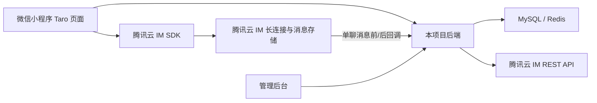

# 腾讯云 IM 聊天接入技术方案

## 1. 结论

本项目采用“腾讯云即时通信 IM 承载实时消息，本项目后端承载业务规则和管理数据”的方案。

小程序不直接保存腾讯云 `SecretKey`，而是登录本项目后从后端获取 `UserID + UserSig`，再初始化并登录 IM SDK。普通私信可以由小程序通过 IM SDK 直发，由腾讯云 IM 的“发单聊消息之前回调”作为最终业务拦截点；悄悄话、官方消息等涉及扣费、状态流转或平台身份的消息由本项目后端编排后发送。

聊天页面不直接采用腾讯云默认 UI 作为最终交付。当前项目是 Taro 4.1.9，并已有蓝湖风格的消息页面，因此首选“无 UI IM SDK + Taro 自绘 UI”。TUIKit 可以作为验证阶段或后续通用页面的备选，但必须先通过 Taro 构建、微信开发者工具和真机 POC。

## 2. 现状与范围

当前仓库的消息页仍是静态数据和页面交互，尚未接入 IM SDK、UserSig、消息接口或聊天数据表：

- `miniapp/src/pages/chat/index.tsx` 中的消息列表由 `verifiedRows`、`unverifiedRows` 硬编码生成。
- `miniapp/package.json` 当前没有腾讯云 IM、TUIKit 或 `@tencentcloud/lite-chat` 依赖。
- 后端尚无消息、会话、悄悄话相关 Controller、Service、DAO、Mapper 和实体。
- PRD-03 已定义私信、悄悄话、官方助手、通知中心、女性保护、举报和后台承接，但实时通道仍要求技术方案确认。

本方案覆盖：

1. 小程序 IM 登录、会话列表、私信、悄悄话、已读和消息状态展示。
2. 后端 UserSig 签发、IM 回调、业务鉴权、消息同步、通知和审计。
3. 管理后台的消息互动摘要、聊天记录查询、举报上下文和规则配置。
4. 自绘聊天 UI 与腾讯云消息能力的边界。

本期不包含：图片、语音、视频/通话、撤回、输入中状态、群聊和完整人工客服 IM 工作台。

## 3. 方案比较

### 3.1 方案 A：无 UI SDK + 项目自绘 UI（采用）

- 优点：可完整复用当前 Taro、React、蓝湖页面和现有组件；业务状态可以直接映射为项目自己的输入框禁用态、女性保护提示、悄悄话卡片和失效态。
- 缺点：需要自己实现消息气泡、会话列表、分页、发送失败重试、已读提示和自定义消息渲染。
- 适用性：最符合当前项目的视觉还原和业务状态要求。

### 3.2 方案 B：直接采用 TUIKit

- 优点：腾讯云提供会话、聊天、历史消息、搜索等通用 UI，基础能力交付速度快。
- 缺点：默认视觉与当前设计稿不一致；自定义业务状态仍需包裹或扩展；官方原生小程序 TUIKit 文档说明其使用 WebView 渲染，暂不支持 Skyline；当前项目还需验证 Taro 4.1.9 的构建和运行兼容性。
- 适用性：可用于独立 POC 或通用聊天页验证，不作为当前首版最终 UI 方案。

### 3.3 方案 C：项目自建 WebSocket 和消息存储

- 优点：协议、数据和 UI 完全自主。
- 缺点：需要自行承担长连接、断线重连、历史消息、未读数、消息漫游、消息投递、风控和扩容，重复建设 IM 基础设施。
- 适用性：不采用。

## 4. 总体架构

职责边界：

| 能力 | 腾讯云 IM | 本项目后端 | 小程序 | 管理后台 |
|---|---|---|---|---|
| 长连接、在线收发 | 负责 | 不重复建设 | 调用 SDK | 不直接依赖 |
| 消息漫游和历史拉取 | 负责 | 保存索引与业务副本 | 展示分页历史 | 查询业务副本 |
| UserSig | 不暴露 SecretKey | 生成和签发 | 获取并使用 | 不处理 |
| 匹配、认证、女性保护 | 不负责 | 最终裁决 | 预检查和展示 | 查看规则状态 |
| 悄悄话扣费和退款 | 不负责 | 事务、幂等、补偿 | 发起操作 | 查询流水 |
| 拉黑、封禁、会话失效 | 提供消息拦截能力 | 保存业务状态并通过回调拦截 | 展示失效态 | 配置和处理处罚 |
| 举报、审计、内容追溯 | 提供回调和消息标识 | 落库、审计、查询 | 提交举报 | 处理举报 |
| 页面样式 | 提供可选通用 UI | 不负责视觉布局 | 负责最终绘制 | 负责后台页面 |

## 5. 小程序端需要建设的内容

### 5.1 IM 初始化和登录

新增独立 IM 适配层，不在页面中直接散落 SDK 调用：

- `miniapp/src/services/im.ts`：初始化、登录、登出、销毁、事件监听和 SDK 状态管理。
- `miniapp/src/services/message.ts`：会话列表、历史消息、已读、私信和悄悄话业务 API。
- `miniapp/src/hooks/useImSession.ts`：登录态变化、SDK_READY、被踢下线、UserSig 过期和断线重连。
- `miniapp/src/types/message.ts`：会话、消息、悄悄话、通知和业务状态类型。

登录流程：

1. 用户先完成本项目登录，获得本项目 `X-Auth-Token`。
2. 小程序调用 `/miniapp/im/credentials`。
3. 后端返回项目绑定的 `imUserId` 和短期 `userSig`。
4. 小程序初始化 IM SDK 并登录。
5. 监听 SDK ready、被踢下线、UserSig 过期、网络断开和新消息事件。

`SecretKey` 只允许存在后端私有环境变量中；不能写进小程序常量、前端构建产物、日志或文档。

### 5.2 消息列表页

将当前静态 `verifiedRows` 替换为“业务接口数据 + IM 会话数据”的聚合结果：

- 官方助手、官方消息、通知中心使用本项目业务接口和本地状态。
- 普通私信会话使用 IM 会话摘要作为消息预览、时间和未读来源，并与本项目会话状态合并。
- 未完成三重认证时，继续遵循 PRD-03，只展示官方消息、通知和认证引导，不展示用户私信会话。
- 会话排序以最后消息时间为主，官方消息固定置顶。
- 下拉刷新调用后端未读汇总；页面可见时按 PRD 约定刷新，实时新消息由 SDK 事件驱动。

### 5.3 私信对话页

新增或改造 `miniapp/src/pages/message-chat/index.tsx`，不要把聊天页继续塞在消息列表页中。页面负责：

- 拉取 IM 历史消息并按时间分页。
- 监听新消息并追加到当前会话。
- 文本输入、发送中、发送成功、失败重试。
- 进入页面后上报已读回执。
- 展示系统提示、匹配成功、女性保护、拉黑、禁言和会话失效。
- 发送前调用后端轻量预检查改善用户体验，但不能把前端预检查当作安全边界。

普通私信的最终权限由后端的 IM 消息前回调裁决，避免用户绕过页面直接调用 SDK 发消息。

### 5.4 悄悄话和官方消息

- 悄悄话发送必须走本项目后端接口，后端负责认证门槛、重复发送限制、内容安全、会员免费次数、千寻币扣费、幂等和失败补偿。
- 悄悄话使用 IM 自定义消息或带业务扩展字段的文本消息，前端根据 `messageType=whisper` 渲染卡片。
- 悄悄话回复和暂不回应必须走后端状态机，回复成功后原子触发匹配成功和普通私信会话开放。
- 官方助手消息由后端使用 IM REST API 或本地通知接口生成，小程序只展示，不开放普通输入框。

### 5.5 微信小程序配置和合规

- 配置 IM SDK 使用的 socket 合法域名和 request 合法域名。
- 在用户同意隐私政策和第三方 SDK 说明后初始化 IM SDK。
- 增加 SDK 登录失败、UserSig 过期、账号冻结和消息服务不可用的降级态。
- 当前项目使用 Taro，必须先做真实微信开发者工具和真机 POC。腾讯官方当前提供小程序/uni-app 的 `@tencentcloud/lite-chat` 文档，但另一份官方小程序说明仍明确写有 Taro 暂不支持，因此不能在未验证前承诺直接兼容。

## 6. 后端需要建设的内容

### 6.1 IM 账号和鉴权

建议新增：

- `common/entity/AppUserImAccount.java`
- `common/dao/AppUserImAccountDao.java`
- `common/dao/impl/AppUserImAccountDaoImpl.java`
- `common/mapper/AppUserImAccountMapper.java`
- `common/service/ImAccountService.java`
- `common/service/impl/ImAccountServiceImpl.java`
- `miniapp/controller/ImCredentialController.java`
- `miniapp/service/ImCredentialService.java`

账号表至少保存：

| 字段 | 用途 |
|---|---|
| `app_user_id` | 本项目用户 ID |
| `im_user_id` | 腾讯云 IM UserID，建议使用不可变的 `u_{appUserId}` |
| `sync_status` | 未同步、正常、冻结、注销 |
| `last_sync_time` | 最近一次同步时间 |
| `last_usersig_time` | 最近一次签发时间 |

UserSig 服务必须校验本项目登录态、账号状态和有效期。UserSig 建议短期签发，并在过期前由小程序重新获取；后端不返回 SecretKey。

### 6.2 IM Provider 和配置

遵循当前 `common/provider` 扩展方式，新增 `ImProvider` 抽象，避免业务 Service 直接依赖腾讯 SDK 或 HTTP 细节：

- `generateUserSig(imUserId, expireSeconds)`
- `ensureAccount(imUserId, profile)`
- `sendSystemMessage(fromImUserId, toImUserId, payload)`
- `sendWhisperMessage(fromImUserId, toImUserId, payload)`
- `disableAccount(imUserId)`

配置从环境变量读取：

- `TENCENT_IM_SDK_APP_ID`
- `TENCENT_IM_SECRET_KEY`
- `TENCENT_IM_ADMIN_USER_ID`
- `TENCENT_IM_CALLBACK_TOKEN` 或等效回调校验配置
- `TENCENT_IM_CALLBACK_BASE_URL`

真实环境配置写入部署平台私有变量；`application-*.yml` 只保留变量引用或非敏感默认值。

### 6.3 消息回调

新增独立回调入口，例如：

- `POST /internal/tencent-im/callback/message-before`
- `POST /internal/tencent-im/callback/message-after`
- `POST /internal/tencent-im/callback/read-receipt`

回调处理要求：

1. 校验 `SDKAppID`、回调来源和请求参数。
2. 通过 IM UserID 映射本项目用户，不信任客户端传入的本项目用户 ID。
3. 消息前回调校验账号状态、认证门槛、匹配关系、女性保护、拉黑/禁言/封禁和内容安全结果。
4. 消息后回调以 `MsgKey/MsgId` 幂等写入本地消息索引，触发站内未读和业务通知。
5. 回调必须快速返回；耗时的审计、统计、通知通过异步任务处理。
6. 回调失败不能造成消息重复入库，必须按 IM 消息唯一标识去重。

腾讯云官方说明单聊消息前回调可用于实时记录和拦截违规发言，但默认超时时间有限，因此不应在回调中执行长事务或同步等待复杂外部服务。

### 6.4 业务接口

沿用 PRD-03 的业务语义，按当前项目路由风格落地为 `/miniapp/message/*`：

| 方法 | 路径 | 责任 |
|---|---|---|
| GET | `/miniapp/im/credentials` | 获取 IM UserID 和 UserSig |
| GET | `/miniapp/message/conversations` | 查询消息列表聚合结果 |
| GET | `/miniapp/message/unread-summary` | 查询消息 Tab 未读汇总 |
| GET | `/miniapp/message/conversations/{conversationId}` | 查询业务会话状态和历史入口 |
| POST | `/miniapp/message/send-text` | 普通私信发送前置校验或业务埋点 |
| POST | `/miniapp/message/messages/read` | 本地已读状态同步 |
| POST | `/miniapp/message/whispers` | 创建并发送悄悄话 |
| POST | `/miniapp/message/whispers/{whisperId}/reply` | 回复悄悄话并触发匹配 |
| POST | `/miniapp/message/whispers/{whisperId}/ignore` | 暂不回应并启动冷却 |
| POST | `/miniapp/message/report` | 聊天或悄悄话举报 |

其中普通文本的最终消息发送可以由 IM SDK 直发；`send-text` 负责前置校验、埋点或生成发送上下文，最终是否落地由 IM 消息前回调决定。这样可以兼顾交互延迟和服务端安全边界。

### 6.5 本地数据

腾讯云 IM 保存消息传输和漫游数据，本项目仍需保存业务数据和最小消息副本，支撑后台查询、举报、审计和规则判断：

- `app_im_conversation`：业务会话、参与者、类型、状态、失效原因、最近业务消息时间。
- `app_im_message`：IM 消息 ID、会话 ID、发送者、接收者、消息类型、内容摘要/文本副本、发送时间、审核状态和回调状态。
- `app_im_whisper`：悄悄话状态、支付流水、冷却时间、回复时间和匹配来源。
- `app_im_notification`：站内通知、跳转类型、已读状态和业务关联 ID。
- `app_im_audit_log`：高敏消息查看、举报处理、处罚联动和配置变更日志。

所有业务表遵循现有 `BaseEntity` 审计字段和逻辑删除约定。消息内容副本属于敏感数据，需定义脱敏、访问权限、保留周期和导出限制，后台查看原文必须写入审计日志。

## 7. 管理后台需要建设的内容

管理后台不直接把腾讯云 IM 控制台嵌进产品，也不新增独立 IM 运营工作台。按照 PRD-03，建设以下本项目能力：

1. App 用户详情“消息互动”区块：会话摘要、私信、悄悄话、通知、举报和会话状态。
2. 消息通知记录查询：按用户、会话、消息类型、状态、时间和来源筛选。
3. 聊天举报处理：展示会话号、消息号、双方用户、内容摘要和举报来源，支持处罚联动。
4. 消息规则配置：女性保护期、悄悄话冷却、每日免费次数、消息模板和官方助手入口。
5. 权限和审计：客服可看脱敏摘要，审核员按权限查看必要上下文，敏感原文查看必须填写原因。
6. 服务降级态：IM 回调异常、消息查询失败、消息副本缺失时展示“消息服务不可用”，不能伪造消息内容。

腾讯云 IM 控制台仅用于 SDKAppID、套餐、回调、云端审核、统计和基础运维；业务人员日常操作仍在本项目后台完成。

## 8. 样式是否自己画

是，建议自己画。

这里的“自己画”不是自己实现长连接，而是：

- 腾讯云 IM SDK 负责登录、收发、历史、未读和事件。
- Taro 页面负责消息气泡、会话卡片、输入框、女性保护提示、悄悄话卡片、官方消息和异常态。
- 自定义消息的 `businessType`、`conversationId`、`whisperId` 等字段由本项目定义，渲染组件由小程序维护。

这样可以保留当前页面的圆角、渐变、头像、认证引导、底部 Tab 和蓝湖视觉，不会因为套用 TUIKit 默认布局而出现明显偏差。TUIKit 可在 POC 中用于验证 SDK，但如果直接作为最终 UI，需要额外做主题覆盖、组件包裹和自定义消息适配，整体成本不一定低于自绘。

## 9. 实施顺序

1. 创建腾讯云 IM 应用，确认数据中心、套餐、SDKAppID、回调 URL 和小程序域名白名单。
2. 用当前 Taro 4.1.9 做最小 POC：安装无 UI SDK、获取 UserSig、登录、两账号收发文本、历史拉取和断线重连。
3. 落地后端 IM 账号表、UserSig 接口、IM Provider 和回调入口。
4. 落地普通私信的业务会话、消息副本、回调拦截和已读同步。
5. 落地小程序自绘私信页和消息列表真实数据替换。
6. 落地悄悄话支付、状态机、回复匹配和自定义消息卡片。
7. 落地官方助手、通知中心、举报和后台消息互动区块。
8. 进行真机、弱网、重复点击、被踢下线、UserSig 过期、封禁、拉黑和消息回调重试验收。

## 10. 主要风险与验收门槛

| 风险 | 处理方式 |
|---|---|
| Taro 与腾讯 UI/SDK 兼容性不确定 | 第一阶段必须完成 Taro 真机 POC；POC 不通过时评估拆出原生小程序聊天子包或改用可兼容的 Web/小程序 SDK |
| 客户端绕过业务页面发消息 | 使用 IM 单聊消息前回调做最终拦截，客户端预检查只用于提升体验 |
| 悄悄话扣费与消息发送不一致 | 使用幂等键、支付状态机、发送结果回调和补偿任务；禁止仅靠前端扣费后直发 |
| 后台无法追溯举报内容 | 消息后回调写入本地索引和必要内容副本，按消息 ID 去重并记录访问审计 |
| SecretKey 泄露 | 只放后端私有环境变量；前端只接收短期 UserSig；提交前做密钥扫描 |
| IM 历史消息保留周期不满足业务 | 在腾讯云控制台配置并核对历史消息保留周期；本地消息副本按合规要求定义保留策略 |
| 离线提醒与站内未读口径不一致 | 站内未读以本项目业务接口和回调为准，离线推送作为辅助触达，不作为消息数据源 |

### 最小验收标准

- 两个已完成认证且已匹配的用户可以在真机互发文本，历史消息可分页拉取。
- 未匹配、未认证、女性保护、拉黑、封禁状态下，客户端无法通过直接 SDK 调用绕过发送限制。
- 悄悄话扣费、发送、回复、匹配和失败补偿具备幂等结果。
- 消息列表未读、进入会话已读、后台消息摘要和 IM 消息 ID 可以相互追溯。
- 页面视觉使用项目自有 Taro 组件完成，运行态没有把输入框、按钮、Tab 或弹窗烘焙进背景图片。

## 11. 官方依据

- 腾讯云即时通信 IM 产品与平台能力：[即时通信 IM 功能介绍](https://cloud.tencent.com/document/product/269/1499)
- 小程序/uni-app 无 UI SDK：[即时通信 IM 小程序 & uni-app](https://cloud.tencent.com/document/product/269/117335)
- UserSig 服务端生成：[即时通信 IM 生成 UserSig](https://cloud.tencent.com/document/product/269/129089)
- 单聊消息前回调：[即时通信 IM 发单聊消息之前回调](https://cloud.tencent.com/document/product/269/1632)
- 第三方回调机制：[即时通信 IM 第三方回调简介](https://cloud.tencent.com/document/product/269/1522)
- 原生小程序 TUIKit：[即时通信 IM 原生小程序完整版](https://cloud.tencent.com/document/product/269/62768)
