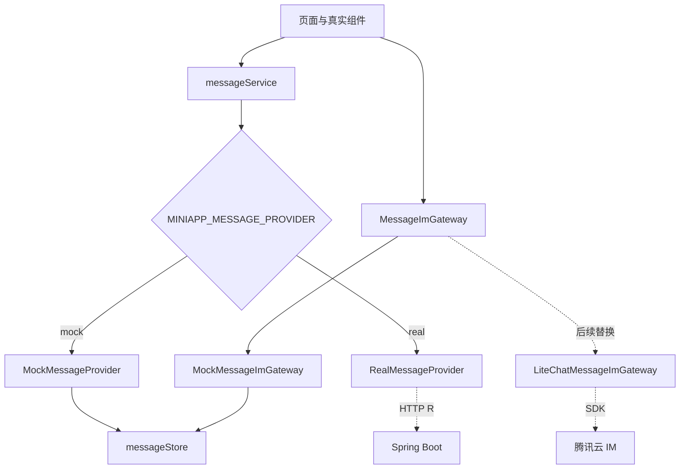
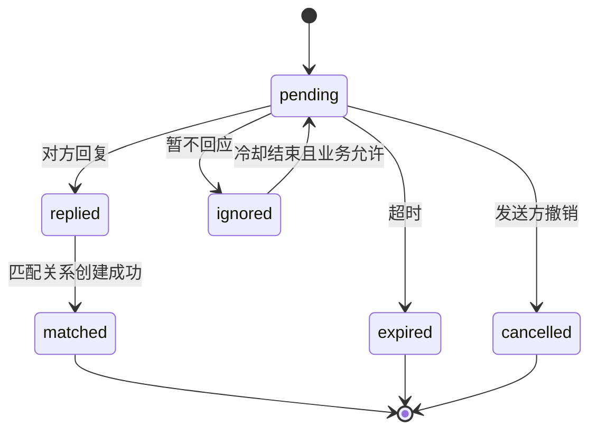
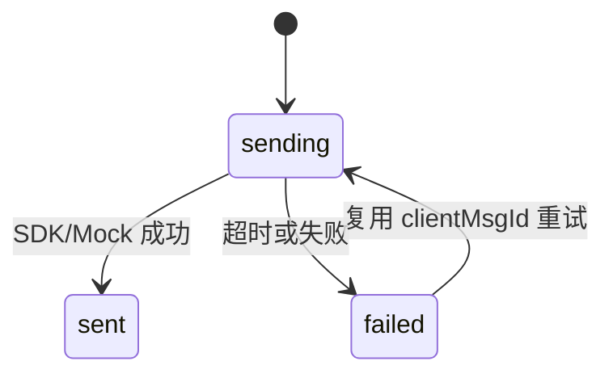

# 消息 15 稿全 Mock 蓝湖还原技术方案

> 日期：2026-07-14
> 适用端：Taro 4.1.9 / React 18 微信小程序
> 视觉基线：蓝湖项目“时空邂逅0625”最新 15 张消息稿，375×812 逻辑视口
> 后端契约：`docs/技术方案/2026-07-14-消息15稿后端接口契约.md`

## 1. 结论

本轮以“6 个业务路由 + 15 个可交互状态”重做消息模块。运行时默认使用 Mock Provider，页面只面向稳定的领域类型、`messageService` 和 `MessageImGateway`，不直接读取 fixture，也不直接依赖 HTTP 或腾讯云 SDK。未来接入后端和 LiteChat 时替换 Provider/Gateway，不修改页面组件和视觉状态模型。

本轮只实施小程序、Mock、自动化和文档，不新增后端代码、数据库表、腾讯云 IM 依赖或云端配置。普通输入态必须使用真实 `<Input>` 与微信原生键盘；按钮、弹窗、Tab、删除区和操作条均使用真实可见组件。

## 2. 范围与非范围

### 2.1 本轮范围

- 15 张蓝湖稿的 2x 设计基线、精确切图、视觉 token、组件映射和截图证据。
- 消息首页、悄悄话列表/详情、私信列表/聊天、官方小助手、系统消息。
- 发送、失败重试、已读、单条隐藏、批量隐藏、申请、回复和频道操作。
- Mock Provider、领域 store、`MessageImGateway` 及状态机测试。
- 单数前缀 `/miniapp/message/*` 的后端接口契约。
- 未认证用户的认证准入兼容态。

### 2.2 非范围

- 后端 Controller、Service、DAO、Mapper、表结构与迁移脚本。
- LiteChat SDK、UserSig、腾讯云回调和 REST API 实现。
- 图片/语音/视频消息、撤回、群聊、搜索和客服工作台。
- 心动、会员、千寻币页面的视觉修改。

## 3. 设计基线

| 组 | Design ID | 页面/状态 | 路由 |
| --- | --- | --- | --- |
| 首页 | `626cd513-005e-4df8-8456-b5280872ba23` | 消息首页 | `/pages/chat/index` |
| 悄悄话列表 | `4eefc2dd-05c7-4a0c-b095-f252741f3781` | 申请我的 | `/pages/message/whisper-list` |
| 同组 | `955469c9-c067-4f6f-97c8-57fcb7fb6ee4` | 全部删除确认 | 同上 |
| 同组 | `57f51864-59c3-4deb-b990-0d946ed5275c` | 我申请的 | 同上 |
| 悄悄话详情 | `797ff271-e45a-4262-bd99-9ddb58bfad56` | 过期拒绝 | `/pages/message/whisper-detail` |
| 同组 | `60f5f2a4-ed1b-4a73-8291-ce65dca97a21` | 匹配成功 | 同上 |
| 同组 | `0a48d19f-b05f-40d0-8f14-f34bd131a50d` | 对方解除 | 同上 |
| 同组 | `da4cd120-0250-4b6c-9d10-7704106317a2` | 申请编辑弹层 | 同上 |
| 私信列表 | `aabf0ea4-b22c-4a5c-afc5-f48f291a4046` | 私信列表 | `/pages/message/private-list` |
| 私信聊天 | `e3ab4fcf-8f3a-44da-b997-e86d13a295fc` | 默认聊天 | `/pages/message/private-chat` |
| 同组 | `4a0eaf37-162c-409a-ba83-a62eed00e9c4` | 输入态 | 同上 |
| 同组 | `5e8feaf3-cd84-4ea5-93ba-b4e181b92a17` | 回复态 | 同上 |
| 同组 | `38ecd723-33cd-4961-9b50-59d8c601a1ad` | 失败重发弹窗 | 同上 |
| 官方频道 | `798b68f9-fda4-4b5d-aca4-b363c29407e3` | 官方小助手 | `/pages/message/channel?channel=assistant` |
| 同组 | `ff867af1-fc44-45b9-b2bc-0f81e51187f9` | 系统消息 | `/pages/message/channel?channel=system` |

`mockScene` 仅用于固定截图状态，业务入口、Tab、列表项、编辑、回复、发送、重发和删除操作必须在无该参数时真实到达相同状态。

## 4. 前端架构



### 4.1 分层职责

| 层 | 责任 | 禁止事项 |
| --- | --- | --- |
| 页面 | 布局、交互、加载/空/错态、路由 | 直接导入 fixture、HTTP、LiteChat SDK |
| 领域组件 | 卡片、气泡、时间线、操作弹层 | 依赖路由参数决定数据 |
| `messageService` | 首页、悄悄话、频道、会话状态等业务能力 | 返回页面专用临时结构 |
| `MessageImGateway` | 普通私信历史、发送、重发、已读 | 实现悄悄话扣费或业务状态机 |
| Provider | Mock/真实接口适配与 DTO 转换 | 把 `R<T>` 或 SDK 对象泄漏给页面 |
| Zustand store | 当前启动周期的 Mock 状态 | 跨账号持久化或模拟后端审计删除 |

### 4.2 编译配置

```text
MINIAPP_MESSAGE_PROVIDER=mock|real
```

- 未配置时默认 `mock`，确保当前交付可独立运行。
- 非法值在构建或启动阶段失败，不静默回退。
- `real` Provider 未完成时返回明确的“能力未接入”错误，不允许偷偷读取 Mock。
- 全局旧 `MOCK_ENABLED` 不控制消息模块，避免其他模块切换时改变消息数据源。

### 4.3 领域模型

核心类型：

- `MessageHome`、`MessageHomeRow`
- `ConversationSummary`、`ConversationState`
- `ChatMessage`、`MessageSendStatus`
- `WhisperRecord`、`WhisperTimelineNode`
- `OfficialChannelMessage`
- `UnreadSummary`

稳定业务号统一使用不可枚举字符串：`conversationNo`、`messageNo`、`whisperNo`。数据库 ID、腾讯 `MsgKey` 和 SDK 消息对象不得作为页面主键。

### 4.4 Provider 接口

```ts
interface MessageService {
  getHome(): Promise<MessageHome>
  getUnreadSummary(): Promise<UnreadSummary>
  listConversations(query: ConversationQuery): Promise<PageResult<ConversationSummary>>
  getConversationState(conversationNo: string): Promise<ConversationState>
  markMessagesRead(command: ReadCommand): Promise<UnreadSummary>
  listWhispers(query: WhisperQuery): Promise<PageResult<WhisperRecord>>
  getWhisper(whisperNo: string): Promise<WhisperRecord>
  precheckWhisper(command: WhisperPrecheckCommand): Promise<WhisperPrecheckResult>
  createWhisper(command: CreateWhisperCommand): Promise<WhisperRecord>
  replyWhisper(whisperNo: string, command: ReplyWhisperCommand): Promise<WhisperRecord>
  ignoreWhisper(whisperNo: string): Promise<WhisperRecord>
  cancelWhisper(whisperNo: string): Promise<WhisperRecord>
  hideWhisper(whisperNo: string): Promise<void>
  batchHideWhispers(command: BatchHideCommand): Promise<{ hiddenCount: number }>
  listChannelMessages(channel: 'assistant' | 'system', query: PageQuery): Promise<PageResult<OfficialChannelMessage>>
  markChannelRead(channel: 'assistant' | 'system'): Promise<UnreadSummary>
  report(command: ReportCommand): Promise<{ reportNo: string }>
}

interface MessageImGateway {
  listHistory(query: HistoryQuery): Promise<CursorResult<ChatMessage>>
  sendText(command: SendTextCommand): Promise<ChatMessage>
  retry(messageNo: string): Promise<ChatMessage>
  markRead(command: ReadCommand): Promise<void>
}
```

## 5. Mock 状态与 fixture

### 5.1 生命周期

- fixture 是每次小程序启动的初始数据源。
- 页面间跳转共享 Zustand store，因此隐藏、发送、重试和已读在当前启动周期内保持一致。
- 不使用持久化中间件；重新启动恢复初始 fixture，保证验收可重复。
- 自动截图前可调用测试重置能力，再传 `mockScene` 固定 UI 瞬时状态。

### 5.2 Mock 能力

| 操作 | 状态变化 |
| --- | --- |
| 发送文本 | `sending -> sent`；指定 fixture 场景为 `sending -> failed` |
| 失败重试 | 复用原 `clientMsgId` 和业务记录，`failed -> sending -> sent` |
| 进入会话 | 标记对方已投递消息为已读并更新未读汇总 |
| 单条删除 | 当前用户的 `visible=false`，详情与状态仍保留 |
| 全部删除 | 当前 Tab/筛选内记录批量 `visible=false` |
| 回复悄悄话 | 合法待处理记录进入 `replied`，匹配成功时会话开放 |
| 忽略 | 进入 `ignored/cooldown`，不能用删除替代 |
| 撤销 | 仅发送方对待处理申请进入 `cancelled` |

### 5.3 幂等

- `createWhisper` 必须携带 `Idempotency-Key`；同一用户和同一键重复调用返回首次结果。
- 私信重试复用首次生成的 `clientMsgId`；Mock store 按该字段更新原记录。
- 已读与隐藏操作天然幂等；重复调用不重复减未读、不增加隐藏计数。

## 6. 状态机

### 6.1 悄悄话



`visible/hidden` 是当前用户视角的列表投影，不属于上述业务状态。删除不会触发 `ignored`、`cancelled`，也不会物理删除记录。

### 6.2 私信发送



## 7. 页面与交互

### 7.1 消息首页

- 新稿的“悄悄话/私信”双入口为真实卡片，分别进入悄悄话列表和私信列表。
- 喜欢我的人、官方小助手、系统消息和普通私信行均按类型跳转。
- 未认证用户保留认证准入状态，但它不计入 15 张新稿评分。
- 首页未读来自 `UnreadSummary`，不由页面自行累加。

### 7.2 悄悄话组

- 申请我的/我申请的使用同一路由真实 Tab。
- 左滑显示真实删除按钮；全部删除打开真实底部操作面板。
- 详情按领域状态渲染时间线，不复制四套页面。
- 申请编辑弹层使用真实 `<Textarea>`，长度以预检查返回的 `contentMaxLength` 控制，当前 Mock 为 60。
- 旧 PRD 的 200/500 字口径登记为产品待确认；本轮不混用旧值。

### 7.3 私信组

- 聊天页消息气泡、匹配提示、安全提示、失败图标、回复引用和输入区均为真实组件。
- 输入态聚焦真实 `<Input>`，键盘由微信绘制；截图验收排除不可控的平台键盘像素差异。
- 重发弹窗由失败消息的可见操作触发，确认后更新原消息。

### 7.4 官方频道

- 内部枚举稳定使用 `assistant/system`，UI 文案使用“官方小助手/系统消息”。
- 频道只读，底部“联系客服/社区规则”等动作绑定真实可见组件。

## 8. 切图与运行资产门禁

15 个设计节点 MCP slice 数为 0，因此先保存完整 2x 原稿，再执行可复核的矩形裁切。裁切不缩放、不转格式、不压缩，并登记：

| 字段 | 说明 |
| --- | --- |
| `designId` | 来源蓝湖 Design ID |
| `sourceSha256` | 完整原稿哈希 |
| `x/y/width/height` | 2x 像素坐标与尺寸 |
| `outputSha256` | 裁切文件哈希 |
| `runtimeKey` | `miniappOssIcons` 键 |

运行代码只能引用 `ossIcons.ts` 中的非底部图标 URL；头像在本轮作为 Mock 内容图片使用精确裁图，未来由 `avatarUrl` 替换。底部 Tab 图标继续使用包内资源。

静态门禁拒绝：

- `lanhuapp.com`、蓝湖 CDN 或 `.lanhu-ref` 运行引用。
- 整页截图、带按钮/输入框/Tab 的大背景图。
- `opacity: 0`、透明热区、空白 View 覆盖点击。
- 用字符、近似 SVG 或 AI 图代替蓝湖图标。
- 同一非底部图标同时使用本地包内资源和 OSS。

## 9. 后端契约边界

完整定义见 `2026-07-14-消息15稿后端接口契约.md`。统一使用：

- 首页与会话：`GET /miniapp/message/home`、未读、会话、状态、已读。
- 悄悄话：列表、详情、预检查、创建、回复、忽略、撤销、单条隐藏、批量隐藏。
- 频道与安全：频道列表/已读、举报、IM 凭证、腾讯回调。

普通文本由 `MessageImGateway` 发送；未来真实实现唯一走 LiteChat，不新增后端 `/send-text` 形成双发送链路。后端仍通过会话状态与腾讯消息前回调执行最终权限裁决。

## 10. 异常、隐私与安全

- 所有页面具备加载、空、网络错误、重试与超长文本状态。
- 401 交给统一请求层处理；403/409/422 映射为可操作业务提示。
- 举报只提交业务号与必要消息号，不在普通日志记录正文。
- 未认证、未匹配、拉黑、禁言、封禁等发送限制以后端会话状态和消息前回调为准。
- 小程序不保存腾讯 SecretKey、管理员 UserSig、回调路径令牌或带签名的长期资源 URL。

## 11. 逐组验收

每个设计状态记录：Design ID、原稿路径、运行截图、视口、差异清单、修复轮次、可控像素差异、评分与结论。

评分口径：

```text
还原度 = 100 - 结构差异扣分 - 尺寸/间距扣分 - 颜色/字体扣分 - 资产差异扣分 - 交互状态扣分
```

微信状态栏、胶囊、原生键盘等不可控平台像素单独登记，不计入可控差异。任一稿低于 97% 不交付。

## 12. 验证矩阵

| 层级 | 验证内容 |
| --- | --- |
| 单元/脚本 | Provider 选择、状态机、幂等、隐藏、已读、60 字限制 |
| 静态门禁 | 15 ID/6 路由、禁用 CDN/参考图/截图背景/透明热区 |
| 工程 | ESLint、TypeScript、OSS 校验、`build:weapp` |
| 自动化 | 首页跳转、Tab、左滑、删除、申请、回复、发送、失败重发、已读 |
| 视觉 | 15 张 375×812 逐稿截图、414×896 响应式补充 |
| 边界 | 空/加载/错误/长文本/安全区/重新启动 fixture 重置 |

## 13. 发布与后续接入

1. 当前所有环境默认 Mock，仅用于本轮前端视觉和交互验收。
2. 后端按接口契约实现后，新增 `RealMessageProvider` 并完成合同测试。
3. LiteChat POC 通过后实现 `LiteChatMessageImGateway`，保持领域消息协议不变。
4. 真实 Provider 灰度期间保留编译开关；禁止在运行时对单个请求静默回退 Mock。
5. 旧复数 `/miniapp/messages/*` 不再实施，调用方统一迁移到新单数契约。
