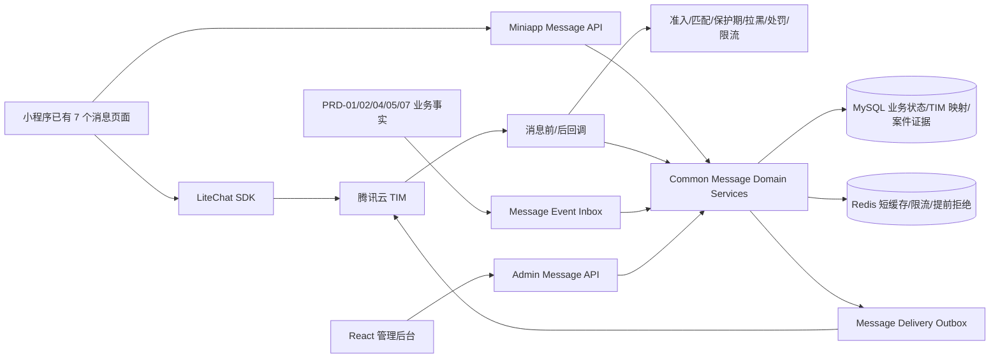
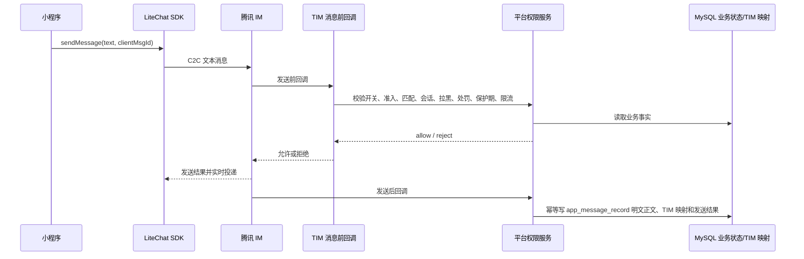

# 消息、私信与通知中心技术方案

> 日期：2026-07-31  
> 需求编号：PRD-03  
> 流程阶段：阶段 3 - 技术方案  
> 当前状态：2026-08-11 已完成后端代码、管理后台消息互动页面、真实数据库流程数据和自动化验证：14 表、正文留存、TIM 单一映射、私信已读、四类未读汇总、四列表固定分页、受控高敏查看及审计均已落地；生产开放仍受腾讯云 TIM、生产 KMS 和法务复核门禁约束  
> 采用技能：`techni-design`

> 完整核查结论：`docs/技术方案/2026-08-07-消息私信通知中心-需求技术一致性核查.md`。

> **2026-08-06 需求变更**：普通私信与悄悄话全部使用腾讯云 TIM。普通私信由小程序 LiteChat SDK 直发，消息前回调执行平台业务鉴权；悄悄话由平台后端完成准入、扣费、状态与幂等后通过 TIM REST 投递。平台自建审核和 TIM 云端审核均不做本期日常消息发送前文本内容审核，举报仍调用 PRD-05 平台接口。

> **2026-08-11 实施确认**：TIM 继续承接普通私信实时传输和移动端漫游历史；`app_message_record` 同步保存接收方已读状态，平台未读接口直接返回私信、悄悄话、官方助手、系统消息四类未读及总数。App 用户“消息互动”固定展示私信消息、悄悄话、系统/助手消息、举报四个 5 条/页列表；具备独立权限的管理员可填写原因后二次确认查看单条高敏正文，所有访问写审计且响应禁止缓存。

## 1. 背景、目标与范围

### 1.1 输入基线

本方案以 2026-07-31 冻结基线及截至 2026-08-07 已回写正式 PRD 的后续确认结论为业务基线：

- `docs/需求分析/2026-07-22-消息、私信与通知中心-requirement-review.md`
- `docs/需求文档/需求冻结记录/消息、私信与通知中心-prd-freeze.md`
- `docs/需求文档/需求文档-正式版/定稿：03-消息、私信与通知中心/`
- `docs/静态Demo/03-消息、私信与通知中心/html/admin.html`
- `docs/静态Demo/01-用户准入与资料认证初始化/html/admin.html`
- `docs/静态Demo/05-推荐模块（朋友、社区与内容互动）/html/admin.html`

`docs/技术方案/2026-07-13-腾讯云IM聊天接入-tcdesign.md` 的 TIM 混合发送架构继续作为消息通道基线；
其中旧的悄悄话忽略/取消/隐藏、旧分页、旧权限和旧状态不再作为实施依据。接口与业务状态以当前
冻结 PRD 和本方案为准。

### 1.2 建设目标

1. 支持固定 7 个移动端页面所需的完整后端接口，不实现移动端前端代码。
2. 支持匹配后普通私信、匹配前悄悄话、女性保护、未读、举报、拉黑和关系失效闭环。
3. 使用腾讯云 TIM 承接普通私信和悄悄话正文的实时传输与移动端云端历史；本地 MySQL 的 `app_message_record` 同步保存消息明文、业务状态、TIM 映射和接收方已读事实，用于平台未读汇总、后台查询、留存、客诉与案件取证。
4. 让悄悄话回复、PRD-02 匹配、会话创建和 TIM 投递对用户表现为整体成功，通过业务事务、Outbox、回调和补偿保证一致性。
5. 让 PRD-04/05/07 等上游业务结果可靠生成站内系统消息，但消息失败不回滚上游业务事实。
6. 普通后台列表、统计和导出只展示元数据，不展示正文或正文片段；正文只允许通过有效举报案件证据端点，或 App 用户详情的独立高敏权限端点按单条查看，两类入口均要求原因、访问审计和 `no-store`。
7. 按分类留存、注销清理、最小权限、幂等、审计和全局安全开关满足上线安全要求；聊天正文按已确认口径明文入库，风险由权限、查询隔离、日志禁载和审计控制承接。

### 1.3 范围

| 模块 | 是否涉及 | 本期范围 |
|------|----------|----------|
| 管理后台前端 | 是 | App 用户模块补充、消息记录查询、社交消息配置、举报案件字段补充 |
| 管理后台后端 | 是 | 查询、配置、模板、脱敏导出、案件证据正文访问与审计 |
| 小程序后端 | 是 | 首页、私信、悄悄话、助手、系统消息、举报、IM 凭证 |
| 小程序前端 | 否 | 只输出 `mobile-api-handoff.md`；客户端改造由移动端团队承接 |
| 数据库 | 是 | 新增 14 张表，修改 `community_report`，复用资产、关系、用户和操作日志表 |
| Redis | 是 | 短时权限快照、限流、未读汇总缓存和安全开关的提前拒绝镜像；不是永久事实源 |
| 腾讯云 IM | 是 | LiteChat V4 普通私信直发、实时收取和漫游历史；REST 投递悄悄话；消息前/后回调；平台同步保存已读事实 |
| 自建 WebSocket/MQ | 否 | 继续单体架构；可靠异步使用 MySQL Inbox/Outbox + 定时任务 |

### 1.4 成功标准

- 冻结范围内 P0/P1 均能追溯到接口、表、状态机、权限和验证方式。
- 管理后台真实实现与 `admin.html` 清单还原度达到 95% 以上。
- 移动端后端接口场景完整度达到 95% 以上。
- 任意客户端都不能绕过匹配、保护期、拉黑、禁言、封禁和全局开关直接发送。
- 重复请求、重复事件、重复回调不会重复扣费、重复匹配、重复未读或重复通知。
- 通用后台查询、导出、日志、异常栈均不包含私信或悄悄话正文。

## 2. 复杂度判断、方案选型与关键决策

### 2.1 复杂度判断

本需求属于**完整严格流程中的复杂方案**，原因是同时包含核心状态机、付费权益、跨 PRD 事务、
第三方 IM、敏感正文、案件证据、后台 RBAC、分类留存和 14 张新增业务表。不能按单页 CRUD
或直接接 SDK 处理。

### 2.2 方案比较

| 方案 | 核心做法 | 优点 | 主要问题 | 结论 |
|------|----------|------|----------|------|
| A. TIM 混合发送 + 主表正文归档 | 普通私信 LiteChat SDK 直发并由前回调鉴权；悄悄话后端编排后通过 TIM REST 投递；发送后回调/后端发送事务把明文正文与已读初态写入 `app_message_record` | 复用 TIM 的收发和移动端历史，同时保证平台未读、留存、客诉与举报可查 | 需要稳定的回调、Outbox、正文落库失败拦截与对账 | **采用** |
| B. 全部后端代发方案 | 后端受理所有文本并落本地消息后再调用 TIM REST | 本地控制集中 | 与 TIM SDK 能力重复，增加延迟、存储和第二套发送状态 | 不采用 |
| C. 独立消息服务 | 拆微服务，引入 Kafka、独立 WebSocket、搜索和风控中心 | 高吞吐、扩展强 | 超出一期规模和项目架构，运维成本高 | 不采用 |

### 2.3 已锁定技术决策

| 决策 ID | 决策 |
|---------|------|
| TD03-01 | 腾讯云 TIM 是普通私信和悄悄话的实时传输及移动端历史来源；`app_message_record` 是平台消息正文、发送结果、TIM 映射和接收方已读状态的事实表；私信、悄悄话、助手、系统四类未读统一由平台接口汇总返回 |
| TD03-02 | 普通私信由小程序 LiteChat SDK 直发；平台不再提供第二条普通消息发送接口 |
| TD03-03 | 腾讯消息前回调依据会话映射、匹配、女性保护、拉黑、处罚和全局开关执行最终授权；悄悄话必须由后端 TIM REST 发送 |
| TD03-04 | 所有写接口使用业务幂等键；所有跨模块事件、Outbox 和腾讯回调使用数据库唯一约束兜底 |
| TD03-05 | 平台自建审核和 TIM 云端审核均不做本期日常消息发送前文本内容审核；只校验长度、空白、业务权限和限流。举报由 PRD-05 接口创建工单，TIM 消息编号用于取证定位 |
| TD03-06 | 悄悄话回复使用业务事务、稳定幂等键、TIM Outbox/回调与补偿，对用户只暴露整体成功或失败 |
| TD03-07 | 上游业务提交后再以独立事务入 Message Inbox，并由对账任务补齐崩溃窗口，通知失败不回滚上游事实 |
| TD03-08 | 客服、运营和通用列表/导出永不返回 `content_text`；正文仅能从有效案件证据端点，或 App 用户详情的 `message:sensitive-content:view` 专用端点按单条读取，必须填写原因、写访问审计并禁止缓存 |
| TD03-09 | 不建设独立 IM 工作台；首版只支持文本和 Unicode Emoji，不实现图片、视频、语音、文件、贴纸、撤回、输入中、全部已读、通知详情、悄悄话忽略/取消 |
| TD03-10 | 解除拉黑不恢复旧会话；后续重新匹配时创建新的会话生命周期和 `conversationNo` |

## 3. PRD 追溯

| 需求 ID | PRD 来源 | 技术设计章节 | 优先级 |
|---------|----------|--------------|--------|
| `M03-DEV-P0-01` | 消息首页、最近 3 条与完整私信列表 | 6.1、8、12 | P0 |
| `M03-DEV-P0-02` | 私信对话、历史、已读、失败重试 | 6.2、8、11.2、12 | P0 |
| `M03-DEV-P0-03` | 悄悄话发送、回复、到期、冷却、扣费补偿 | 6.3、10.5、11.3、11.4 | P0 |
| `M03-DEV-P0-04` | 官方助手低频引导 | 6.4、10.7、12 | P0 |
| `M03-DEV-P0-05` | 五类系统消息、批次已读、幂等事件 | 6.5、10.6、11.5、16 | P0 |
| `M03-DEV-P0-06` | 女性保护与配置快照 | 6.2、10.2、10.11、11.1 | P0 |
| `M03-DEV-P0-07` | 举报、拉黑、安全记录 | 6.6、10.2、10.15、14.4 | P0 |
| `M03-DEV-P0-08` | 后台最小权限、审计、分类清理 | 13、14、16.4 | P0 |
| `M03-DEV-P0-09` | 全局安全总开关 | 10.12、14.2、16.3 | P0 |
| `M03-RULE-whisper-reply-atomic` | 悄悄话回复原子性 | 6.3、11.3 | P0 |
| `M03-RULE-whisper-payment-refund` | 免费权益/千寻币与补偿 | 6.3、10.5、17.3 | P0 |
| `M03-RULE-relation-invalidated-consume` | 关系失效消费 | 6.7、11.1、16.2 | P0 |
| `M03-RULE-sensitive-content-access` | 案件上下文最小权限正文访问 | 6.6、10.14、14.4 | P0 |
| `M03-RULE-data-retention` | 分类留存与注销处理 | 10、16.4 | P0 |
| `M03-CMD-system-message-create` | 跨模块系统消息命令 | 6.5、10.8、16.1 | P0 |
| `ADM-03-PAGE-user-message-section` | 用户模块补充消息互动 Tab | 13.2、13.4 | P0 |
| `ADM-03-PAGE-message-record-query` | 脱敏记录查询与导出 | 13.2、13.4 | P0 |
| `ADM-03-PAGE-message-config` | 版本配置与即时安全开关 | 13.2、13.4 | P0 |
| `ADM-03-PAGE-report-chat-fields` | PRD-05 举报字段与冻结证据 | 6.6、13.2、14.4 | P0 |
| `M03-RULE-whisper-read-privacy` | 发送方不见已读/拒绝/处罚原因 | 8、10.5、12 | P0 |
| `M03-RULE-notification-subscribe` | 外部提醒失败不影响站内消息 | 6.5、16.1、17.5 | P1 |

## 4. 现状与改动边界

| 现状 | 证据 | 处理 |
|------|------|------|
| 原消息领域草稿采用平台 HTTP 发送普通私信、本地已读游标，且没有 TIM Provider、UserSig 与回调闭环 | 历史草稿 | 已按本方案收敛：普通私信不提供平台发送/历史/已读接口，悄悄话经后端编排和 TIM REST 投递 |
| 小程序消息页仍为 Mock，旧枚举含 `ignored/cancelled/matched` | `miniapp/src/types/message.ts`、`miniapp/src/services/message.ts` | 本期不改小程序前端；在交接文档列出必须删除的旧契约 |
| `miniapp/package.json` 未接入 LiteChat | 当前依赖清单 | 移动端团队先做 Taro 4.1.9 POC，精确锁定版本 |
| PRD-02 已有匹配来源 `whisper_reply` 和事务服务 | `RelationDomainServiceImpl.addMatchSource` | 直接加入悄悄话回复事务，不复制匹配表 |
| 拉黑已有 `MiniappSettingServiceImpl.addBlock` | 现有黑名单和关系失效调用 | 抽取 common 黑名单领域服务，消息入口和设置入口共用 |
| PRD-05 已有 `community_report` 与统一处理状态 | `CommunityAdminController`、`CommunityReport` | 只扩展聊天目标和证据，不创建 PRD-03 举报状态机 |
| 已有 Promotion Inbox 的认领/重试模式 | `PromotionEventInboxServiceImpl` | Message Inbox/Outbox 复用同一可靠任务模式 |
| 非生产环境使用 AES-256-GCM；生产 KMS 资源尚未提供 | `LocalAesSensitiveTextCipher`、`ProductionSensitiveTextCipherGate` | 非生产 Cipher 已实现；生产 profile 在 KMS 未接入时失败关闭，禁止明文降级 |
| 用户后台路径为 `/admin/users/app` | `AppUserController` | 用户消息接口沿用该基路径 |
| 举报移动端路径为 `/miniapp/community/reports` | `CommunityController` | 扩展原接口，不另建 `/miniapp/message/report` |

## 5. 总体架构



### 5.1 数据权威边界

| 数据 | 权威来源 | 腾讯云 IM 角色 |
|------|----------|----------------|
| 匹配、核心准入、拉黑、禁言、封禁 | 本项目 PRD-01/02/05 表 | 消息前回调再次裁决 |
| 会话状态与女性保护 | `app_message_conversation` | 不保存业务状态 |
| 普通私信正文与发送结果 | `app_message_record` + 腾讯云 TIM | TIM 负责实时传输和移动端历史；平台消息主表明文保存完整正文、TIM 编号和发送结果 |
| 悄悄话业务状态、付费、回复、到期 | `app_message_whisper` + `app_message_record` + PRD-04 资产表/流水 | 申请与回复各写一条消息主表记录，并通过 TIM 自定义消息投递 |
| 普通私信会话与移动端历史 | 腾讯云 TIM + `app_message_conversation` | 小程序通过 LiteChat SDK 收发和拉取漫游历史；平台维护业务会话可见性与 TIM 映射 |
| 普通私信已读与未读 | `app_message_record.receiver_read_status/receiver_read_at` | TIM 会话已读保证腾讯侧体验；小程序同时提交平台最后已读消息编号，平台汇总只统计有效会话内发给当前用户的 sent+unread 消息 |
| 待处理悄悄话列表与未读 | `app_message_whisper` | 平台按当前用户参与的 `pending` 申请统计；TIM 仅承载正文，`whisper_request` 不计入 TIM 未读 |
| 系统消息 | `app_system_message` | 可选发送轻量刷新事件，不作为全文来源 |
| 举报与处罚状态 | PRD-05 `community_report` | 不保存案件状态 |
| 举报证据 | `community_report_evidence` | 优先从 `app_message_record.content_text` 固化最小必要证据，TIM 历史仅作缺失补查；举报提交本身不经过 TIM |

### 5.2 腾讯 LiteChat 版本策略

- 移动端候选版本为 `@tencentcloud/lite-chat@4.4.2`，必须精确锁版本，禁止 `latest`、`^`、`~`。
- 本期小程序前端不在实现范围；移动端团队先完成 Taro 4.1.9 构建、登录、收消息、前后台切换、
  弱网和包体积 POC，再写入 `miniapp/package.json`。
- LiteChat 负责普通私信的发送、接收、会话和云端历史；项目 API 返回会话可见性、`canSend`、
  关系状态、TIM 会话映射，并提供平台已读确认和四类未读汇总。小程序进入会话后同时调用 TIM 已读和平台已读确认。
- UserSig 只由后端生成，腾讯 SecretKey 不得进入小程序、源码、文档、接口响应或日志。
- 官方依据：
  - [LiteChat V4 集成](https://cloud.tencent.com/document/product/269/75285)
  - [消息前回调](https://cloud.tencent.com/document/product/269/1632)
  - [登录、UserSig 与 SDK_READY](https://cloud.tencent.com/document/product/269/75295)
  - [npm 包](https://www.npmjs.com/package/@tencentcloud/lite-chat)

## 6. 前后台与跨模块闭环

### 6.1 消息首页与未读

1. `GET /miniapp/message/home` 读取账号准入模式。
2. 正常用户从平台接口取得普通私信、悄悄话、官方助手、系统消息四类未读及最近 3 条有效业务会话映射；小程序再与 LiteChat 会话数据合并正文和最后消息。
3. 受限用户仅查询 `safety_required=1` 且业务类型属于处罚、安全、申诉、本人举报结果的系统消息；
   不返回真实用户、助手或悄悄话入口。
4. 首页和完整私信列表共用同一业务会话查询；最后正文和移动端会话排序由 LiteChat 展示，平台普通私信未读以 `app_message_record` 为事实源，不读取 TIM 全局未读总数。
5. `GET /miniapp/message/unread-summary` 直接返回 `privateUnreadCount + whisperUnreadCount + assistantUnreadCount + systemUnreadCount = messageUnreadCount`；`platformUnreadCount` 保留为后三类之和的兼容字段，前端不再自行叠加 TIM 未读。
6. 小程序进入会话并成功渲染消息后，先调用 LiteChat 会话已读，再调用 `POST /miniapp/message/conversations/{conversationNo}/read` 提交当前页面最后一条已读 `messageNo`；重复提交幂等，失败时后台未读不允许本地猜测清零。
7. `whisper_request` 通过 TIM REST 投递时设置 `NoUnread + NoLastMsg`，避免进入普通私信和最近会话；`whisper_reply` 完成匹配并归入有效会话后，按普通私信消息计入平台接收方未读。

### 6.2 普通私信发送



- 小程序正文展示和历史分页仍以 TIM SDK 为准；平台不提供第二条普通文本发送接口，但发送后回调必须把正文、TIM 编号、发送结果和初始未读状态写入 `app_message_record`。
- 小程序成功展示会话后同时确认 TIM 已读和平台已读；平台确认只更新当前会话内发给当前用户且不晚于 `lastMessageNo` 的 `sent + unread` 消息。
- 普通私信调用 LiteChat 发送时设置 `messageControlInfo.excludedFromContentModeration=true`；平台消息前回调只做业务授权，不执行文本内容审核。
- `canSend` 是发送按钮的提前提示，TIM 消息前回调才是不可绕过的最终授权；任一业务事实不可用时拒绝发送。
- 男方处于保护期时可以进入会话和查看历史，但 `canSend=false`，直接篡改客户端调用 SDK 仍会被回调拒绝。
- 女方首条普通文本发送成功后，由消息后回调幂等更新 `female_first_message_at`；系统提示、悄悄话自定义消息不解锁保护期。
- TIM `clientMsgId/random` 与回调事件均按唯一键去重；相同消息重复回调只补齐同一条 `app_message_record`，不得重复插入正文、更新关系或触发业务事件。

### 6.3 悄悄话发送、付费与回复

**发送：**

1. 预检返回短期 `quoteToken`，包含目标、支付方式、千寻币单价、权益日期、配置版本和到期时间。
2. 创建接口校验准入、关系、重复申请、冷却、限流、非空和 1-60 字长度，不做发送前文本内容审核。
3. MySQL 事务锁定 `app_user_asset`，重新验证报价：
   - 有效会员优先使用当日免费次数；
   - 免费次数以当日 `app_message_whisper(pay_type=vip_free)` 的未退款记录计数为事实，
     `today_free_whisper_remain` 仅作投影；
   - 无免费次数时原子扣千寻币并写 `app_user_coin_log.biz_idempotency_key`。
4. 同一事务创建悄悄话业务记录、`app_message_record(message_type=whisper,content_text=明文,send_status=queued)` 和 TIM Outbox；Outbox 只保存消息主键、业务号等投递元数据，发送时从消息主表读取正文。
5. 只有 `delivery_status=sent` 的记录向接收方暴露为 `pending`。
6. 投递永久失败时记录转 `invalid` 并原路补回免费权益或千寻币；补偿使用独立幂等键。

**回复：**

1. 校验回复非空和 1-500 字长度，不做发送前文本内容审核。
2. `SELECT ... FOR UPDATE` 锁定悄悄话，验证 `pending`、已送达、未过期、双方可匹配、
   `replyRequestId` 和回复正文；同一幂等键必须对应相同正文。
3. 第一段事务以稳定 `replyRequestId` 预占回复，创建 `app_message_record(message_type=whisper_reply,content_text=明文,send_status=queued)` 和 TIM Outbox；重复请求复用原消息与 Outbox，
   不同幂等键不能并发回复同一申请。
4. Outbox 调度器使用稳定 `MsgSeq/MsgRandom` 通过 TIM REST 投递回复自定义消息，并保存 MsgKey；
   TIM 永久失败时清理回复预占、把回复消息记录改为 `failed`，悄悄话保持 `pending` 且不创建匹配。
5. TIM 投递成功后，在同一 MySQL 业务事务调用
   `RelationDomainService.addMatchSource(..., "whisper_reply", whisperNo, now)`，创建有效私信会话和两名成员。
6. 同一事务更新悄悄话为 `replied`，写入 match/conversation 及申请、回复对应的 TIM 消息映射；提交后双方悄悄话默认列表立即移除。
7. 业务事务暂失败时按同一 `replyRequestId` 和已保存 MsgKey 重试最终确认，不重复发送 TIM 消息或创建第二条匹配/会话；接口在最终提交前不返回成功。
8. 原悄悄话与回复作为该 TIM C2C 会话的开场上下文保留，匹配后双方私信列表显示同一会话。

### 6.4 官方助手

- 官方助手不是私信会话，不允许用户回复。
- 内容来自已发布模板，按 `receiverUserId + topicCode + contentVersion` 懒加载幂等生成。
- 仅包含首次功能介绍、安全规则、帮助和服务号/公众号引导，不接收认证或正式业务结果。
- 客户端成功曝光后按消息号批量已读。

### 6.5 系统消息

1. PRD-04/05/07、社区运营和平台安全先提交自身业务事实。
2. `MessageEventPublisher` 在原事务提交后，以 `REQUIRES_NEW` 写入 Inbox；失败不会影响上游。
3. 对账任务按上游稳定业务号补入遗漏事件。
4. Inbox 消费者校验模板变量和跳转白名单，按
   `producerEventId + receiverUserId + bizType` 幂等生成 `app_system_message`。
5. 站内消息一旦落库即计入未读；微信订阅或腾讯轻量刷新事件失败不影响站内消息。
6. 系统消息正文在列表直接展示，不提供独立详情和全部已读。

平台公告沿用 `content_article` 的已发布公告作为上游事实；用户首次查询时按文章版本懒加载对应
系统消息。社区互动聚合由 PRD-05/社区任务按用户生成稳定事件，不逐条发送点赞提醒。

### 6.6 拉黑、举报与案件处理

- 会话菜单“拉黑”调用会话拉黑接口；common 黑名单领域服务在同一事务写黑名单、立即把会话转
  `blocked` 并调用现有关系失效服务。
- “拉黑并举报”由客户端先拉黑成功，再以稳定 `clientReportId` 调
  `/miniapp/community/reports`。举报失败不回滚拉黑，客户端保留重试入口。
- 会话、具体消息和悄悄话举报都由 PRD-05 创建 `community_report`；服务端从目标记录解析被举报人，
  不信任客户端提交的用户 ID。
- 聊天举报创建事务必须从 `app_message_record` 读取并冻结证据：
  - 具体消息：目标消息、最多 5 条前文和报告时已存在的最多 2 条后文；
  - 会话：报告时最新 20 条已发送消息；
  - 悄悄话：申请正文和当时已存在的回复。
- 参与关系、目标归属或业务/TIM 映射校验失败时拒绝举报；本地历史正文缺失时才按 TIM 映射补查，仍无法取得则创建
  `snapshot_status=partial` 的 PRD-05 工单并进入补证，绝不使用客户端上传正文冒充证据。已经独立提交的拉黑保持有效。
- PRD-05 是案件状态和处罚事实源。处理完成后发布处罚/结果事件，由 PRD-03 失效会话并生成系统消息。
- 通用记录页没有正文端点且查询 SQL 必须显式排除 `content_text`。正文只能调用有效案件下的专用端点，并在读取前写入访问审计。

### 6.7 关系失效、账号受限和注销

- PRD-02 关系失效后发布稳定 `producerEventId`；Message Inbox 幂等把有效会话转 `invalid`。
- 事件尚未消费时，发送接口仍实时查询 PRD-02 活跃匹配，因此不能利用延迟继续发送。
- 拉黑路径同步转 `blocked`；解除拉黑不恢复旧会话。
- 冻结、封禁、核心准入失效和注销事件将会话转 `invalid`，从正常列表与未读入口移除。
- 参与者仍可用已知 `conversationNo` 在 180 天隔离期内查看自己的只读安全记录并举报；
  不返回对方最新主页、在线状态或新资料。

### 6.8 闭环矩阵

| 闭环 ID | 移动端 | 后端 | 管理后台 | 通知/反馈 | 验证方式 |
|---------|--------|------|----------|-----------|----------|
| CL03-01 | 匹配后进入私信 | 消费 PRD-02 匹配并建会话 | 用户消息统计与元数据可查 | 会话系统提示 | 匹配、重复事件、入口测试 |
| CL03-02 | 发送/收取/已读私信 | 消息前回调鉴权、业务会话、TIM 映射和平台已读游标 | 只见元数据 | LiteChat SDK 收发/历史 + 平台 read/未读汇总 | 双账号、保护期、回调拒绝、失败重试、重复已读 |
| CL03-03 | 发送悄悄话 | PRD-04 权益/扣费 + 投递 | 支付与状态元数据 | 接收方红点 | 免费、千寻币、重复、补偿 |
| CL03-04 | 回复悄悄话 | 原子匹配+会话+消息 | 匹配来源和状态可追溯 | 双方进入私信 | 任一步故障回滚 |
| CL03-05 | 拉黑/举报 | 黑名单、会话终态、证据冻结 | PRD-05 统一处理 | 治理结果系统消息 | 部分成功、重复举报 |
| CL03-06 | 查看系统消息 | Inbox 幂等生成、批次已读 | 元数据和模板可查 | 站内未读/可选外部提醒 | 重复事件、提醒失败 |
| CL03-07 | 发布普通配置 | 新版本仅新对象快照 | 配置页和日志 | 新会话/申请生效 | 乐观锁、历史不变 |
| CL03-08 | 关闭安全开关 | MySQL 权威行立即阻断写入 | 二次确认和审计 | 客户端 30015 | 多实例一致性测试 |
| CL03-09 | 处罚/注销 | 会话失效、隔离和清理 | 案件/用户摘要 | 安全/申诉消息 | 30/180/730/1095/1825 天规则 |

## 7. 后端接口总表

### 7.1 移动端接口

所有移动端接口除腾讯回调外均使用 `X-Auth-Token`，Controller 返回精确 `R<T>`；时间统一
`yyyy-MM-dd HH:mm:ss`，业务号一律为字符串。

| Method | Path | 入参 | 出参 | 主要错误码 |
|--------|------|------|------|------------|
| GET | `/miniapp/im/credentials` | 无 | `R<ImCredentialVO>` | 30001、30023 |
| GET | `/miniapp/message/home` | 无 | `R<MessageHomeVO>` | 30001、30024 |
| GET | `/miniapp/message/unread-summary` | 无 | `R<MessageUnreadSummaryVO>`，返回四类未读和总数 | 30024 |
| GET | `/miniapp/message/conversations` | `cursor,size` | `R<CursorPageVO<ConversationItemVO>>` | 30001 |
| GET | `/miniapp/message/conversations/{conversationNo}` | 无 | `R<ConversationDetailVO>`，仅业务状态和 TIM 映射 | 30004 |
| POST | `/miniapp/message/conversations/{conversationNo}/read` | `MessageReadReq` | `R<MessageReadVO>`，平台私信已读确认 | 30004、4001 |
| POST | `/miniapp/message/conversations/{conversationNo}/block` | `ConversationBlockReq` | `R<ConversationBlockVO>` | 30004、30020 |
| GET | `/miniapp/message/whispers` | `direction,status,cursor,size` | `R<CursorPageVO<WhisperItemVO>>` | 30001 |
| GET | `/miniapp/message/whispers/{whisperNo}` | 无 | `R<WhisperDetailVO>` | 30011 |
| POST | `/miniapp/message/whispers/precheck` | `WhisperPrecheckReq` | `R<WhisperQuoteVO>` | 30001、30002、30005-30007、30015 |
| POST | `/miniapp/message/whispers` | `WhisperSendReq` + `Idempotency-Key` | `R<WhisperSendVO>` | 30001、30002、30005-30008、30012-30013、30015、30019-30021 |
| POST | `/miniapp/message/whispers/{whisperNo}/reply` | `WhisperReplyReq` + `Idempotency-Key` | `R<WhisperReplyVO>` | 30001、30011、30014-30015、30019-30020 |
| POST | `/miniapp/message/whispers/read-batch` | `WhisperReadBatchReq` | `R<ReadBatchVO>` | 30020 |
| GET | `/miniapp/message/assistant/messages` | `cursor,size` | `R<CursorPageVO<AssistantMessageVO>>` | 30024 |
| POST | `/miniapp/message/assistant/messages/read-batch` | `AssistantReadBatchReq` | `R<ReadBatchVO>` | 30020 |
| GET | `/miniapp/message/system-messages` | `cursor,size` | `R<CursorPageVO<SystemMessageVO>>` | 30024 |
| POST | `/miniapp/message/system-messages/read-batch` | `SystemMessageReadBatchReq` | `R<ReadBatchVO>` | 30009、30020 |
| POST | `/miniapp/community/reports` | `CommunityReportCreateReq` 扩展字段 | `R<CommunityReportCreateVO>` | 30020、30022 |
| POST | `/internal/tencent-im/callback/{callbackPathToken}` | 腾讯协议 | 腾讯协议响应，非 `R<T>` | 腾讯回调结果码 |

普通私信正文发送和历史分页调用 LiteChat SDK，不再定义同功能的平台 HTTP 接口。平台会话接口提供业务
可见性、`canSend`、关系状态及 TIM 会话标识；TIM 消息前回调执行最终授权。会话已读采用“双确认”：
LiteChat 已读负责腾讯侧状态，平台 `read` 接口负责 `app_message_record` 已读事实。消息 Tab 直接使用
`MessageUnreadSummaryVO.messageUnreadCount`，不得再叠加 TIM 全局未读。

### 7.2 管理后台接口

| Method | Path | `@RequirePermission` | 入参 | 出参 |
|--------|------|----------------------|------|------|
| GET | `/admin/users/app/{userId}/messages/summary` | `message:summary:view` | 无 | `R<UserMessageSummaryVO>` |
| GET | `/admin/users/app/{userId}/messages/private-messages` | `message:conversation:list` | `PageReq`，页面固定 `size=5` | `R<Page<AdminPrivateMessageVO>>`，无正文 |
| GET | `/admin/users/app/{userId}/messages/whispers` | `message:whisper:list` | `PageReq` | `R<Page<AdminWhisperVO>>` |
| GET | `/admin/users/app/{userId}/messages/platform-messages` | `message:system:list` | `PageReq`，页面固定 `size=5` | `R<Page<AdminPlatformMessageVO>>`，系统/助手合并 |
| GET | `/admin/users/app/{userId}/messages/reports` | `community:report:list` | `PageReq` | `R<Page<AdminReportLinkVO>>` |
| POST | `/admin/users/app/{userId}/messages/private-messages/{messageNo}/content-view` | `message:sensitive-content:view` | `SensitiveContentViewReq` | `R<AdminSensitiveMessageContentVO>`，`no-store` |
| POST | `/admin/users/app/{userId}/messages/whispers/{whisperNo}/content-view` | `message:sensitive-content:view` | `SensitiveContentViewReq` | `R<AdminSensitiveMessageContentVO>`，返回申请/回复可用正文且 `no-store` |
| GET | `/admin/message/records/stats` | `message:record:list` | `MessageRecordPageReq` | `R<MessageRecordStatsVO>` |
| GET | `/admin/message/records` | `message:record:list` | `MessageRecordPageReq` | `R<Page<AdminMessageRecordVO>>` |
| GET | `/admin/message/records/{recordNo}` | `message:record:list` | 无 | `R<AdminMessageRecordDetailVO>`，无正文 |
| POST | `/admin/message/records/export` | `message:record:export` | `MessageRecordExportReq` | `R<ExportTaskVO>` |
| GET | `/admin/message/config` | `message:config:view` | 无 | `R<MessageConfigVO>` |
| POST | `/admin/message/config/versions` | `message:config:edit` | `MessageConfigPublishReq` | `R<MessageConfigVO>` |
| POST | `/admin/message/config/runtime/global-send` | `message:config:edit` | `GlobalSendSwitchReq` | `R<MessageRuntimeControlVO>` |
| GET | `/admin/message/config/logs` | `message:config:view` | `PageReq` | `R<Page<ContentOperationLogVO>>` |
| GET | `/admin/message/templates` | `message:template:view` | `MessageTemplatePageReq` | `R<Page<MessageTemplateVO>>` |
| POST | `/admin/message/templates/{templateCode}/versions` | `message:template:edit` | `MessageTemplatePublishReq` | `R<MessageTemplateVO>` |
| GET | `/admin/community/reports/{reportNo}/evidence` | `community:report:list` | 无 | `R<List<ReportEvidenceVO>>`，无正文 |
| POST | `/admin/community/reports/{reportNo}/evidence/{evidenceNo}/content-view` | `message:report-context:view` | `SensitiveContentViewReq` | `R<SensitiveContentVO>` |

举报证据正文端点还必须在 Service 层再次校验 `community:report:handle`、案件有效、操作人案件权限、
证据属于案件和 5-100 字查看原因。App 用户高敏正文端点必须再次校验 `message:sensitive-content:view`、
目标消息确实涉及该用户、正文未清理和 5-100 字原因；两类端点均先写访问审计且禁止缓存。当前仓库的
`@RequirePermission` 只支持单权限字符串，因此复合约束不能只依赖注解。

### 7.3 技术扩展错误码

冻结 PRD 的 30001-30016 原样保留；平台与 TIM 均不做本期日常消息发送前文本审核，因此不再使用原 30017/30018。
为接口契约完整性保留以下实现级错误码：

| HTTP | code | 含义 | 前端处理 |
|------|------|------|----------|
| 429 | 30019 | 发送或举报频率过高 | 按 `retryAfterSeconds` 倒计时 |
| 409 | 30020 | 幂等键冲突、批次归属错误或重复动作参数不一致 | 停止自动重试并刷新 |
| 409 | 30021 | 悄悄话报价过期或资产/价格已变化 | 重新预检并二次确认 |
| 404 | 30022 | 举报目标不存在、不属于当前用户或已清理 | 提示目标不可举报 |
| 503 | 30023 | IM 账号/UserSig 暂不可用 | 进入只读，重新获取凭证 |
| 503 | 30024 | 消息读取服务降级 | 显示错误态，不伪造空列表 |

## 8. DTO、VO 与通用契约

### 8.1 通用契约

| 对象 | 字段 | 类型 | 必填 | 约束 |
|------|------|------|------|------|
| `CursorReq` | cursor | string | 否 | 不透明游标，客户端不得解析 |
| `CursorReq` | size | int | 否 | 默认 20，1-50 |
| `CursorPageVO<T>` | list | array | 是 | 当前批次 |
| `CursorPageVO<T>` | nextCursor | string | 否 | 无下一页为 null |
| `CursorPageVO<T>` | hasMore | bool | 是 | 是否有下一页 |
| `ReadBatchVO` | acceptedNos | string[] | 是 | 归属校验通过的业务号 |
| `ReadBatchVO` | updatedCount | int | 是 | 本次从未读转已读数量 |
| `ReadBatchVO` | platformUnreadSummary | object | 是 | 兼容字段名，实际结构为完整 `MessageUnreadSummaryVO`，包含四类未读和总数 |

平台列表游标按 `(sort_time,id)` 倒序编码并签名，避免翻页期间新数据造成重复或遗漏。普通私信历史
不使用本节游标，完全遵循 LiteChat SDK 的历史消息游标。

### 8.2 写入请求

| 对象 | 字段 | 类型 | 必填 | 约束 |
|------|------|------|------|------|
| `ConversationBlockReq` | sourceScene | string | 是 | `chat_menu/message_long_press` |
| `MessageReadReq` | lastMessageNo | string | 是 | 当前会话内已成功展示的最后一条平台消息编号，最长 64 字符 |
| `WhisperPrecheckReq` | targetUserNo | string | 是 | 不能为本人 |
| `WhisperSendReq` | targetUserNo | string | 是 | 必须与报价一致 |
| `WhisperSendReq` | content | string | 是 | trim 后 1-60 字 |
| `WhisperSendReq` | quoteToken | string | 是 | 服务端签名，5 分钟有效 |
| `WhisperReplyReq` | requestId | string | 是 | 8-64 字符，接收方+悄悄话下唯一 |
| `WhisperReplyReq` | content | string | 是 | trim 后 1-500 字 |
| `*ReadBatchReq` | messageNos/noticeNos/whisperNos | string[] | 是 | 1-100 个当前用户成功曝光的编号 |
| `CommunityReportCreateReq` | clientReportId | string | 是 | 8-64 字符，举报人下唯一 |
| `CommunityReportCreateReq` | targetType | enum | 是 | `post/comment/user/conversation/message/whisper` |
| `CommunityReportCreateReq` | targetId | long | 条件 | 旧社区目标使用 |
| `CommunityReportCreateReq` | targetBizNo | string | 条件 | 聊天目标使用 |
| `CommunityReportCreateReq` | reasonCode | string | 是 | `community_report_reason` |
| `CommunityReportCreateReq` | extraText | string | 否 | 0-500 字 |

### 8.3 核心响应字段

| 对象 | 关键字段 | 说明 |
|------|----------|------|
| `MessageHomeVO` | `accessMode,fixedEntries,recentConversationBindings,platformUnreadSummary,hasMoreConversations` | `platformUnreadSummary` 为兼容字段名，内容已包含四类未读；小程序仅与 LiteChat 会话正文/排序合并 |
| `MessageUnreadSummaryVO` | `privateUnreadCount,whisperUnreadCount,assistantUnreadCount,systemUnreadCount,platformUnreadCount,messageUnreadCount,snapshotTime` | `platformUnreadCount` 为后三类兼容和；`messageUnreadCount` 为四类总数 |
| `ConversationItemVO` | `conversationNo,timConversationId,targetUser,conversationStatus,canEnterConversation,canSend,sendBlockReason,lastBusinessActivityTime` | 不返回最后正文和普通私信未读 |
| `ConversationDetailVO` | `conversationNo,timConversationId,targetUser,targetProfileAvailable,status,canEnterConversation,canSend,sendBlockReason,protectStatus,safetyActions` | 历史由 LiteChat 承接；失效会话不返回最新资料 |
| `MessageReadVO` | `conversationNo,lastReadMessageNo,unreadCount,readAt` | 平台已读确认结果；不向对方暴露逐条已读回执 |
| `WhisperQuoteVO` | `canSend,payType,coinAmount,freeRemain,coinBalance,quoteToken,quoteExpireTime` | 服务端仍会事务内重验 |
| `WhisperItemVO` | `whisperNo,direction,status,displayStatus,peerUser,timConversationId,requestTimMessageId,requestTimMsgKey,expireTime,canReply,unread` | 移动端正文仍按 TIM 标识取得；平台主表虽保存明文，但本接口不返回；发送方永不收到接收方查看时间 |
| `WhisperReplyVO` | `whisperNo,status,matchNo,conversationNo,replyMessageNo,replyTimMessageId,replyTimMsgKey` | 业务结果与 TIM 映射整体返回；不暴露平台主表中的正文归档字段 |
| `SystemMessageVO` | `noticeNo,notificationType,bizType,title,content,readStatus,jumpType,jumpValue,createdTime` | 无详情 URL |
| `ImCredentialVO` | `sdkAppId,imUserId,userSig,expireAt,protocolVersion` | 不含 SecretKey |
| `AdminMessageRecordVO` | `recordNo,recordType,userMask,peerMask,messageType,status,createdTime,caseCount` | 仅含元数据，不含正文、摘要、正文片段或可逆快照 |

完整移动端示例见：
`docs/技术方案/2026-07-31-消息、私信与通知中心-mobile-api-handoff.md`。

## 9. 后端分层与类设计

### 9.1 调用链

```text
MiniappMessageController
  -> MiniappMessageService
  -> MiniappMessageServiceImpl
  -> common Message*DomainService
  -> Message*Dao
  -> Message*DaoImpl
  -> Message*Mapper / XML
  -> MySQL / Redis / Provider
```

`admin/` 与 `miniapp/` 不互相 import。状态机、加密、Outbox、案件证据和跨模块适配放在
`common/`；端内 ServiceImpl 只做登录用户/管理员上下文、DTO/VO 转换和用例编排。

### 9.2 主要类

| 层 | 类/接口 | 主要职责 |
|----|---------|----------|
| miniapp Controller | `MiniappMessageController` | `/miniapp/message/**` 精确 `R<T>` |
| miniapp Controller | `MiniappImController` | UserSig 凭证 |
| common Controller | `TencentImCallbackController` | 腾讯协议校验与响应，不走通用 `R<T>` |
| miniapp Service | `MiniappMessageService/Impl` | 当前用户聚合、归属校验、VO 映射 |
| common Service | `MessageAccessPolicyService/Impl` | 准入、匹配、保护期、处罚、开关、限流统一裁决 |
| common Service | `MessageConversationDomainService/Impl` | 业务会话生命周期、发送权限、TIM 映射、拉黑 |
| common Service | `MessageWhisperDomainService/Impl` | 预检、资产、发送、回复、到期、补偿 |
| common Service | `MessageNotificationDomainService/Impl` | 助手、系统消息、未读和模板渲染 |
| common Service | `MessageEventInboxService/Impl` | 入箱、认领、重试、死信、对账 |
| common Service | `MessageDeliveryOutboxService/Impl` | 腾讯/微信投递、回执、重试 |
| common Service | `MessageSensitiveContentService/Impl` | 仅解密 PRD-05 已冻结案件证据，执行复合授权与审计前置 |
| common Service | `MessageRuleService/Impl` | 不可变配置版本和新对象快照 |
| common Service | `MessageRetentionService/Impl` | 隔离、匿名化、逻辑删除 |
| common Provider | `InstantMessageProvider` / `TencentImProvider` | UserSig、账号同步、REST 投递 |
| common Provider | `SensitiveTextCipher` / `KmsEnvelopeTextCipher` | AES-256-GCM 和版本化密钥 |
| admin Controller | `AppUserMessageAdminController` | `/admin/users/app/{userId}/messages/**` |
| admin Controller | `MessageAdminController` | 记录、配置、模板、导出 |
| admin Service | `MessageAdminService/Impl` | 元数据查询、掩码、配置和导出白名单 |
| admin Service | `ReportEvidenceAdminService/Impl` | 案件复合权限、审计、单条正文 |
| existing Service | `CommunityServiceImpl` | 扩展聊天举报创建并冻结证据 |
| existing Service | `RelationDomainServiceImpl` | 复用 `whisper_reply` 匹配来源 |
| common Service | `RelationBlockDomainService/Impl` | 设置页与聊天页共用的黑名单原子链路 |

所有新实体均配套 `DAO -> DAOImpl -> Mapper`。ServiceImpl 不直接调用 Mapper，Controller 不直接调用
DAO/Mapper。

## 10. 数据库与表设计

### 10.1 总体规则与表清单

- 迁移脚本：`backend/docs/sql/migration-20260731-prd03-message-center.sql`。
- 字符集统一 `utf8mb4`，引擎 `InnoDB`，时间使用 `DATETIME`。
- 所有业务号由服务端生成，接口不暴露 BIGINT 主键。
- `app_message_record.content_text` 按产品确认使用明文 `TEXT`。业务消息创建时必须写入，终态隔离满 180 天后仅将该列置空并记录 `content_cleared_at`，消息编号、参与方、TIM 映射和发送事实继续保留；不得建立正文索引、进入普通查询/导出/日志。系统消息、助手消息和举报冻结证据等仍标记为加密字段的内容使用 AES-256-GCM。
- 加密字段的密文、IV、密钥版本必须同时写入；匿名化后密文/IV/密钥版本置空，HMAC 是否保留按法务结论执行。
- `active_marker=1` 只用于唯一的活跃生命周期；终态置 `NULL`，利用 MySQL 可存在多个 NULL 的规则保留历史。
- `version` 由 DAO 使用 `WHERE id=? AND version=?` 手工 CAS；当前工程未启用 MyBatis-Plus 乐观锁插件。

| 类型 | 表 | 变更 | 事实职责 |
|------|----|------|----------|
| 会话 | `app_message_conversation` | 新增 | 私信生命周期、保护期快照 |
| 会话 | `app_message_conversation_member` | 新增 | 参与者与对方映射；保存 TIM/HTTP 同步的平台单调已读水位 |
| 消息主表 | `app_message_record` | 新增 | 明文保存普通私信、悄悄话申请/回复正文，同时保存业务消息号、TIM ID/MsgKey、发送结果和来源 |
| 悄悄话 | `app_message_whisper` | 新增 | 申请、付费、投递、回复、到期 |
| 系统消息 | `app_system_message` | 新增 | 五类用户站内消息 |
| 助手 | `app_assistant_message` | 新增 | 低频助手内容和已读 |
| 可靠事件 | `app_message_event_inbox` | 新增 | 上游事件/腾讯后回调可靠消费 |
| 可靠投递 | `app_message_delivery_outbox` | 新增 | 腾讯 IM/微信订阅投递 |
| IM | `app_user_im_account` | 新增 | 用户与腾讯 IM 账号映射 |
| 配置 | `app_message_rule_version` | 新增 | 不可变普通规则版本 |
| 配置 | `app_message_runtime_control` | 新增 | 即时安全总开关 |
| 模板 | `app_message_template_version` | 新增 | 系统消息/助手模板版本 |
| 审计 | `app_message_sensitive_access_log` | 新增 | 正文访问尝试审计 |
| 举报证据 | `community_report_evidence` | 新增 | PRD-05 聊天举报冻结证据 |
| 举报 | `community_report` | 修改 | 增加案件号、幂等号、聊天目标 |
| 资产 | `app_user_asset` | 复用 | 行锁、余额、免费次数展示投影 |
| 资产流水 | `app_user_coin_log` | 复用 | 千寻币消费/补偿及唯一幂等键 |
| 配置审计 | `content_operation_log` | 复用 | 配置/模板变更前后摘要 |
| 导出 | `app_user_export_task` | 复用 | `message_metadata` 脱敏导出任务 |

#### 所有新增业务表的公共字段

以下字段逐表强制存在，后续字段表不再重复展开；这 6 个字段与各表业务字段共同构成完整表结构。

| 字段 | 类型/长度 | 必填 | 默认值 | 字段描述 | 索引/约束 |
|------|-----------|------|--------|----------|-----------|
| `id` | BIGINT | 是 | AUTO_INCREMENT | 内部主键 | PRIMARY KEY |
| `create_time` | DATETIME | 是 | CURRENT_TIMESTAMP | 创建时间 | 按具体表组合索引 |
| `update_time` | DATETIME | 是 | CURRENT_TIMESTAMP ON UPDATE | 更新时间 | 按具体表组合索引 |
| `created_by` | BIGINT | 否 | NULL | 创建人；系统任务可空 | 无 |
| `updated_by` | BIGINT | 否 | NULL | 最后修改人；系统任务可空 | 无 |
| `deleted` | TINYINT | 是 | 0 | 逻辑删除：0 否、1 是 | 所有业务查询带 `deleted=0` |

### 10.2 `app_message_conversation`

| 字段 | 类型/长度 | 必填 | 默认值 | 字段描述 |
|------|-----------|------|--------|----------|
| `conversation_no` | VARCHAR(64) | 是 | 无 | 会话业务号 |
| `tim_conversation_id` | VARCHAR(128) | 是 | 无 | 平台内部 TIM 映射键，不等同客户端 C2C 会话 ID |
| `match_id` | BIGINT | 是 | 无 | PRD-02 匹配主键 |
| `match_no` | VARCHAR(64) | 是 | 无 | PRD-02 匹配业务号 |
| `user_low_id` | BIGINT | 是 | 无 | 双方较小用户 ID |
| `user_high_id` | BIGINT | 是 | 无 | 双方较大用户 ID |
| `status` | VARCHAR(20) | 是 | `active` | `active/blocked/invalid` |
| `active_marker` | TINYINT | 否 | 1 | 活跃唯一标记；终态置空 |
| `config_version` | VARCHAR(32) | 是 | 无 | 创建时规则版本 |
| `protection_enabled` | TINYINT | 是 | 1 | 女性保护快照 |
| `female_user_id` | BIGINT | 否 | NULL | 可识别女方时写入 |
| `male_user_id` | BIGINT | 否 | NULL | 可识别男方时写入 |
| `protection_until` | DATETIME | 否 | NULL | 保护结束时间 |
| `female_first_message_at` | DATETIME | 否 | NULL | 女方首条真实文本时间 |
| `last_message_id` | BIGINT | 否 | NULL | 最后一条已发送消息主键 |
| `last_message_time` | DATETIME | 否 | NULL | 最后一条已发送消息时间 |
| `blocked_by_user_id` | BIGINT | 否 | NULL | 触发拉黑者 |
| `invalid_reason` | VARCHAR(40) | 否 | NULL | 关系/账号/处罚等失效原因 |
| `invalid_time` | DATETIME | 否 | NULL | 进入终态时间 |
| `isolated_at` | DATETIME | 否 | NULL | 从正常业务查询隔离时间 |
| `purge_after` | DATETIME | 否 | NULL | 普通内容到期清理时间 |
| `version` | INT | 是 | 0 | 手工 CAS 版本 |

| 索引/约束 | 字段 | 类型 | 说明 |
|-----------|------|------|------|
| `uk_message_conversation_no` | `conversation_no` | UNIQUE | 业务号唯一 |
| `uk_message_conversation_match` | `match_id` | UNIQUE | 一个匹配生命周期一个会话 |
| `uk_message_conversation_active_pair` | `user_low_id,user_high_id,active_marker` | UNIQUE | 同一对用户最多一个活跃会话 |
| `idx_message_conversation_low` | `user_low_id,status,last_message_time` | INDEX | 用户会话查询 |
| `idx_message_conversation_high` | `user_high_id,status,last_message_time` | INDEX | 用户会话查询 |
| `idx_message_conversation_purge` | `purge_after,deleted` | INDEX | 清理任务 |

### 10.3 `app_message_conversation_member`

| 字段 | 类型/长度 | 必填 | 默认值 | 字段描述 |
|------|-----------|------|--------|----------|
| `conversation_id` | BIGINT | 是 | 无 | 会话主键 |
| `conversation_no` | VARCHAR(64) | 是 | 无 | 会话业务号，减少列表回表 |
| `user_id` | BIGINT | 是 | 无 | 当前参与者 |
| `peer_user_id` | BIGINT | 是 | 无 | 对方用户 |
| `last_read_message_time` | DATETIME | 否 | NULL | 已读水位覆盖的最近消息发送时间，只允许单调递增 |
| `last_read_at` | DATETIME | 否 | NULL | 最近一次推进已读水位的业务时间，只允许单调递增 |
| `version` | INT | 是 | 0 | 成员业务状态 CAS 版本 |

| 索引/约束 | 字段 | 类型 | 说明 |
|-----------|------|------|------|
| `uk_message_member_conversation_user` | `conversation_id,user_id` | UNIQUE | 每会话每用户一条 |
| `idx_message_member_user` | `user_id,update_time` | INDEX | 用户业务会话列表 |
| `idx_message_member_peer` | `user_id,peer_user_id` | INDEX | 用户对查询 |

### 10.4 `app_message_record`

| 字段 | 类型/长度 | 必填 | 默认值 | 字段描述 |
|------|-----------|------|--------|----------|
| `message_no` | VARCHAR(64) | 是 | 无 | 消息业务号 |
| `client_msg_id` | VARCHAR(64) | 否 | NULL | TIM 客户端随机号或后端稳定幂等号 |
| `conversation_id` | BIGINT | 条件 | NULL | 会话主键；匹配前悄悄话申请为空，回复匹配成功后回填 |
| `conversation_no` | VARCHAR(64) | 条件 | NULL | 会话业务号；匹配前悄悄话申请为空，回复匹配成功后回填 |
| `sender_type` | VARCHAR(20) | 是 | `user` | `user/system` |
| `sender_user_id` | BIGINT | 否 | NULL | 系统提示可空 |
| `receiver_user_id` | BIGINT | 否 | NULL | 系统提示可空 |
| `message_type` | VARCHAR(20) | 是 | `text` | `text/whisper/whisper_reply/system_tip` |
| `content_text` | TEXT | 条件 | NULL | 消息明文正文；业务写入时必填，合规清理后置空；禁止普通列表、统计、导出、日志和全文索引，仅专用受控端点可读取 |
| `send_status` | VARCHAR(20) | 是 | `queued` | TIM 投递状态：`queued/sent/failed` |
| `receiver_read_status` | VARCHAR(20) | 是 | `not_applicable` | 接收方已读状态：`not_applicable-未送达或不适用/unread-未读/read-已读`；sent 成功后置 unread |
| `receiver_read_at` | DATETIME | 否 | NULL | 接收方平台确认已读时间；仅用于本用户统计，不向发送方展示 |
| `tim_message_id` | VARCHAR(128) | 否 | NULL | 腾讯云 TIM 消息 ID |
| `tim_msg_key` | VARCHAR(128) | 否 | NULL | 腾讯云 TIM 消息唯一键/回调去重键 |
| `provider_sent_at` | DATETIME | 否 | NULL | 腾讯确认时间 |
| `sent_at` | DATETIME | 否 | NULL | 本地进入 sent 时间 |
| `reply_to_message_id` | BIGINT | 否 | NULL | 被回复消息；首版只预留 |
| `source_biz_type` | VARCHAR(32) | 否 | NULL | `match/whisper_reply` 等 |
| `source_biz_no` | VARCHAR(64) | 否 | NULL | 来源业务号 |
| `failure_code` | VARCHAR(40) | 否 | NULL | 失败码，不含正文 |
| `failure_reason` | VARCHAR(200) | 否 | NULL | 脱敏失败摘要 |
| `isolated_at` | DATETIME | 否 | NULL | 隔离时间 |
| `purge_after` | DATETIME | 否 | NULL | 正文到期清理时间；按分类留存规则计算，不用于删除消息元数据 |
| `content_cleared_at` | DATETIME | 否 | NULL | 正文实际清空时间；为空表示正文仍在留存期内 |
| `version` | INT | 是 | 0 | 发送状态 CAS 版本 |

| 索引/约束 | 字段 | 类型 | 说明 |
|-----------|------|------|------|
| `uk_message_record_no` | `message_no` | UNIQUE | 业务号唯一 |
| `uk_message_record_client` | `sender_user_id,client_msg_id` | UNIQUE | NULL 可重复；客户端/后端发送去重 |
| `uk_message_record_tim_key` | `tim_msg_key` | UNIQUE | NULL 可重复；TIM 回调去重 |
| `idx_message_record_conversation` | `conversation_id,create_time` | INDEX | 业务追溯和消息映射 |
| `idx_message_record_receiver_unread` | `receiver_user_id,receiver_read_status,send_status,conversation_id,deleted` | INDEX | 有效会话私信未读统计和按游标确认 |
| `idx_message_record_source` | `source_biz_type,source_biz_no` | INDEX | 跨业务追溯 |
| `idx_message_record_purge` | `purge_after,deleted` | INDEX | 分类清理 |

`content_text` 不单独拆表、不做字段级加密。清理任务只能执行
`content_text=NULL,content_cleared_at=当前时间`，不得物理删除消息记录，也不得清除案件已冻结证据。
所有列表、统计、用户详情和导出 Mapper 必须显式列出字段，
禁止 `SELECT *` 或把实体直接作为响应 DTO；只有有效举报案件证据 Service，或 App 用户详情的独立
`message:sensitive-content:view` Service 可以读取该列。后者必须校验消息参与用户、正文留存状态、
5-100 字查看原因并写入 `app_user_message` 上下文访问审计。

### 10.5 `app_message_whisper`

| 字段 | 类型/长度 | 必填 | 默认值 | 字段描述 |
|------|-----------|------|--------|----------|
| `whisper_no` | VARCHAR(64) | 是 | 无 | 悄悄话业务号 |
| `send_request_id` | VARCHAR(64) | 是 | 无 | 发送幂等号 |
| `reply_request_id` | VARCHAR(64) | 否 | NULL | 回复幂等号 |
| `sender_user_id` | BIGINT | 是 | 无 | 发送方 |
| `receiver_user_id` | BIGINT | 是 | 无 | 接收方 |
| `user_low_id` | BIGINT | 是 | 无 | 双方较小 ID |
| `user_high_id` | BIGINT | 是 | 无 | 双方较大 ID |
| `status` | VARCHAR(20) | 是 | `pending` | `pending/replied/expired/invalid` |
| `active_marker` | TINYINT | 否 | 1 | pending 唯一标记，终态置空 |
| `version` | INT | 是 | 0 | 状态 CAS/行锁后校验版本 |
| `pay_type` | VARCHAR(20) | 是 | 无 | `vip_free/coin` |
| `payment_status` | VARCHAR(20) | 是 | `paying` | `paying/paid/refunding/refunded` |
| `coin_amount` | INT | 是 | 0 | 实际消耗千寻币 |
| `benefit_date` | DATE | 否 | NULL | 免费权益归属日，Asia/Shanghai |
| `quota_snapshot` | INT | 否 | NULL | 当日免费次数配置快照 |
| `asset_consume_flow_no` | VARCHAR(64) | 否 | NULL | 消费流水号 |
| `asset_refund_flow_no` | VARCHAR(64) | 否 | NULL | 补偿流水号 |
| `delivery_status` | VARCHAR(20) | 是 | `queued` | `queued/sent/failed` |
| `config_version` | VARCHAR(32) | 是 | 无 | 普通规则版本 |
| `expire_days_snapshot` | INT | 是 | 7 | 有效期快照 |
| `cooldown_days_snapshot` | INT | 是 | 7 | 冷却期快照 |
| `expires_at` | DATETIME | 是 | 无 | 到期时间 |
| `cooldown_until` | DATETIME | 是 | 无 | 到期后的冷却结束时间 |
| `delivered_at` | DATETIME | 否 | NULL | 有效送达时间 |
| `receiver_read_at` | DATETIME | 否 | NULL | 接收方查看时间；绝不返回发送方 |
| `replied_at` | DATETIME | 否 | NULL | 原子回复完成时间 |
| `invalid_reason` | VARCHAR(40) | 否 | NULL | 失效原因；对发送方只映射统一文案 |
| `invalid_time` | DATETIME | 否 | NULL | 失效时间 |
| `match_id` | BIGINT | 否 | NULL | 回复生成的匹配主键 |
| `match_no` | VARCHAR(64) | 否 | NULL | 回复生成的匹配业务号 |
| `conversation_id` | BIGINT | 否 | NULL | 回复生成的会话主键 |
| `conversation_no` | VARCHAR(64) | 否 | NULL | 回复生成的会话业务号 |
| `request_message_id` | BIGINT | 否 | NULL | 转入会话的悄悄话卡片 |
| `reply_message_id` | BIGINT | 否 | NULL | 回复消息主键 |
| `isolated_at` | DATETIME | 否 | NULL | 隔离时间 |
| `purge_after` | DATETIME | 否 | NULL | 清理时间 |
| `anonymized_at` | DATETIME | 否 | NULL | 用户标识匿名化时间 |

| 索引/约束 | 字段 | 类型 | 说明 |
|-----------|------|------|------|
| `uk_message_whisper_no` | `whisper_no` | UNIQUE | 业务号唯一 |
| `uk_message_whisper_send_request` | `sender_user_id,send_request_id` | UNIQUE | 发送幂等 |
| `uk_message_whisper_reply_request` | `receiver_user_id,reply_request_id` | UNIQUE | NULL 可重复；回复幂等 |
| `uk_message_whisper_active_pair` | `user_low_id,user_high_id,active_marker` | UNIQUE | 双向最多一条 pending |
| `idx_message_whisper_receiver` | `receiver_user_id,status,create_time` | INDEX | 收到列表/未读 |
| `idx_message_whisper_sender` | `sender_user_id,status,create_time` | INDEX | 已发列表 |
| `idx_message_whisper_expire` | `status,delivery_status,expires_at` | INDEX | 到期任务 |
| `idx_message_whisper_free_quota` | `sender_user_id,benefit_date,pay_type,payment_status` | INDEX | 当日免费次数 |
| `idx_message_whisper_purge` | `purge_after,deleted` | INDEX | 分类清理 |

`status=pending` 且 `delivery_status!=sent` 是仅服务端可见的投递中状态；接收方查询必须同时要求
`delivery_status=sent`。因此对外 `pending` 仍严格表示已有效送达。

悄悄话表只通过 `request_message_id/reply_message_id` 关联消息主表。申请和回复的
`tim_message_id/tim_msg_key` 统一从对应 `app_message_record` 读取，禁止在本表重复保存或回写；
后台和移动端 VO 需要 TIM 字段时由 DAO 批量关联组装。

### 10.6 `app_system_message`

| 字段 | 类型/长度 | 必填 | 默认值 | 字段描述 |
|------|-----------|------|--------|----------|
| `notice_no` | VARCHAR(64) | 是 | 无 | 系统消息业务号 |
| `receiver_user_id` | BIGINT | 是 | 无 | 接收用户 |
| `producer_event_id` | VARCHAR(128) | 是 | 无 | 上游稳定事件号 |
| `notification_type` | VARCHAR(20) | 是 | 无 | `governance/asset/invite/community/platform` |
| `biz_type` | VARCHAR(64) | 是 | 无 | PRD 枚举业务类型 |
| `biz_no` | VARCHAR(64) | 否 | NULL | 上游业务号 |
| `template_code` | VARCHAR(64) | 是 | 无 | 模板编码 |
| `template_version` | VARCHAR(32) | 是 | 无 | 渲染模板版本 |
| `title_ciphertext` | BLOB | 否 | NULL | 标题密文 |
| `title_iv` | VARBINARY(12) | 否 | NULL | 标题 IV |
| `title_key_version` | VARCHAR(32) | 否 | NULL | 标题密钥版本 |
| `title_hmac` | CHAR(64) | 否 | NULL | 标题 HMAC-SHA256 完整性摘要 |
| `content_ciphertext` | MEDIUMBLOB | 否 | NULL | 全文密文 |
| `content_iv` | VARBINARY(12) | 否 | NULL | 全文 IV |
| `content_key_version` | VARCHAR(32) | 否 | NULL | 全文密钥版本 |
| `content_hmac` | CHAR(64) | 否 | NULL | 全文 HMAC |
| `jump_type` | VARCHAR(32) | 是 | `none` | PRD 跳转枚举 |
| `jump_value` | VARCHAR(500) | 否 | NULL | 白名单校验后的目标 |
| `safety_required` | TINYINT | 是 | 0 | 受限账号是否必须可见 |
| `read_at` | DATETIME | 否 | NULL | 批次曝光确认时间 |
| `visible_until` | DATETIME | 是 | 无 | 用户侧可见截止时间 |
| `anonymized_at` | DATETIME | 否 | NULL | 注销后普通内容匿名化时间 |

| 索引/约束 | 字段 | 类型 | 说明 |
|-----------|------|------|------|
| `uk_system_message_no` | `notice_no` | UNIQUE | 业务号唯一 |
| `uk_system_message_event` | `producer_event_id,receiver_user_id,biz_type` | UNIQUE | 跨模块通知幂等 |
| `idx_system_message_user_read` | `receiver_user_id,read_at,create_time` | INDEX | 未读/列表 |
| `idx_system_message_user_visible` | `receiver_user_id,visible_until` | INDEX | 可见性 |
| `idx_system_message_biz` | `biz_type,biz_no` | INDEX | 上游追溯 |
| `idx_system_message_cleanup` | `visible_until,deleted` | INDEX | 清理任务 |

### 10.7 `app_assistant_message`

| 字段 | 类型/长度 | 必填 | 默认值 | 字段描述 |
|------|-----------|------|--------|----------|
| `assistant_message_no` | VARCHAR(64) | 是 | 无 | 助手消息业务号 |
| `receiver_user_id` | BIGINT | 是 | 无 | 接收用户 |
| `topic_code` | VARCHAR(64) | 是 | 无 | 首次介绍/安全/帮助等主题 |
| `content_version` | VARCHAR(32) | 是 | 无 | 用户侧去重版本 |
| `template_code` | VARCHAR(64) | 是 | 无 | 模板编码 |
| `template_version` | VARCHAR(32) | 是 | 无 | 模板版本 |
| `title_ciphertext` | BLOB | 否 | NULL | 标题密文 |
| `title_iv` | VARBINARY(12) | 否 | NULL | 标题 IV |
| `title_key_version` | VARCHAR(32) | 否 | NULL | 标题密钥版本 |
| `title_hmac` | CHAR(64) | 否 | NULL | 标题 HMAC-SHA256 完整性摘要 |
| `content_ciphertext` | MEDIUMBLOB | 否 | NULL | 内容密文 |
| `content_iv` | VARBINARY(12) | 否 | NULL | 内容 IV |
| `content_key_version` | VARCHAR(32) | 否 | NULL | 内容密钥版本 |
| `content_hmac` | CHAR(64) | 否 | NULL | 内容 HMAC |
| `action_type` | VARCHAR(32) | 是 | `none` | `none/h5/wechat_service/help` |
| `action_value` | VARCHAR(500) | 否 | NULL | 白名单目标 |
| `read_at` | DATETIME | 否 | NULL | 批次曝光确认时间 |
| `visible_from` | DATETIME | 是 | CURRENT_TIMESTAMP | 生效时间 |
| `visible_until` | DATETIME | 否 | NULL | 可选下线时间 |

| 索引/约束 | 字段 | 类型 | 说明 |
|-----------|------|------|------|
| `uk_assistant_message_no` | `assistant_message_no` | UNIQUE | 业务号唯一 |
| `uk_assistant_message_user_topic` | `receiver_user_id,topic_code,content_version` | UNIQUE | 版本去重 |
| `idx_assistant_message_user_read` | `receiver_user_id,read_at,create_time` | INDEX | 列表/未读 |
| `idx_assistant_message_visible` | `visible_from,visible_until` | INDEX | 生效查询 |

### 10.8 `app_message_event_inbox`

| 字段 | 类型/长度 | 必填 | 默认值 | 字段描述 |
|------|-----------|------|--------|----------|
| `event_key` | VARCHAR(160) | 是 | 无 | 消费幂等键 |
| `source_module` | VARCHAR(32) | 是 | 无 | `prd01/prd02/prd04/prd05/prd07/tencent_im/content` |
| `event_type` | VARCHAR(64) | 是 | 无 | 事件类型 |
| `producer_event_id` | VARCHAR(128) | 是 | 无 | 上游稳定事件号 |
| `biz_no` | VARCHAR(64) | 否 | NULL | 上游业务号 |
| `receiver_user_id` | BIGINT | 否 | NULL | 单用户事件接收方 |
| `payload_ciphertext` | MEDIUMBLOB | 否 | NULL | 处理前临时变量/回调载荷密文；不得包含聊天正文，处理结束后清空 |
| `payload_iv` | VARBINARY(12) | 否 | NULL | 载荷 IV |
| `payload_key_version` | VARCHAR(32) | 否 | NULL | 载荷密钥版本 |
| `payload_hmac` | CHAR(64) | 否 | NULL | 载荷 HMAC |
| `payload_expires_at` | DATETIME | 否 | NULL | 临时载荷最晚保留时间；为空表示该事件不需要临时载荷 |
| `payload_cleared_at` | DATETIME | 否 | NULL | 临时载荷实际清空时间 |
| `status` | VARCHAR(20) | 是 | `pending` | `pending/processing/success/failed/dead` |
| `retry_count` | INT | 是 | 0 | 重试次数 |
| `next_retry_time` | DATETIME | 否 | NULL | 下次重试时间 |
| `processing_started_at` | DATETIME | 否 | NULL | 认领时间 |
| `last_error_code` | VARCHAR(40) | 否 | NULL | 最后错误码 |
| `last_error_summary` | VARCHAR(500) | 否 | NULL | 脱敏错误摘要 |
| `processed_at` | DATETIME | 否 | NULL | 成功时间 |

| 索引/约束 | 字段 | 类型 | 说明 |
|-----------|------|------|------|
| `uk_message_event_inbox_key` | `event_key` | UNIQUE | 重复事件只处理一次 |
| `idx_message_event_inbox_claim` | `status,next_retry_time,create_time` | INDEX | 批量认领 |
| `idx_message_event_inbox_source` | `source_module,event_type,biz_no` | INDEX | 对账/排查 |
| `idx_message_event_inbox_timeout` | `status,processing_started_at` | INDEX | 超时回收 |
| `idx_message_event_inbox_payload_cleanup` | `payload_expires_at,payload_cleared_at,deleted` | INDEX | 临时载荷到期清理 |

Inbox 是可靠消费记录，不是第二份业务事实表。聊天正文只能存在消息主表；系统消息渲染变量或腾讯
回调原始包确需跨事务时，才允许写入有界的加密临时载荷。消费成功必须在同一事务清空
`payload_ciphertext/payload_iv/payload_key_version/payload_hmac` 并写 `payload_cleared_at`；失败事件保留到
可重试截止时间，进入 `dead` 或到达 `payload_expires_at` 后清空载荷，只永久保留路由、幂等、状态和
脱敏错误元数据。处理器不得在载荷已清空后伪造重试成功。

### 10.9 `app_message_delivery_outbox`

| 字段 | 类型/长度 | 必填 | 默认值 | 字段描述 |
|------|-----------|------|--------|----------|
| `outbox_no` | VARCHAR(64) | 是 | 无 | Outbox 业务号 |
| `event_key` | VARCHAR(160) | 是 | 无 | 聚合+动作稳定幂等键 |
| `aggregate_type` | VARCHAR(32) | 是 | 无 | `message/whisper/system_message/assistant` |
| `aggregate_id` | BIGINT | 是 | 无 | 本地聚合主键 |
| `aggregate_no` | VARCHAR(64) | 是 | 无 | 本地聚合业务号 |
| `sender_user_id` | BIGINT | 否 | NULL | 平台消息可空 |
| `receiver_user_id` | BIGINT | 是 | 无 | 接收用户 |
| `channel` | VARCHAR(32) | 是 | 无 | `tencent_im/wechat_subscribe` |
| `event_type` | VARCHAR(64) | 是 | 无 | 文本、自定义卡片、刷新提示等 |
| `payload_json` | JSON | 否 | NULL | 仅保存协议版本、控制参数等非正文投递元数据；聊天正文按 `aggregate_id` 从消息主表读取 |
| `protocol_version` | INT | 是 | 1 | 客户端消息协议版本 |
| `status` | VARCHAR(20) | 是 | `pending` | `pending/processing/sent/failed/dead` |
| `retry_count` | INT | 是 | 0 | 重试次数 |
| `next_retry_time` | DATETIME | 否 | NULL | 下次重试时间 |
| `processing_started_at` | DATETIME | 否 | NULL | 认领时间 |
| `provider_msg_key` | VARCHAR(128) | 否 | NULL | 渠道返回消息标识 |
| `last_error_code` | VARCHAR(40) | 否 | NULL | 渠道错误码 |
| `last_error_summary` | VARCHAR(500) | 否 | NULL | 脱敏错误摘要 |
| `sent_at` | DATETIME | 否 | NULL | 渠道发送成功时间 |
| `callback_confirmed_at` | DATETIME | 否 | NULL | 腾讯后回调确认时间 |

| 索引/约束 | 字段 | 类型 | 说明 |
|-----------|------|------|------|
| `uk_message_delivery_outbox_no` | `outbox_no` | UNIQUE | 业务号唯一 |
| `uk_message_delivery_event_channel` | `event_key,channel` | UNIQUE | 同动作同渠道不重复 |
| `uk_message_delivery_provider` | `provider_msg_key` | UNIQUE | NULL 可重复；渠道回调去重 |
| `idx_message_delivery_claim` | `status,next_retry_time,create_time` | INDEX | 批量认领 |
| `idx_message_delivery_aggregate` | `aggregate_type,aggregate_id` | INDEX | 状态回查 |
| `idx_message_delivery_timeout` | `status,processing_started_at` | INDEX | 超时回收 |

### 10.10 `app_user_im_account`

| 字段 | 类型/长度 | 必填 | 默认值 | 字段描述 |
|------|-----------|------|--------|----------|
| `user_id` | BIGINT | 是 | 无 | 本项目用户 ID |
| `im_user_id` | VARCHAR(64) | 是 | 无 | 不含手机号/昵称的稳定腾讯账号 |
| `sync_status` | VARCHAR(20) | 是 | `pending` | `pending/synced/disabled/failed` |
| `synced_at` | DATETIME | 否 | NULL | 最近同步成功时间 |
| `disabled_at` | DATETIME | 否 | NULL | 账号禁用时间 |
| `last_error_code` | VARCHAR(40) | 否 | NULL | 最近同步错误码 |
| `last_error_summary` | VARCHAR(200) | 否 | NULL | 脱敏错误摘要 |
| `version` | INT | 是 | 0 | 状态 CAS 版本 |

| 索引/约束 | 字段 | 类型 | 说明 |
|-----------|------|------|------|
| `uk_user_im_account_user` | `user_id` | UNIQUE | 一用户一稳定 IM 账号 |
| `uk_user_im_account_im_user` | `im_user_id` | UNIQUE | 腾讯账号唯一 |
| `idx_user_im_account_status` | `sync_status,update_time` | INDEX | 补偿同步 |

表中不保存 UserSig、管理员 UserSig 或 SecretKey。UserSig 按请求短期生成。

### 10.11 `app_message_rule_version`

| 字段 | 类型/长度 | 必填 | 默认值 | 字段描述 |
|------|-----------|------|--------|----------|
| `version_no` | VARCHAR(32) | 是 | 无 | 如 `M03-RULE-V0001` |
| `scope_code` | VARCHAR(32) | 是 | `global` | 规则作用域 |
| `status` | VARCHAR(20) | 是 | `draft` | `draft/published/retired` |
| `active_marker` | TINYINT | 否 | NULL | 当前发布版本为 1 |
| `female_protection_enabled` | TINYINT | 是 | 1 | 女性保护开关 |
| `female_protection_days` | INT | 是 | 3 | 1-30 |
| `whisper_expire_days` | INT | 是 | 7 | 1-30 |
| `whisper_cooldown_days` | INT | 是 | 7 | 1-30 |
| `ordinary_message_retain_days` | INT | 是 | 180 | 普通内容隔离保留 |
| `system_message_visible_days` | INT | 是 | 730 | 用户可见期 |
| `report_evidence_retain_days` | INT | 是 | 1095 | 普通举报证据 |
| `severe_evidence_retain_days` | INT | 是 | 1825 | 严重证据 |
| `sensitive_audit_retain_days` | INT | 是 | 1095 | 敏感审计 |
| `remark` | VARCHAR(500) | 是 | 无 | 发布原因 |
| `published_by` | BIGINT | 否 | NULL | 发布管理员 |
| `published_at` | DATETIME | 否 | NULL | 发布时间 |

| 索引/约束 | 字段 | 类型 | 说明 |
|-----------|------|------|------|
| `uk_message_rule_version_no` | `version_no` | UNIQUE | 版本号唯一 |
| `uk_message_rule_active_scope` | `scope_code,active_marker` | UNIQUE | 每作用域一个当前版本 |
| `idx_message_rule_status` | `scope_code,status,create_time` | INDEX | 版本列表 |

发布事务先把旧版本 `active_marker` 置空/状态改 `retired`，再把新版本设为 `published + 1`。
历史会话和悄悄话不回读当前版本，而是读取自身快照。

### 10.12 `app_message_runtime_control`

| 字段 | 类型/长度 | 必填 | 默认值 | 字段描述 |
|------|-----------|------|--------|----------|
| `control_key` | VARCHAR(64) | 是 | 无 | 首版固定 `global_send_enabled` |
| `enabled` | TINYINT | 是 | 1 | 1 开启、0 关闭 |
| `version` | INT | 是 | 0 | 多管理员修改 CAS 版本 |
| `reason` | VARCHAR(500) | 是 | 无 | 5-100 字变更原因 |
| `changed_by` | BIGINT | 是 | 无 | 操作管理员 |
| `changed_at` | DATETIME | 是 | CURRENT_TIMESTAMP | 生效时间 |

| 索引/约束 | 字段 | 类型 | 说明 |
|-----------|------|------|------|
| `uk_message_runtime_control_key` | `control_key` | UNIQUE | 每控制项一行 |
| `idx_message_runtime_changed` | `changed_at` | INDEX | 审计排查 |

MySQL 单例行是开关权威来源，每次发送在快速预检和写事务内都读取/复核该行，避免 Redis 据旧值
放行。保存接口在数据库事务中锁行并更新版本，同时把 `enabled=false + version` 写入 Redis
提前拒绝镜像；开启时删除该镜像。Redis 操作失败则抛错并回滚数据库事务，不向后台宣告成功。
若数据库提交在 Redis 成功后失败，发送路径仍以数据库复核结果 fail closed，对账任务按数据库
恢复镜像。Redis 整体不可用时，发送也会因限流不可判定而 fail closed，历史读取保持可用。

### 10.13 `app_message_template_version`

| 字段 | 类型/长度 | 必填 | 默认值 | 字段描述 |
|------|-----------|------|--------|----------|
| `template_code` | VARCHAR(64) | 是 | 无 | 稳定模板编码 |
| `biz_type` | VARCHAR(64) | 是 | 无 | 系统消息业务类型或助手主题 |
| `notification_type` | VARCHAR(20) | 是 | 无 | 五类系统消息；助手为 `assistant` |
| `version_no` | VARCHAR(32) | 是 | 无 | 模板版本 |
| `status` | VARCHAR(20) | 是 | `draft` | `draft/published/retired` |
| `active_marker` | TINYINT | 否 | NULL | 当前发布版本为 1 |
| `title_template` | VARCHAR(256) | 是 | 无 | 标题模板 |
| `content_template` | TEXT | 是 | 无 | 正文模板 |
| `allowed_variables_json` | JSON | 是 | 无 | 变量名、类型、必填和脱敏级别 |
| `jump_type` | VARCHAR(32) | 是 | `none` | PRD 跳转枚举 |
| `jump_value_template` | VARCHAR(500) | 否 | NULL | 白名单跳转模板 |
| `safety_required` | TINYINT | 是 | 0 | 受限账号必须可见 |
| `published_by` | BIGINT | 否 | NULL | 发布管理员 |
| `published_at` | DATETIME | 否 | NULL | 发布时间 |
| `remark` | VARCHAR(500) | 是 | 无 | 发布原因 |

| 索引/约束 | 字段 | 类型 | 说明 |
|-----------|------|------|------|
| `uk_message_template_version` | `template_code,version_no` | UNIQUE | 模板版本唯一 |
| `uk_message_template_active` | `template_code,active_marker` | UNIQUE | 每模板一个当前版本 |
| `idx_message_template_biz` | `biz_type,status` | INDEX | 事件渲染查找 |

模板变量使用 Jackson 结构化解析并按 allowlist 渲染；缺变量、未知变量、非法 H5 域名或停用模板
使本次 Inbox 失败重试，不生成半成品系统消息。

### 10.14 `app_message_sensitive_access_log`

| 字段 | 类型/长度 | 必填 | 默认值 | 字段描述 |
|------|-----------|------|--------|----------|
| `access_no` | VARCHAR(64) | 是 | 无 | 访问审计业务号 |
| `operator_id` | BIGINT | 是 | 无 | 管理员 ID |
| `operator_role_codes` | VARCHAR(500) | 是 | 无 | 当时角色快照 |
| `context_type` | VARCHAR(20) | 是 | 无 | `report/risk_case` |
| `context_no` | VARCHAR(64) | 是 | 无 | 案件号 |
| `target_type` | VARCHAR(20) | 是 | 无 | `message/whisper` |
| `target_biz_no` | VARCHAR(64) | 是 | 无 | 目标消息/悄悄话号 |
| `view_reason` | VARCHAR(200) | 是 | 无 | 5-100 字查看原因 |
| `result` | VARCHAR(20) | 是 | `pending` | `pending/allowed/denied/error` |
| `deny_reason_code` | VARCHAR(40) | 否 | NULL | 拒绝/失败原因 |
| `request_id` | VARCHAR(64) | 是 | 无 | 请求追踪号 |
| `client_ip` | VARCHAR(64) | 是 | 无 | IPv4/IPv6 |
| `user_agent_hash` | CHAR(64) | 否 | NULL | User-Agent HMAC |
| `accessed_at` | DATETIME | 是 | CURRENT_TIMESTAMP | 尝试时间 |
| `retain_until` | DATETIME | 是 | 无 | 默认 3 年 |

| 索引/约束 | 字段 | 类型 | 说明 |
|-----------|------|------|------|
| `uk_message_sensitive_access_no` | `access_no` | UNIQUE | 审计业务号唯一 |
| `idx_message_sensitive_operator` | `operator_id,accessed_at` | INDEX | 操作人审计 |
| `idx_message_sensitive_context` | `context_type,context_no,accessed_at` | INDEX | 案件审计 |
| `idx_message_sensitive_target` | `target_type,target_biz_no,accessed_at` | INDEX | 目标追溯 |
| `idx_message_sensitive_retain` | `retain_until,deleted` | INDEX | 到期处理 |

该表为追加写，业务代码不得修改或逻辑删除未到期记录。服务先以 `REQUIRES_NEW` 插入 `pending`
访问尝试，成功后更新结果；即使解密或响应失败，也保留尝试记录。

### 10.15 `community_report_evidence`

| 字段 | 类型/长度 | 必填 | 默认值 | 字段描述 |
|------|-----------|------|--------|----------|
| `evidence_no` | VARCHAR(64) | 是 | 无 | 证据业务号 |
| `report_id` | BIGINT | 是 | 无 | `community_report.id` |
| `report_no` | VARCHAR(64) | 是 | 无 | 举报案件号 |
| `evidence_type` | VARCHAR(20) | 是 | 无 | `target/context` |
| `target_type` | VARCHAR(20) | 是 | 无 | `message/whisper` |
| `source_biz_no` | VARCHAR(64) | 是 | 无 | 原消息/悄悄话号 |
| `conversation_no` | VARCHAR(64) | 否 | NULL | 所属会话 |
| `sender_user_id` | BIGINT | 否 | NULL | 原发送方 |
| `receiver_user_id` | BIGINT | 否 | NULL | 原接收方 |
| `message_type` | VARCHAR(20) | 是 | 无 | 原消息类型 |
| `content_ciphertext` | MEDIUMBLOB | 是 | 无 | 冻结时独立重新加密的正文 |
| `content_iv` | VARBINARY(12) | 是 | 无 | 证据 IV |
| `content_key_version` | VARCHAR(32) | 是 | 无 | 证据密钥版本 |
| `content_hmac` | CHAR(64) | 是 | 无 | 冻结正文 HMAC |
| `event_time` | DATETIME | 是 | 无 | 原消息时间 |
| `context_order` | SMALLINT | 是 | 0 | 案件内上下文顺序 |
| `severity` | VARCHAR(20) | 是 | `normal` | `normal/severe` |
| `snapshot_at` | DATETIME | 是 | CURRENT_TIMESTAMP | 冻结时间 |
| `retain_until` | DATETIME | 是 | 无 | 3 年或 5 年截止 |
| `anonymized_at` | DATETIME | 否 | NULL | 到期匿名化时间 |

| 索引/约束 | 字段 | 类型 | 说明 |
|-----------|------|------|------|
| `uk_community_report_evidence_no` | `evidence_no` | UNIQUE | 证据号唯一 |
| `uk_community_report_evidence_source` | `report_id,source_biz_no,evidence_type` | UNIQUE | 同案件不重复冻结同一来源 |
| `idx_community_report_evidence_case` | `report_id,context_order` | INDEX | 案件顺序查询 |
| `idx_community_report_evidence_source` | `target_type,source_biz_no` | INDEX | 证据反查 |
| `idx_community_report_evidence_retain` | `retain_until,severity,deleted` | INDEX | 分类清理 |

证据是举报时刻的不可变副本，不能通过更新原消息改变。严重等级只能由 PRD-05 处理流程提升，
不能缩短既有 `retain_until`。

### 10.16 `community_report` 字段修改

| 字段 | 类型/长度 | 必填 | 默认值 | 变更说明 |
|------|-----------|------|--------|----------|
| `report_no` | VARCHAR(64) | 是 | 迁移回填 | 新增案件业务号 |
| `client_report_id` | VARCHAR(64) | 否 | NULL | 新客户端必填；历史社区举报可空 |
| `reported_user_id` | BIGINT | 否 | NULL | 服务端解析的被举报用户 |
| `target_biz_no` | VARCHAR(64) | 否 | NULL | 会话/消息/悄悄话业务号 |
| `source_scene` | VARCHAR(32) | 是 | `community` | `community/chat/whisper` |
| `snapshot_status` | VARCHAR(20) | 是 | `not_required` | `not_required/complete/partial`；正文暂不可回查时建单后补证 |
| `target_id` | BIGINT | 否 | NULL | 从 NOT NULL 改为可空；旧目标继续使用 |

| 索引/约束 | 字段 | 类型 | 说明 |
|-----------|------|------|------|
| `uk_community_report_no` | `report_no` | UNIQUE | 案件号唯一 |
| `uk_community_report_client` | `reporter_id,client_report_id` | UNIQUE | NULL 可重复；举报幂等 |
| `idx_community_report_target_biz` | `target_type,target_biz_no,deleted` | INDEX | 聊天目标查询 |
| `idx_community_report_reported` | `reported_user_id,status,update_time` | INDEX | 被举报用户查询 |

旧 `(target_type,target_id)` 索引保留。应用校验保证社区目标填写 `target_id`，聊天目标填写
`target_biz_no`，两者不得同时为空。

### 10.17 迁移、种子与回滚

1. 使用 `CREATE TABLE IF NOT EXISTS` 建新表；对 `community_report` 的字段/索引使用
   `information_schema` 判断后再变更，脚本可重复执行。
2. 先新增可空 `report_no`，按 `RPT-LEGACY-{id}` 回填，再改为 NOT NULL 并建唯一索引。
3. 插入首个规则版本：女性保护开启/3 天、悄悄话 7 天、冷却 7 天、留存 180/730/1095/1825/1095 天。
4. 插入 `global_send_enabled=true` 运行控制行。
5. 按冻结 PRD 种五类系统消息和助手模板，仅种模板，不生成用户消息。
6. 新增 RBAC 菜单与按钮权限，通过父菜单查询插入，不占用硬编码主键；按第 14.1 节角色矩阵授权。
7. `app_user_asset.today_free_whisper_remain` 不改表结构，改为展示投影；首次调用按当天免费使用事实重算。
8. 不迁移小程序 Mock 数据；不存在可迁移的真实消息表。
9. 发布回滚只关闭 `global_send_enabled`、隐藏新增菜单/路由并停止新消费，不删除消息、证据、Inbox/Outbox。
10. 禁止生产环境执行 DROP 表式 down migration；数据清理由保留策略任务完成。

## 11. 状态机、事务和幂等

### 11.1 会话状态机

| 当前状态 | 事件 | 目标状态 | 事务/幂等 | 移动端与后台表现 |
|----------|------|----------|-----------|------------------|
| 无 | PRD-02 匹配成功 | `active` | `match_id` 唯一；重复事件返回原会话 | 正常列表出现；写匹配提示 |
| 无 | 悄悄话原子回复 | `active` | 与匹配/回复消息同一事务 | 返回新 `conversationNo` |
| `active` | 任一方拉黑 | `blocked` | 黑名单、关系失效、会话 CAS 同一事务 | 移出列表、禁发，保留安全读取 |
| `active` | 关系/准入/账号/处罚失效 | `invalid` | `producerEventId` Inbox 幂等 | 移出列表、禁发 |
| `blocked/invalid` | 重复事件 | 原状态 | 幂等成功 | 不重复扣未读/发通知 |
| `blocked/invalid` | 解除拉黑/账号恢复 | 原状态 | 禁止反向流转 | 旧会话不恢复 |
| 任意终态 | 后续重新匹配 | 新建 `active` 记录 | 旧 `active_marker=NULL`，新生命周期唯一 | 新会话号，旧历史隔离 |

当用户性别条件不能唯一识别男方/女方时，`protection_enabled=0`，不以猜测结果阻断发送。

### 11.2 普通私信 TIM 发送与消息主表归档

| 阶段 | 权威状态 | 平台动作 |
|------|----------|----------|
| SDK 创建/发送 | TIM SDK `sending` | 小程序本地 Outbox 保留本地 `localOutboxId`、会话号和正文，平台不接收该本地编号，也不创建普通私信发送 Outbox |
| 消息前回调允许 | TIM 待投递 | 平台只做最终业务授权；正文和已读初态由发送后回调归档 |
| TIM 发送成功 | TIM SDK `sent` | 消息后回调按 `SDKAppID + MsgKey` 幂等写 `app_message_record.content_text`、TIM 映射，并根据成员已读水位写入 `unread/read` 和业务活动时间 |
| TIM 发送失败 | TIM SDK `failed` | 小程序本地 Outbox 复用原 `localOutboxId` 和正文重试；平台不伪造成功或新建第二条消息 |
| 重复后回调 | TIM 原状态 | 返回成功，不重复写映射、更新摘要或触发业务事件 |

普通私信气泡发送状态和移动端历史仍以 TIM 为准；`app_message_record` 是平台正文留存、TIM 映射及
已读/未读事实表，但不是第二套实时消息传输通道。发送后回调若缺少可识别正文或本地主表写入失败，
必须进入回调重试/对账告警，不能把该消息标记为平台归档完成。主已读链路由 TIM 已读回调推进成员水位，
小程序还可通过专用 read 接口按平台 `lastMessageNo` 或 TIM `timMessageId/timMsgKey` 幂等补偿；迟到归档若已被水位覆盖则直接记为已读。发送后回调和已读回调必须按消息发送时间或读水位时间定位当时所属会话生命周期；旧会话终态后重新匹配产生的新会话不能接收旧生命周期的迟到回调投影。

### 11.3 悄悄话业务状态机

| 当前状态 | 事件 | 目标状态 | 原子边界 |
|----------|------|----------|----------|
| 无 | 支付/权益、记录和 Outbox 事务成功 | 内部 `pending + queued` | 同一 MySQL 事务 |
| `pending + queued` | 有效送达 | 对外 `pending` | 更新 delivery，不重复收费 |
| `pending` | 接收方回复 | `replied` | TIM 由幂等 Outbox 先确认投递；匹配、会话、映射和状态在同一 MySQL 事务提交，提交前不对用户可见 |
| `pending` | 到期任务抢占成功 | `expired` | `WHERE status=pending AND version=?` |
| `pending` | 拉黑/处罚/账号失效 | `invalid` | 稳定事件幂等 |
| `pending` | 投递永久失败/平台主动下架 | `invalid` | 触发权益或千寻币补偿 |
| `replied/expired/invalid` | 任意重复动作 | 原状态 | 不可逆，返回当前状态 |

回复事务和到期任务都锁定同一行；先获得行锁且满足条件的一方成功，另一方返回 30014。
发送方的 `displayStatus` 只允许“等待回应/申请已结束/已回复”，不返回 `receiver_read_at`、
拉黑、处罚、拒绝或具体失效原因。

### 11.4 悄悄话支付与投递状态

| 支付状态 | 事件 | 目标状态 | 规则 |
|----------|------|----------|------|
| `paying` | 免费权益核销或千寻币流水写入成功 | `paid` | 与悄悄话、Outbox 同事务 |
| `paid` | 正常到期或已回复 | `paid` | 不退款 |
| `paid` | 未有效送达/平台主动下架 | `refunding` | 写稳定补偿幂等键 |
| `refunding` | 资产补偿成功 | `refunded` | 免费次数重算或正向千寻币流水 |
| `refunding` | 补偿暂失败 | `refunding` | 指数退避、告警、人工重试 |

千寻币消费键为 `whisper:{sendRequestId}:consume`，退款键为
`whisper:{whisperNo}:refund`。免费权益以 `benefit_date + pay_type + payment_status`
计数，跨日退款不会错误增加新一天的额度。

### 11.5 已读状态

| 对象 | 未读事实 | 置已读动作 | 隐私规则 |
|------|----------|------------|----------|
| 私信 | 有效会话内 `send_status=sent AND receiver_read_status=unread` 的接收消息 | 成功渲染后先调用 LiteChat 会话已读，再向平台提交 `lastMessageNo` | 产品不展示对方逐条已读状态；重复提交幂等 |
| 悄悄话 | `receiver_read_at IS NULL` 的已送达待处理申请 | 接收方成功曝光批次 | 发送方永不读取此字段 |
| 官方助手 | `read_at IS NULL` | 成功曝光批次 | 无全部已读 |
| 系统消息 | `read_at IS NULL` | 成功曝光的 `noticeNo` 批次 | 未加载消息保持未读 |

所有批次接口校验当前用户归属、数量上限和编号类型，重复提交幂等。

### 11.6 Inbox/Outbox 状态机

| 状态 | 进入 | 退出 | 处理 |
|------|------|------|------|
| `pending` | 新事件/投递 | 认领为 `processing` | 按创建时间批量 |
| `processing` | 原子 claim 成功 | `success/sent` 或 `failed` | 超过 10 分钟可回收 |
| `failed` | 可重试异常 | `processing/dead` | 1m、5m、15m、1h、6h、12h、24h 退避 |
| `dead` | 第 8 次失败或不可重试 | 终态；排障后由来源事实重新发布 | 立即错误告警；Inbox 清空临时载荷，禁止无来源载荷盲目重放 |
| `success/sent` | 成功完成 | 终态 | 重复消费直接返回 |

消息正文和完整事件载荷不写普通日志、死信错误摘要或监控标签。

### 11.7 配置状态机

| 类型 | 状态/版本 | 生效规则 |
|------|-----------|----------|
| 普通规则 | `draft -> published -> retired` | 发布新版本，只写入新会话/新悄悄话快照 |
| 模板 | `draft -> published -> retired` | 只影响新生成消息，历史保存渲染快照 |
| 全局安全开关 | `enabled=true/false + version` | 多实例即时覆盖所有新发送，不改写历史对象 |

## 12. 移动端后端设计与对接边界

### 12.1 7 个页面到接口映射

| 页面 ID | 页面 | 必需接口 |
|---------|------|----------|
| `APP-03-PAGE-message-list` | 消息首页 | home、unread-summary |
| `APP-03-PAGE-private-list` | 完整私信列表 | conversations |
| `APP-03-PAGE-private-chat` | 私信对话 | 平台 conversation detail/block/report + LiteChat history/send/read |
| `APP-03-PAGE-official-assistant` | 官方助手 | assistant list、assistant read-batch |
| `APP-03-PAGE-whisper-message` | 悄悄话列表 | whispers、whisper read-batch |
| `APP-03-PAGE-whisper-detail` | 悄悄话详情 | detail、precheck、send、reply、report |
| `APP-03-PAGE-notification-center` | 系统消息全文流 | system list、system read-batch |

### 12.2 移动端接口场景清单

| 场景 ID | 场景 | 契约落点 |
|---------|------|----------|
| MOB03-01 | 正常用户首页固定 3 入口 + 最近 3 会话 | home |
| MOB03-02 | 受限用户只见必要安全/申诉消息 | home |
| MOB03-03 | 私信列表游标分页、空态、失败态 | conversations |
| MOB03-04 | active 会话可进入，发送权限单独判断 | conversation detail |
| MOB03-05 | blocked/invalid 会话只读安全记录 | conversation detail |
| MOB03-06 | 普通文本通过 LiteChat 发送并展示 SDK 发送状态 | TIM SDK send |
| MOB03-07 | SDK 原消息重试和重复回调不产生重复业务映射 | TIM SDK + callback |
| MOB03-08 | 未匹配、保护期、全局开关、处罚由消息前回调最终拦截 | TIM before-send callback |
| MOB03-09 | 消息前回调超时或业务事实不可用时拒绝发送 | TIM before-send callback |
| MOB03-10 | 私信历史由 LiteChat 承接；小程序渲染后同时确认 TIM 与平台已读，Tab 直接使用平台四类未读总数 | TIM SDK + conversation read + unread-summary |
| MOB03-11 | 拉黑立即生效 | block |
| MOB03-12 | 拉黑成功、举报失败的部分成功 | block + report |
| MOB03-13 | 悄悄话免费权益预检 | precheck |
| MOB03-14 | 悄悄话千寻币报价/余额不足 | precheck |
| MOB03-15 | 同一对用户 pending/冷却拦截 | precheck/send |
| MOB03-16 | 报价过期、价格变化重新确认 | send |
| MOB03-17 | 悄悄话投递失败原路补偿 | send/status |
| MOB03-18 | 回复成功原子生成匹配和会话 | reply |
| MOB03-19 | 回复与到期/处罚竞争全部回滚 | reply |
| MOB03-20 | 发送方看不到接收方已读/拒绝原因 | whisper list/detail |
| MOB03-21 | 助手不可回复、版本去重、批次已读 | assistant |
| MOB03-22 | 五类系统消息全文展示、合法跳转 | system |
| MOB03-23 | 系统消息只把曝光批次置已读 | system read-batch |
| MOB03-24 | 无通知详情、无全部已读 | 路由/API 不存在 |
| MOB03-25 | 会话/消息/悄悄话举报证据冻结 | community reports |
| MOB03-26 | 主页不可访问仍可从历史目标举报 | community reports |
| MOB03-27 | UserSig 过期刷新、账号受限只读 | im credentials |
| MOB03-28 | 未知枚举和协议版本降级 | 全部接口 |

独立交接文档：
`docs/技术方案/2026-07-31-消息、私信与通知中心-mobile-api-handoff.md`。

### 12.3 小程序前端迁移要求

本期不修改 `miniapp/`，但移动端团队后续必须完成：

1. 删除 `ignored/cancelled/matched` 悄悄话状态和忽略、取消、批量隐藏操作。
2. 会话只保留 `active/blocked/invalid`，保护期只读 `canSend/protectStatus`。
3. `createMessageService('real')` 接入平台业务接口，并由独立 LiteChat 适配层承接普通私信通信。
4. LiteChat SDK 负责普通私信发送、接收、历史和腾讯会话状态；适配层将腾讯对象映射为页面模型，与平台业务状态及未读汇总合并，并在渲染后双写已读确认。
5. `messageNo/whisperNo/noticeNo/timMessageId/timMsgKey` 全部按 string 处理并去重。
6. 私信页面成功渲染后调用 LiteChat 已读接口；悄悄话、助手和系统消息仍调用各自平台批次已读接口。
7. 系统消息卡片直接展示全文，不新建通知详情页。
8. “拉黑并举报”按先拉黑、后举报实现，并明确展示举报重试状态。
9. 未知枚举显示通用文案，不崩溃、不推导为可操作状态。
10. 正式 7 张 UI 设计稿补齐后再做视觉验收；当前只进行功能契约联调。

## 13. 管理后台设计

### 13.1 页面、路由与文件

| 页面/承接点 | React 路由 | 权限 | 前端文件建议 | API |
|-------------|------------|------|--------------|-----|
| App 用户管理模块补充 | `/users/app` | message summary/list 权限 | 修改 `frontend/src/pages/customers/CustomersPage.tsx`，拆 `features/message/UserMessageTab.tsx` | `/admin/users/app/{id}/messages/**` |
| 消息通知记录查询 | `/operation/message-records` | `message:record:list` | `frontend/src/pages/message/MessageRecordPage.tsx` | `/admin/message/records*` |
| 社交权限与消息配置 | `/mobile-config/messages` | `message:config:view/edit` | `frontend/src/pages/message/MessageConfigPage.tsx` | `/admin/message/config*` |
| 消息模板分组 | `/content/articles` 的 PRD-03 Tab | `message:template:view/edit` | `frontend/src/features/message/MessageTemplatePanel.tsx` | `/admin/message/templates*` |
| 举报处理聊天字段 | `/community/reports` | PRD-05 + 案件正文权限 | 修改 `frontend/src/pages/community/CommunityManagementPage.tsx` | `/admin/community/reports/**` |

路由和 API 分别修改 `frontend/src/router/index.tsx` 与新增 `frontend/src/api/message.ts`。共享类型放
`frontend/src/types/message-admin.ts`，不把数据库实体暴露给前端。

### 13.2 页面行为

**App 用户消息互动 Tab**

- 顶部统计与下方“私信消息、悄悄话、系统/助手消息、举报”四个列表按权限独立加载；四个列表始终保留版位，无数据时显示“暂无数据”。
- 四个列表固定每页 5 条、各自独立分页。私信按单条消息展示 `queued/sent/failed`、`unread/read/not_applicable` 和失败原因；系统与助手消息合并后按业务时间倒序分页。
- 普通列表只显示编号、参与方掩码、消息类型、状态、时间、支付类型和失效原因，不返回正文或内容摘要。
- 有 `message:sensitive-content:view` 权限且该行正文仍可用时展示“查看高敏”；点击后打开居中二级确认弹窗，必须填写 5-100 字原因，成功后显示审计编号和本次单条正文。关闭二级弹窗后保留原用户、消息 Tab 和分页状态。
- 举报列表只展示业务关联和处理状态，不增加“查看原因”按钮；案件正文仍从 PRD-05 案件入口查看。
- 单个接口失败只影响对应面板，显示错误与重试，不把失败伪装为空列表。

**消息记录查询**

- 查询字段与 Demo 一致：用户/编号、记录类型、消息类型、系统分类、状态、时间范围。
- 统计卡使用固定业务口径，不跟随列表筛选；列表操作按钮统一命名为“详情”，不使用“元数据”。详情抽屉按类型分流：私信/悄悄话受控查看高敏正文，系统/助手消息直接展示明文正文。
- 导出必须二次确认 `confirmNoContent=true`，服务端使用固定字段白名单，忽略客户端字段列表。
- 导出文件和任务结果不得包含密文、IV、HMAC、正文、正文片段或案件冻结内容。

**社交权限与消息配置**

- 普通规则保存发布新版本，要求 `expectedVersion + remark`；冲突提示刷新。
- 全局开关使用单独高风险接口，只允许风控/超管；保存失败不得在 UI 提示已生效。
- 免费悄悄话次数只读并跳转 PRD-04 配置。
- 变更日志复用 `content_operation_log`，展示前后结构化摘要。

**举报处理**

- PRD-05 列表增加来源、会话/消息/悄悄话编号、证据数量和 HMAC 摘要。
- 案件详情先加载证据元数据；点击单条证据后弹出原因和二次确认。
- 正文响应使用 `Cache-Control: no-store`，关闭弹窗立即从 React state 清空。
- 处罚按钮仍调用 PRD-05 原处理接口；PRD-03 不增加第二套处理状态。

### 13.3 权限 ID 到代码映射

| 正式需求权限 ID | 实际权限码 |
|------------------|------------|
| `ADM-03-PERM-message-summary-view` | `message:summary:view` |
| `ADM-03-PERM-conversation-list-view` | `message:conversation:list` |
| `ADM-03-PERM-whisper-view` | `message:whisper:list` |
| `ADM-03-PERM-system-message-view` | `message:system:list` |
| 通用记录查询 | `message:record:list` |
| `ADM-03-PERM-message-config-edit` | `message:config:edit`，另设 `message:config:view` |
| `ADM-03-PERM-template-edit` | `message:template:edit`，另设 `message:template:view` |
| `ADM-03-PERM-report-context-content-view` | `message:report-context:view` |
| App 用户消息正文受控查看 | `message:sensitive-content:view` |
| `ADM-03-PERM-risk-case-content-view` | `message:risk-context:view`，首版 fail closed |
| `ADM-03-PERM-export` | `message:record:export` |

### 13.4 管理后台 1:1 Demo 还原清单

每个单元格是一个二值核查项；实施后以通过项/总项计算，不在技术方案阶段预填通过。

| admin.html 位置 | 页面/模块 | 页面 | 字段 | 按钮 | 弹窗 | 状态/异常态 | 控件形态 | 详情形式 | 分页/统计 | 反馈提示 | 交互链路 | 验证证据 |
|----------------|-----------|------|------|------|------|-------------|----------|----------|-----------|----------|----------|----------|
| `ADM-03-MERGED-user-management` | 01 用户管理承接说明 | 原路由内承接 | 卡片不铺消息字段 | 模块补充 | 原弹窗 | 无权限/单 Tab 失败 | Tab | 弹窗消息互动 | 各 Tab 分页/摘要 | toast/loading | 用户卡片 -> 模块补充 | 截图+操作 |
| 01 `moduleSupplement` | 消息互动 Tab | 非独立菜单 | 摘要/私信消息/悄悄话/系统与助手/举报 | 查看高敏 | 居中二级确认 | 空/失败/无权限/多状态 | Tab+四面板 | 原弹窗内分页 | 四列表固定 5 条/页 | 加载/重试/no-store | 行 -> 原因 -> 审计 -> 正文 | 截图+接口+审计 |
| `ADM-03-PAGE-message-record-query` | 记录查询页 | 独立路由 | 6 类筛选+9 列 | 查询/重置/导出/详情 | 导出确认 | 空/失败/无权限 | input/select/date | 右侧详情抽屉 | 4 统计+分页 | toast/loading | 筛选 -> 详情/导出 | 截图+操作 |
| `recordDrawer/exportModal` | 记录详情/导出 | 原页弹层 | 仅元数据/类型摘要 | 关闭/确认导出 | 抽屉+Modal | 导出失败/超量 | 只读+确认 | 720px 抽屉 | 导出任务 | 成功/失败 toast | 列表 -> 抽屉/任务 | 截图+文件字段核对 |
| `ADM-03-PAGE-message-config` | 社交消息配置 | 独立路由 | 开关/3/7/7/留存/只读引用 | 保存/取消/日志/安全开关 | 保存确认 | dirty/冲突/缓存失败/只读 | switch/input/Tab | 日志抽屉 | 6 统计 | 高风险提示 | 加载 -> 发布版本 | 截图+DB |
| `configLogDrawer/configSaveModal/safetySwitchModal` | 配置弹层 | 原页弹层 | 前后值/原因/影响范围 | 确认/取消 | 抽屉+Modal | 乐观锁/Redis 失败 | textarea/switch | 720px 抽屉 | 日志分页 | toast/告警 | 修改 -> 二次确认 | 截图+审计 |
| `ADM-03-MERGED-report-chat-fields` | 05 举报页承接 | 原 PRD-05 路由 | 来源/案件/目标/证据 HMAC | 详情/处罚 | 举报详情 | 无权限/案件失效 | 表格+Badge | PRD-05 抽屉 | 原分页 | 处理反馈 | 列表 -> 案件 | 截图+接口 |
| `caseContentConfirmModal/punishModal` | 冻结正文/处罚 | 案件内弹层 | 案件号/证据号/原因 | 查看/处罚确认 | Modal | 越权/证据不属/审计失败 | textarea/危险按钮 | 单条正文 | 不适用 | no-store/失败提示 | 案件 -> 审计 -> 解密 | 截图+审计 |

Demo 中“用户通知设置页”“后台通知偏好中心”标记为不做，只展示范围说明，不实现额外页面。

## 14. 权限、安全、隐私与审计

### 14.1 角色授权矩阵

| 权限码 | 客服 | 运营 | 审核员 | 风控 | 超级管理员 |
|--------|------|------|--------|------|------------|
| `message:summary:view` | 是 | 是 | 是 | 是 | 是 |
| `message:conversation:list` | 是，脱敏 | 是，脱敏 | 否 | 是，脱敏 | 是，脱敏 |
| `message:whisper:list` | 是，脱敏 | 是，脱敏 | 是，脱敏 | 是，脱敏 | 是，脱敏 |
| `message:system:list` | 是 | 是 | 是 | 是 | 是 |
| `message:record:list` | 是 | 是 | 是 | 是 | 是 |
| `message:config:view` | 是 | 是 | 否 | 是 | 是 |
| `message:config:edit` | 否 | 普通规则 | 否 | 普通规则+安全开关 | 全部 |
| `message:template:view` | 是 | 是 | 否 | 是 | 是 |
| `message:template:edit` | 否 | 是 | 否 | 否 | 是 |
| `message:report-context:view` | 否 | 否 | 有效本人案件 | 有效案件 | 有效案件 |
| `message:sensitive-content:view` | 否 | 否 | 否 | 按职责授权 | 是，仍需原因与审计 |
| `message:risk-context:view` | 否 | 否 | 否 | 预留且默认禁用 | 预留且默认禁用 |
| `message:record:export` | 否 | 否 | 否 | 否 | 是 |

不设置可搜索、批量导出或绕过原因的全局 `message:content:view`。`message:sensitive-content:view` 只允许在
App 用户详情按已知业务号查看单条正文，不提供全文检索；超级管理员也必须填写原因并留下审计。

### 14.2 发送安全裁决顺序

写接口按以下固定顺序执行，避免先扣费后发现无权限：

1. 幂等记录查找；同键同正文直接返回。
2. MySQL 权威安全开关；Redis 的关闭镜像只用于提前拒绝，不能用于放行。
3. 登录、账号状态、核心准入和用户归属。
4. 限流；幂等重试不重复计数。
5. 匹配/未匹配场景、会话状态、双向拉黑、禁言/封禁。
6. 女性保护、悄悄话 pending/冷却和目标可用性。
7. 长度、空白和编码校验；平台与 TIM 均不做本期日常消息发送前文本内容审核。
8. 数据库事务内再次读取关键事实并写入。

建议初始 Redis 限流：

| 场景 | 用户维度 | 对象维度 | Redis 不可用 |
|------|----------|----------|--------------|
| 普通私信 | 10 条/10 秒 | 60 条/分钟/会话 | 禁止新发送 |
| 悄悄话创建 | 5 条/小时、20 条/日 | 一对用户最多一条 pending | 禁止新发送 |
| 举报 | 10 次/小时 | `clientReportId` 幂等 | 禁止新提交 |
| IM 凭证 | 10 次/分钟 | 一用户一账号 | 使用未过期凭证；无凭证则只读 |

阈值为安全基线，通过压测和风控数据可配置调整，但不进入运营后台普通配置。

### 14.3 系统消息与举报证据加密设计

本节不适用于 `app_message_record.content_text`；聊天正文按产品确认明文写入消息主表。以下加密仅用于
系统/助手消息和从主表冻结出来、需要长期保留的举报证据。

| 项 | 设计 |
|----|------|
| 算法 | AES-256-GCM，每条内容随机 96-bit IV |
| 生产密钥 | 推荐阿里云 KMS 信封加密；应用只缓存解封后的数据密钥短期版本 |
| 开发/测试 | 环境变量本地密钥，仅在非 production profile 允许 |
| 完整性 | 独立 HMAC 密钥计算正文 HMAC，用于证据一致性，不用于正文检索 |
| 轮换 | 新写入使用当前 keyVersion；旧 keyVersion 保留解密直到其数据完成清理 |
| 失败策略 | 平台系统消息或举报证据加密失败时不落库；解密失败返回显式错误，不回退明文 |
| 日志 | 禁止记录正文、密文、IV、UserSig、SecretKey、发送许可和完整事件 payload |

生产 profile 若配置本地静态密钥或 Mock IM Provider，应用应启动失败而不是静默降级。

### 14.4 正文最小访问

```text
POST /admin/community/reports/{reportNo}/evidence/{evidenceNo}/content-view
  -> 注解校验 message:report-context:view
  -> Service 再校验 community:report:handle
  -> 校验案件有效、操作人案件权限/分配关系
  -> 校验证据属于案件且未超过保留期
  -> REQUIRES_NEW 写 pending 访问审计
  -> 解密单条冻结证据
  -> 更新审计 allowed/error
  -> Cache-Control: no-store 返回
```

- 案件端点不直接返回消息主表行；举报创建时先从主表读取必要窗口并生成独立证据副本，案件查看只读取该副本。
- App 用户详情另提供两个受控端点：私信按 `messageNo` 查看一条；悄悄话按 `whisperNo` 返回仍在留存期的申请和回复。端点校验独立权限、消息确实涉及目标用户、正文未清理、5-100 字原因，先写 `context_type=app_user_message` 审计，再返回 `no-store` 响应。
- 通用列表、记录详情和导出没有正文参数，也不能通过传案件号或用户编号提升权限；App 用户受控端点不支持模糊搜索、批量查看或导出。
- 当前仓库没有正式风控案件事实源。`risk_case` Authorizer 首版注册为 fail-closed，
  不开放 `message:risk-context:view` 正文入口；待独立风控 PRD 提供案件状态、分配和权限事实后再启用。
- 审计写入失败时拒绝解密。审计响应中不记录正文。

### 14.5 跳转与模板安全

- `jumpType=h5` 只接受后台白名单 HTTPS 域名，禁止 `javascript:`、任意小程序路径和开放重定向。
- `chat/profile/community/asset/invite_center/appeal` 在点击时重新校验目标可访问性。
- 模板变量必须在 `allowed_variables_json` 内；渲染时 HTML 转义，禁止脚本、Secret 和任意 JSON 注入。
- 系统消息不得披露被举报人的具体处罚细节、手机号、身份证、支付凭证或内部风控标签。

## 15. 腾讯 IM、举报证据与回调

### 15.1 IM 账号与 UserSig

- `im_user_id` 使用随机稳定业务号，不拼手机号、昵称、OpenID 或可枚举的内部用户 ID。
- `GET /miniapp/im/credentials` 校验登录、账号状态后生成 24 小时 UserSig，返回 `expireAt`。
- 客户端在剩余不足 10 分钟时刷新；刷新复用同一 `im_user_id`。
- 冻结/注销后禁用腾讯账号并拒绝新凭证；必要安全系统消息仍通过本地 API 可读。

### 15.2 普通私信回调鉴权与悄悄话服务端投递

普通私信由小程序 LiteChat SDK 直接发送。腾讯消息前回调按以下顺序作最终授权：

1. 校验回调地址令牌、SDKAppID、腾讯签名、命令白名单、Body 大小和频率；
2. 将 TIM 发送方、接收方映射为平台用户，确认双方属于同一条有效业务会话；
3. 校验全局发送开关、账号准入、匹配、会话、双向拉黑、禁言/封禁和女性保护；
4. 校验消息类型与长度，普通用户只允许本期开放的文本类型；
5. 任一业务事实不可用时拒绝发送，不调用支付、KMS 或其他外部 RPC。

悄悄话不允许客户端绕过平台业务接口直接构造自定义消息。平台完成资格、免费次数/扣费、
pending/冷却和幂等校验后，使用 TIM REST API 投递 `whisper_request` 或 `whisper_reply` 自定义消息，
并在 `cloudCustomData` 中只携带 `whisperNo`、消息类型和协议版本等非敏感业务标识。对应 Outbox、
TIM 消息编号与悄悄话业务记录必须能互相追溯。

`whisper_request` 投递必须设置 TIM `SendMsgControl=["NoUnread","NoLastMsg","NoMsgCheck"]`，
待处理数只由平台 `app_message_whisper` 统计，避免申请同时计入“悄悄话未读”和“普通私信未读”，
也不让匹配前申请进入最近私信会话。`whisper_reply` 设置 `SendMsgControl=["NoMsgCheck"]`，完成匹配
并开放会话后按普通私信写入平台接收方未读，TIM 侧同时保持正常会话未读。普通私信的 LiteChat 发送同样显式设置
`excludedFromContentModeration=true`；TIM 云端审核与平台自建审核均不参与本期日常消息发送。
Outbox 不重复保存正文，只保存 `messageRecordId/messageNo/whisperNo` 等投递元数据；投递任务按主键读取
`app_message_record.content_text` 后调用 TIM。TIM 是移动端实时收发与历史来源，消息主表是平台留存、
客诉和举报取证来源。

TIM 投递与 MySQL 无法组成物理分布式事务。回复接口以 `replyRequestId` 保证业务幂等：回复 TIM
消息已送达但业务事务尚未提交时，小程序必须暂存该事件，只有平台返回对应 `active`
`conversationNo + timConversationId` 后才展示会话并计入未读；业务提交失败由同一请求继续最终确认，
不得把半完成状态暴露给双方。

消息前回调必须按类型分支：普通 `text` 要求已有有效业务会话；`whisper_request/whisper_reply`
要求存在对应的有效悄悄话业务记录和未终结 Outbox，并校验为平台 REST 投递。客户端伪造同名
自定义消息一律拒绝，不能因为匹配前尚无私信会话而误拦平台合法悄悄话。

回调目标 P95 小于 300ms、P99 小于 800ms。平台与 TIM 均不做本期普通私信或悄悄话的发送前文本内容审核。

### 15.3 举报与消息证据边界

- 举报提交调用平台 PRD-05 的 `POST /miniapp/community/reports`，**不发送 TIM 消息，也不通过 TIM 创建工单**。
- 举报聊天内容时，请求携带目标类型、TIM 会话标识、TIM 消息 ID/MsgKey 和客户端举报幂等号。
- 平台校验举报人是会话参与方、目标消息属于对方且当前可举报后，优先从 `app_message_record`
  取得目标正文和时间窗口；只有本地主表记录缺失或对账异常时，才调用 TIM `admin_getroammsg` 补查。
  取得正文后将最小必要内容固化到 `community_report_evidence`。
- 本地主表和 TIM 均无法取得正文时，举报工单仍可创建，证据状态记为 `partial`，仅固化已验证的
  业务/TIM 元数据并进入人工补证，不得信任客户端正文或伪造完整证据。
- TIM 消息编号只是证据定位键；举报状态、受理、处理、处罚和结果通知均以 PRD-05 数据为准。
- 本期不对日常私信和悄悄话做平台发送前审核；举报后的人工处理属于案件治理，不等于日常内容审核。

### 15.4 后回调与对账

- 腾讯消息后回调按 `SDKAppID + timMsgKey` 映射到唯一业务消息。
- REST 响应与后回调都可确认悄悄话投递，但 DAO 唯一约束保证映射、扣费确认和状态只处理一次。
- 回调先到、REST 响应后到或重复到达都返回成功。
- 普通私信后回调用于明文归档正文、记录必要映射、写入接收方未读初态并更新女性首条消息和业务活动时间；移动端历史由 TIM 承接，平台已读由小程序 read 接口同步推进。
- 普通私信发送后和已读回调按事件业务时间查询当时有效的用户对会话生命周期；旧生命周期迟到回调只归档旧事实，不更新重新匹配后的新会话。`app_message_conversation` 增加用户对+生命周期时间索引，`app_message_record` 增加会话+TIM 消息 ID 索引。
- 回调缺口由 Outbox 状态、TIM 消息标识和时间窗对账任务发现；模糊超时先等待对账窗口再重投。

## 16. 可靠事件、任务、留存和可观测性

### 16.1 上游系统消息事件

| 来源 | 事件示例 | `producerEventId` | PRD-03 失败影响 |
|------|----------|-------------------|-----------------|
| PRD-04 | 资产变动、退款、补偿、订单结果 | 上游订单/流水事件号 | 不回滚资产/订单 |
| PRD-05 | 举报受理/处理、内容治理、处罚/申诉 | reportNo + 状态版本 | 不回滚处理/处罚 |
| PRD-07 | 邀请绑定、奖励成功/失败 | 推广事件/奖励幂等键 | 不回滚绑定/奖励 |
| 社区 | 互动聚合、热点、精选、活动 | 聚合窗口业务号 | 不回滚社区业务 |
| 内容中心 | 平台公告文章版本 | articleId + version | 不回滚文章发布 |

推荐事件键：
`sourceModule:eventType:producerEventId:receiverUserId`。系统消息最终唯一键仍为
`producerEventId + receiverUserId + bizType`。

### 16.2 关系和账号事件

- PRD-02、PRD-01 在事务提交后调用 `MessageEventPublisher`。
- 若 after-commit 入箱失败，`MessageFactReconcileJob` 按 `update_time + id` 游标扫描最近 24 小时
  的终态匹配、账号状态、处罚和奖励事实，补写缺失事件。
- 每个来源适配器只读其自身事实表；PRD-03 不修改上游状态。
- 发送路径实时重验事实，因此对账延迟只影响列表投影，不形成越权发送窗口。

### 16.3 定时任务

| 任务 | 建议频率 | 批量 | 职责 |
|------|----------|------|------|
| `MessageDeliveryOutboxJob` | 2 秒 | 100 | 投递和重试 |
| `MessageEventInboxJob` | 5 秒 | 100 | 消费上游/回调事件 |
| `MessageWhisperExpireTask` | 1 分钟 | 200 | pending 到期 CAS |
| `MessageWhisperCompensationTask` | 1 分钟 | 100 | 免费权益/千寻币补偿 |
| `MessageFactReconcileJob` | 5 分钟 | 每来源 200 | 补 after-commit 崩溃窗口 |
| `MessageRetentionJob` | 每日 02:30 | 500 | 到期正文清列与 Inbox 临时载荷清理；不删除消息事实 |
| `MessageImAccountSyncJob` | 1 分钟 | 100 | IM 账号补偿同步 |
| `CommunityMessageOutboxJob` | 5 秒 | 100 | PRD-05 治理及社区消息转入 Message Inbox |
| `MessageTimMappingAuditJob` | 5 分钟 | 100 | 检测本地消息/TIM 映射差异并告警，不盲目重发 |

任务采用 Promotion Inbox 已有的原子 claim 模式。多实例运行时只能有一个实例认领同一行，
不能仅用 JVM 锁。

### 16.4 分类留存与注销

| 数据 | 可见/有效期 | 到期动作 |
|------|-------------|----------|
| 普通私信/悄悄话消息主表明文正文 | 业务有效期间；会话/关系终态后 180 天 | `purge_after` 到期后仅清空 `content_text` 并写 `content_cleared_at`；消息元数据和 TIM 映射继续保留，不影响已经冻结的合法案件证据 |
| 消息主表元数据与 TIM 映射 | 作为消息发送、投诉和审计事实保留 | 不随正文清理物理删除；注销后按规则匿名化用户标识 |
| Inbox 临时加密载荷 | 成功消费前或失败重试窗口内 | 成功事务立即清空；`dead` 或 `payload_expires_at` 到期清空，Inbox 幂等和处理结果继续保留 |
| 腾讯云 TIM 漫游正文 | 至少配置 180 天，按消息发送时间计算 | 作为移动端历史与本地主表缺失补查，按 TIM 配置清理 |
| 会话、悄悄话业务状态与 TIM 映射 | 业务有效期间；终态后按 180 天 | 用户标识匿名化并按规则逻辑删除，不影响合法案件证据 |
| 普通系统消息 | 用户侧 730 天 | 密文匿名化并逻辑删除 |
| 普通举报冻结证据 | 1095 天 | 经法务允许后匿名化/删除 |
| 严重违规/永久封禁证据 | 1825 天 | 经法务允许后匿名化/删除 |
| 敏感访问、配置、导出审计 | 1095 天 | 到期后按审计制度归档/删除 |
| 网络安全日志 | 不少于 180 天 | 由日志平台按合规策略处理 |
| 注销用户 | 申请后立即隐藏，30 天冷静期 | 冷静期满清普通消息；合法安全证据和审计按原期限保留 |

`purge_after` 在对象进入终态时按创建时规则快照计算；后续配置不能缩短已承诺期限。证据严重等级
提升只能延长保留。生产上线前必须完成法务/隐私复核。

关系有效期间消息主表保留正文；进入解除匹配、拉黑、注销或其他终态时，为相关普通消息计算
`purge_after=终态时间+180天`。到期任务只清空正文列并记录时间，不删除消息业务号、状态、来源或
唯一的 TIM 映射。TIM 仍按每条消息发送时间计算漫游期限，因此 TIM 只作为移动端历史和本地主表
异常补查，不再承担平台留存的唯一责任。正文清理、延长和注销例外必须由法务/隐私结论约束。

### 16.5 指标与告警

| 指标 | 告警建议 |
|------|----------|
| LiteChat 发送成功率、TIM 错误码、平台业务接口 30015/30019 比例 | 5 分钟异常上升告警 |
| IM 消息前回调 P95/P99、拒绝原因 | P95 >300ms 或 P99 >800ms |
| Inbox/Outbox 最老积压 | 超过 5 分钟 |
| dead 数量、补偿 `refunding` 年龄 | 任一新增 dead；补偿超过 15 分钟 |
| 悄悄话 Outbox 投递中年龄 | 超过 5 分钟 |
| pending 悄悄话到期延迟 | 超过 2 分钟 |
| TIM 会话/消息映射对账差异 | 任意发生 |
| KMS 错误率 | production 任意持续错误；仅影响系统消息和举报证据等平台加密数据 |
| 敏感正文访问拒绝/异常 | 按操作人、案件和 IP 聚合告警，不含正文 |

## 17. 跨 PRD 联动影响

### 17.1 PRD-01 用户准入与账号安全

- 复用核心准入、认证、账号冻结/封禁/注销事实。
- 受限账号只返回必要安全/处罚/申诉系统消息。
- 账号事件通过 Inbox 失效会话；发送路径实时重验。
- PRD-03 不复制认证状态，不把认证结果迁入官方助手。

### 17.2 PRD-02 关系反馈

- 匹配成功事件幂等创建会话。
- 悄悄话回复调用现有 `RelationDomainService.addMatchSource`，来源固定 `whisper_reply`。
- 关系失效是会话 invalid 的事实来源；Message Inbox 做投影。
- PRD-03 不自行判断相互喜欢，也不修改关系表之外的关系事实。

### 17.3 PRD-04 商业化

- 免费悄悄话配置和会员状态归 PRD-04；PRD-03 配置页只读引用。
- `app_user_asset` 行锁串行化免费次数计数和千寻币扣减。
- 千寻币流水复用 `biz_idempotency_key` 唯一约束；不复用推广奖励发币服务。
- 悄悄话创建失败/未送达/平台下架才补偿；正常到期不退款。
- 资产结果系统消息失败不回滚资产事实。

### 17.4 PRD-05 社区与举报

- `community_report` 是唯一举报状态/处理/处罚事实源。
- PRD-03 只扩目标类型、冻结证据和结果消费，不新建举报工单。
- 处罚事件可使 `canSend=false` 或会话 invalid，具体由 PRD-05 处罚类型映射。
- 举报结果系统消息只通知必要结果，不泄露对方处罚细节。

### 17.5 PRD-07 推广裂变联动影响

| 项 | 设计 |
|----|------|
| 是否触发推广事件 | 否。发送消息、悄悄话、回复和已读都不是推广奖励条件 |
| 消费事件 | 消费 PRD-07 的邀请绑定、奖励成功/失败事实，生成 `invite_result` 系统消息 |
| 幂等键 | `producerEventId + receiverUserId + invite_result` |
| 失败策略 | PRD-03 入箱/渲染/提醒失败不回滚邀请绑定、奖励日志或千寻币发放；通过重试和对账补齐 |
| 关联数据 | 只读 `promotion_reward_log`、`promotion_event_inbox` 等稳定事实，不修改推广表 |
| 通知顺序 | 奖励/绑定事实提交后才允许生成系统消息，禁止先通知后发奖 |
| 测试覆盖 | 重复推广事件、奖励失败、通知失败、延迟补齐、同一奖励只生成一条系统消息 |

本节遵守 `docs/技术方案/2026-07-27-PRD-07推广裂变与邀请奖励重构-tcdesign.md`
的跨 PRD 约束。

## 18. 测试策略与 95% 达标口径

本节只定义阶段 4 应生成的测试范围；技术方案确认前不创建测试用例或脚本。

### 18.1 分层测试

| 层级 | 覆盖 | 后续产物 |
|------|------|----------|
| L1 cURL/PowerShell | 全部移动端和后台接口；登录、权限、参数、状态、幂等、写库证据 | `docs/测试文档/消息、私信与通知中心-test-l1.*` |
| L2 MockMvc | Controller 路径、精确 `R<T>`、`@RequirePermission`、腾讯回调协议例外 | backend Controller 测试 |
| L3 JUnit | 保护期、发送、未读、悄悄话付费/回复/到期/补偿、Inbox/Outbox、证据权限、留存 | backend Service 测试 |
| DB 集成 | 唯一约束、行锁竞争、CAS、事务回滚、迁移幂等 | Testcontainers 或独立 MySQL |
| Provider 合同 | IM REST/消息前后回调、UserSig、KMS 超时与重试 | MockWebServer/Provider fake |
| L4 Playwright | 真实管理后台 Demo 1:1、权限、弹层、导出字段 | `frontend/e2e-tests/tests/message-*.spec.ts` |
| 移动端契约 | 不写移动端页面；校验所有接口示例、状态和错误码 | handoff 走查 + L1/L2/L3 |

关键并发测试至少包含：

1. 同一 TIM 消息前/后回调 100 次并发只落一条映射且只执行一次业务投影。
2. 同一对用户双向并发发送悄悄话只成功一条且只扣一次。
3. 悄悄话回复与到期任务竞争只有一方成功。
4. 回复事务在匹配后、会话后、消息后分别注入异常，全部回滚且仍 pending。
5. 悄悄话腾讯 REST 响应与后回调乱序/重复，投递状态和扣费确认只处理一次。
6. 全局开关关闭与发送并发，关闭完成后的新请求全部被阻断。
7. 案件失效与正文访问并发，失效后不返回正文且保留拒绝审计。

### 18.2 管理后台 1:1 Demo 还原度

```text
管理后台 1:1 Demo 还原度 =
第 13.4 节二值核查通过项 / 应核查项总数 × 100%
```

| 维度 | 权重 | 达标标准 | 封顶规则 |
|------|------|----------|----------|
| 页面覆盖 | 15% | 3 个独立/合并承接点均存在 | 缺 P0/P1 页面封顶 80% |
| 字段与文案 | 15% | 筛选、表格、配置、案件字段一致 | 缺核心字段封顶 90% |
| 按钮与操作 | 15% | 查询、导出、配置、正文确认、处罚闭环 | 核心操作不可用封顶 90% |
| 弹窗/抽屉/详情 | 10% | 形态与 Demo 一致 | 核心详情缺失封顶 90% |
| 状态与异常态 | 15% | 空、失败、无权限、冲突、降级覆盖 | P0/P1 状态缺失封顶 90% |
| 控件形态 | 10% | Tab、select、date、switch、textarea 一致 | 大面积错误封顶 90% |
| 分页/统计/反馈 | 10% | 统计、分页、loading、toast、重试可验证 | 关键反馈缺失封顶 90% |
| 权限/审计/证据 | 10% | RBAC、审计、截图和操作证据齐全 | 无证据不得达标 |

目标为 **>=95%**。Demo 中已经明确不做的用户通知设置、后台通知偏好中心、独立 IM 工作台不计入
缺失项；未经冻结 PRD 支持的 Demo 外能力也不得为了得分而实现。

### 18.3 移动端接口完整度

```text
移动端接口完整度 =
第 12.2 节场景通过项 / 场景总数 × 100%
```

| 维度 | 权重 | 达标标准 | 封顶规则 |
|------|------|----------|----------|
| 场景覆盖 | 20% | MOB03-01 至 MOB03-28 正常/异常/边界均有证据 | 缺 P0/P1 场景封顶 80% |
| 接口契约 | 20% | Method/Path/字段/游标/时间/示例一致 | 缺核心接口封顶 90% |
| 状态/错误码 | 15% | 所有公开状态和适用错误码均覆盖；30017/30018 已退役 | 缺核心状态封顶 90% |
| 权限与安全 | 10% | 归属、案件、限流、幂等、发送许可可验证 | 有越权不得达标 |
| 数据一致性 | 10% | 关系/资产/举报/通知前后台闭环一致 | 断链不得达标 |
| 对接文档 | 15% | handoff 场景、示例、前端建议完整 | 无文档不得达标 |
| 测试证据 | 10% | L1/L2/L3 或合同走查有真实结果 | 无证据不得达标 |

技术方案阶段只定义计分清单，不声明当前已经达到 95%。实现后任一指标不足 95% 时必须修复、
复测并重新计分。

## 19. 风险、降级、发布与回滚

| 风险 | 等级 | 降级/控制 |
|------|------|-----------|
| 腾讯 IM 应用、回调或套餐未准备 | P0 外部门禁 | 只开放本地只读和后台开发；保持全局发送关闭，不伪造投递成功 |
| KMS 和密钥权限未准备 | P0 外部门禁 | production 禁止写入系统/助手消息密文和独立举报证据；日常聊天正文按已确认方案明文写消息主表，不受该门禁影响 |
| 移动端 7 张正式 UI 缺失 | P1 外部门禁 | API 和业务可开发；移动端视觉还原标记 N/A，设计补齐后单独验收 |
| 法务/隐私未确认留存 | P0 上线门禁 | 使用冻结基线开发，生产流量开放前必须书面复核 |
| 腾讯 REST 模糊超时造成重复传输 | P1 | 稳定 messageNo、等待回调/对账、客户端去重 |
| After-commit 崩溃窗口漏系统消息 | P1 | 24 小时事实对账、稳定 producerEventId |
| Redis 故障 | P1 | 消息前回调和悄悄话写操作 fail closed；普通历史仍由 TIM SDK 拉取；安全开关不宣告成功 |
| KMS 解密故障 | P1 | 系统/助手消息或独立举报证据显式不可用并告警，不返回空正文或明文备份；不影响消息主表明文归档 |
| 历史数据量导致后台慢查询 | P1 | 元数据索引、游标/页码限制、异步导出、禁止正文搜索 |
| 风控案件无事实源 | P1 范围门禁 | 首版正文访问 fail closed，只开放 PRD-05 有效举报案件 |
| 跨模块直接耦合 | P1 | common 领域服务 + after-commit Inbox，admin/miniapp 不互引 |

### 19.1 发布顺序

1. 迁移表、权限和初始模板，验证脚本可重复执行。
2. 发布消息主表明文归档、系统/证据加密、IM Provider、Inbox/Outbox 和只读业务 API，发送入口保持关闭。
3. 配置腾讯消息前后回调、系统/证据 KMS 和监控，完成 Provider 合同测试。
4. 发布移动端写 API、管理后台页面和跨 PRD 事件适配。
5. 移动端团队完成 LiteChat POC 和 handoff 联调。
6. 灰度账号打开全局发送，验证双账号、扣费、举报、回调和补偿。
7. 逐步全量；全量后继续观察积压、重复、TIM 回调拒绝和审计指标。

### 19.2 回滚

- 第一动作是关闭 `global_send_enabled`，停止新私信和悄悄话，保留历史读取与回调消费。
- 隐藏新增后台菜单和移动端入口，不删除表、不清空 Outbox、不撤销已完成匹配/资产事实。
- 回滚应用版本时继续运行兼容的 Inbox/Outbox 消费器，避免灰度期间消息丢失。
- SDK 问题由移动端回退到上一精确版本，协议 `v=1` 保持兼容。
- 数据修复只能使用幂等补偿任务和审计脚本，不执行手工删行或反向改举报/资产事实。

## 20. 预计变更文件

| 类型 | 文件/目录 | 新增/修改 | 说明 |
|------|-----------|-----------|------|
| SQL | `backend/docs/sql/migration-20260731-prd03-message-center.sql` | 新增 | 14 表、举报字段、权限、模板和规则种子 |
| common entity | `backend/src/main/java/com/spacetime/common/entity/AppMessage*.java` 等 | 新增 | 本节全部实体 |
| common DAO | `backend/src/main/java/com/spacetime/common/dao/Message*.java` | 新增 | 分层 DAO |
| common DAO impl | `backend/src/main/java/com/spacetime/common/dao/impl/Message*.java` | 新增 | 仅调用 Mapper |
| common Mapper | `backend/src/main/java/com/spacetime/common/mapper/Message*.java` 和 XML | 新增 | 行锁、CAS、游标和 claim SQL |
| common service | `backend/src/main/java/com/spacetime/common/service/Message*.java` | 新增 | 领域接口 |
| common service impl | `backend/src/main/java/com/spacetime/common/service/impl/Message*.java` | 新增 | 状态机、事务、任务 |
| provider | `backend/src/main/java/com/spacetime/common/provider/` | 新增/修改 | IM、UserSig、KMS 实现 |
| task | `backend/src/main/java/com/spacetime/common/task/Message*.java` | 新增 | Inbox/Outbox/到期/补偿/清理 |
| miniapp API | `backend/src/main/java/com/spacetime/miniapp/controller/MiniappMessageController.java` | 新增 | 消息 API |
| miniapp API | `backend/src/main/java/com/spacetime/miniapp/controller/MiniappImController.java` | 新增 | IM 凭证 |
| miniapp service | `backend/src/main/java/com/spacetime/miniapp/service/MiniappMessageService.java` 及 impl | 新增 | 端内用例/VO |
| report | `CommunityController/CommunityServiceImpl/CommunityReport*` | 修改 | 聊天目标和证据冻结 |
| relation/block | `RelationLifecycleServiceImpl`、`MiniappSettingServiceImpl` | 修改 | 事件发布、共用拉黑领域服务 |
| admin API | `AppUserMessageAdminController`、`MessageAdminController` | 新增 | 用户、记录、配置、模板 |
| admin service | `MessageAdminService`、`ReportEvidenceAdminService` 及 impl | 新增 | 脱敏、导出和案件访问 |
| frontend API | `frontend/src/api/message.ts` | 新增 | 后台 API |
| frontend type | `frontend/src/types/message-admin.ts` | 新增 | 后台领域类型 |
| frontend page | `frontend/src/pages/message/MessageRecordPage.tsx` | 新增 | 记录查询 |
| frontend page | `frontend/src/pages/message/MessageConfigPage.tsx` | 新增 | 配置页 |
| frontend feature | `frontend/src/features/message/` | 新增 | 用户 Tab、模板、弹层 |
| frontend existing | `CustomersPage.tsx`、`CommunityManagementPage.tsx`、`router/index.tsx` | 修改 | Demo 合并承接和路由 |
| configuration | `backend/src/main/resources/application*.yml` | 修改 | Provider、任务、限流；不写 Secret |
| handoff | `docs/技术方案/2026-07-31-消息、私信与通知中心-mobile-api-handoff.md` | 新增 | 移动端联调契约 |

实现阶段会按实际类名逐项收敛，但不得改变本方案定义的分层、接口语义、表字段和权限边界。

## 21. 已确认技术决策与外部门禁

| 确认项 ID | 类型 | 内容 | 影响范围 | Codex 建议 | 用户结论 |
|-----------|------|------|----------|------------|----------|
| T03-01 | 架构选型 | TIM 承接普通私信与悄悄话的消息传输和移动端历史；平台保存消息主表明文归档、业务状态、TIM 映射和案件证据 | 全链路 | 采用方案 A，不建第二套消息传输通道 | **已确认（2026-08-07）** |
| T03-02 | 表设计 | 新增 14 张表、修改 `community_report`，复用资产/关系/日志/导出表 | SQL、后端、留存 | 按第 10 节整体确认，不拆零散口头确认 | **已确认（2026-08-07）** |
| T03-03 | 发送安全 | 普通私信由 SDK 直发并由消息前回调鉴权；悄悄话经平台业务校验后由 TIM REST 投递 | 移动端、IM 回调 | 采用，兼顾 TIM 能力复用与付费业务不可绕过 | **已确认（2026-08-06）** |
| T03-04 | 加密设施 | 平台系统/助手消息和独立举报证据在生产使用阿里云 KMS 信封加密；日常聊天正文不适用该规则 | 运维、安全、成本 | 采用；甲方提供 KMS 实例和最小权限 RAM | **已确认（2026-08-07）** |
| T03-05 | 举报证据窗口 | 单消息=目标+前 5+后 2；会话=最新 20；悄悄话=申请+已有回复 | 隐私、审核、存储 | 采用最小必要窗口；暂不可回查时允许 partial 工单补证 | **已确认（2026-08-07）** |
| T03-06 | 消息内容 | 平台与 TIM 均不做本期普通私信和悄悄话的发送前文本内容审核；只校验格式、业务权限和限流 | 发送、扣费、上线 | 举报后按 PRD-05 案件流程取证处理 | **已确认（2026-08-06）** |
| T03-07 | 风控案件 | 当前无正式风控案件事实源，首版 `risk_case` 正文权限 fail closed，只开放 PRD-05 举报案件 | 后台权限 | 采用安全降级，后续独立 PRD 再开放 | **已确认（2026-08-07）** |
| T03-08 | 限流基线 | 普通私信、悄悄话、举报和 IM 凭证按第 14.2 节初始阈值 | 用户体验、风控 | 先按建议值上线，压测/灰度后配置调整 | **已确认（2026-08-07）** |
| T03-09 | 外部门禁 | 腾讯 IM 应用/消息前后回调、KMS、7 张移动端 UI、法务隐私复核 | 联调与生产上线 | 方案已确认；资料与环境仍需在对应阶段提供，缺 TIM 回调和法务结论不得开放生产发送 | **外部准备中，不是需求待确认项** |
| T03-10 | 交付边界 | 后续实现仅含管理后台前后端和移动端后端 API，不修改小程序前端 | 排期与验收 | 按工作流执行，移动端团队依据 handoff 对接 | **已确认（2026-08-07）** |
| T03-11 | 日常正文存储 | 普通私信、悄悄话申请和回复的完整明文统一写入 `app_message_record.content_text`；普通移动端业务接口与管理后台查询均不得返回该字段，举报案件按授权固化证据后查看 | 数据库、发送回调、后台权限、举报取证 | 主表作为平台归档副本；禁止 `SELECT *`、正文检索、普通导出和日志打印；Outbox 只保存投递元数据 | **已确认（2026-08-07）** |
| T03-12 | 14 表结构修正 | 保留 14 张表；正文到期仅清空主表 `content_text` 并保留元数据；TIM 消息映射只存消息主表，悄悄话按消息外键读取；Inbox 载荷为禁止聊天正文的临时密文，成功或到期必须清空 | 数据库、DAO、可靠任务、留存 | 以单一事实源消除映射漂移，并补齐两类敏感临时数据的可执行生命周期 | **已确认（2026-08-10）** |
| T03-13 | 私信已读与总未读 | TIM 继续负责收发和漫游历史；平台消息主表保存接收方已读状态，小程序成功渲染会话后提交最后已读消息编号；总未读为私信、悄悄话、助手、系统四类之和 | 小程序后端、消息首页、后台统计、数据库索引 | 避免依赖 TIM 全局未读范围，平台统计与后台查询使用同一事实口径 | **已确认（2026-08-11）** |
| T03-14 | App 用户消息互动 | 四列表固定 5 条/页，第三列表命名“系统/助手消息”；普通列表不返正文，独立高敏权限可在填写原因并审计后按单条查看 | 管理后台前后端、RBAC、审计、测试 | 使用居中二级确认，不跳转、不覆盖外层弹窗；无数据也保留四个面板 | **已确认（2026-08-11）** |

T03-01 至 T03-14 的技术口径已经统一确认，可进入测试用例与实现阶段。T03-09 属于外部环境和上线
准备门禁，不阻塞代码设计与测试文档，但缺少对应真实资源时不得宣称 TIM/KMS 联调或生产开放完成。

## 22. 实施计划

| 步骤 | 改动范围 | 核心交付 | 验证方式 |
|------|----------|----------|----------|
| 1 | 外部 POC/配置 | LiteChat 4.4.2、消息前后回调、UserSig、TIM REST、系统/证据 KMS 可用性 | 独立合同 POC，不改全页面 |
| 2 | SQL 与实体 | 迁移、实体、枚举、DAO/DAOImpl/Mapper | 迁移重复执行、索引和唯一约束测试 |
| 3 | 安全基础 | 系统/证据 Cipher 与 KMS、IM Provider、消息前回调鉴权、正文列访问白名单、限流 | Provider 单测、字段白名单、密钥/日志扫描 |
| 4 | 可靠任务 | Inbox/Outbox、claim、重试、dead、对账 | 重复/乱序/超时测试 |
| 5 | 会话私信 | 业务会话、TIM 映射、回调鉴权、保护期、拉黑 | L2/L3/回调并发测试 |
| 6 | 悄悄话 | 预检、权益/扣费、投递、原子回复、到期、补偿 | 故障注入和资产对账 |
| 7 | 助手/系统消息 | 模板、五类事件、已读、受限模式 | 重复事件、外部提醒失败 |
| 8 | 举报证据 | 社区举报扩展、冻结证据、案件正文审计 | 越权、失效、窗口和 no-store |
| 9 | 管理后台 API | 用户消息统计、记录元数据、配置、模板、脱敏导出 | 权限矩阵和字段白名单 |
| 10 | React 管理后台 | 1:1 Demo 页面、弹层、状态和交互 | Playwright 截图/操作矩阵 |
| 11 | 跨 PRD 接入 | PRD-01/02/04/05/07 after-commit 事件与对账 | 闭环集成测试 |
| 12 | 联调与灰度 | handoff、双账号、Provider、告警、留存任务 | 两个 95% 指标和灰度证据 |

每一步都在后续测试用例确认后按 TDD 执行；复杂状态机和第三方 Provider 实现必须保留必要代码注释。

### 22.1 2026-08-10 后端实施结果

| 范围 | 结果 |
|------|------|
| 数据库 | `070_prd03_message_center_closure.sql` 保留 14 张表，表/字段/枚举均有中文注释；正文、TIM 映射和 Inbox 临时载荷按 T03-12 修正 |
| TIM | Provider、UserSig、账号同步、REST 投递、前后回调、单一映射冲突保护与本地映射审计已实现 |
| 领域流程 | 会话、悄悄话发送/回复/到期/补偿、匹配会话联动、拉黑及账号失效联动已实现 |
| 通知 | 助手、系统模板、公告，以及资产、邀请、账号、治理和社区事件接入与事实对账已实现 |
| 管理后台后端 | 元数据查询、配置、模板、脱敏导出、案件证据访问和审计接口已实现 |
| 留存与可靠性 | Inbox/Outbox 原子认领、7 段退避、dead 告警、正文清理、临时载荷清理和 after-commit 事实对账已实现 |
| 自动化验证 | 后端完整 Maven 测试通过；结果见 `docs/测试文档/消息私信通知中心-testreport.md` |
| 未包含 | 未修改小程序前端；真实 TIM 双账号、生产 KMS、隔离 MySQL/Redis 与法务验收仍属于上线门禁 |

## 23. 2026-08-13 管理后台遗漏菜单与举报兼容增量设计

> 变更来源：用户确认按 `docs/Codex需求到验收标准流程.md` 跳过需求确认阶段，直接修订现有技术方案并完成遗漏闭环。  
> 范围约束：只实现两个遗漏菜单页面，并把聊天举报、悄悄话举报兼容进现有 `社区互动管理 -> 举报处理`；不修改 PRD、不新增独立聊天举报菜单、不扩散到模板中心、小程序前端或其他后台模块。  
> 视觉基线：`docs/静态Demo/03-消息、私信与通知中心/html/admin.html`；正式页面使用真实 React 组件和真实接口，不使用整页截图、透明热区或静态假数据冒充交互。

### 23.1 现状核对与缺口

| 范围 | 当前现状 | 本次缺口 | 处理结论 |
|------|----------|----------|----------|
| 消息记录后端 | `MessageAdminController`、`MessageRecordAdminServiceImpl`、查询 DAO、统计、详情和脱敏导出已存在 | 正式 React 页面、API 封装、路由、菜单和角色授权未接入 | 复用现有 `/admin/message/records*`，只补正式后台闭环 |
| 消息配置后端 | 当前配置、普通规则版本发布、全局安全开关和日志接口已存在 | 正式 React 页面、API 封装、路由、菜单和角色授权未接入 | 复用现有 `/admin/message/config*`，只补正式后台闭环 |
| 举报处理 | 正式页面实际为 `frontend/src/pages/community/CommunityReportsPage.tsx`；PRD-05 列表、详情和处理已存在；聊天冻结证据接口已存在 | 前端尚未完整展示私信消息/私信会话/悄悄话类型、证据元数据和受控正文查看 | 修改现有举报页面与 `frontend/src/api/community.ts`；不新建页面或菜单 |
| 工作区状态 | `CommunityReport*`、聊天举报解析和社区 Service 已有未提交改动 | 新实现可能与既有改动重叠 | 保留并兼容现有改动，禁止覆盖、回退或重写无关逻辑 |

旧方案第 13、20 节中将举报正式页面写为 `CommunityManagementPage.tsx` 的描述作废；本次及后续实现统一以 `CommunityReportsPage.tsx` 为准。

### 23.2 固定菜单、路由与权限

| 菜单归属 | 菜单名称 | React 路由 | 页面组件 | 页面权限 | 按钮权限 |
|----------|----------|------------|----------|----------|----------|
| 运营中心 | 消息通知记录查询 | `/operation/message-records` | `frontend/src/pages/message/MessageRecordPage.tsx` | `message:record:list` | `message:record:export` |
| 移动端配置管理 | 社交权限与消息配置 | `/mobile-config/message-social` | `frontend/src/pages/message/MessageConfigPage.tsx` | `message:config:view` | `message:config:edit` |
| 社区互动管理 | 举报处理（复用） | `/community/reports` | 修改 `frontend/src/pages/community/CommunityReportsPage.tsx` | `community:report:list` | `community:report:handle`、`message:report-context:view` |

菜单和权限通过 `deploy/sql/prod/070_prd03_message_center_closure.sql` 的增量段幂等写入：

1. 复用现有 `移动端配置管理(id=810)`；补齐经仓库扫描确认未占用的 `运营中心(id=830)`，再按唯一权限码把原隐藏功能权限升级为页面菜单，重复执行只更新同一节点。
2. 两个页面菜单可见性分别受页面权限控制；导出、编辑和查看冻结正文只作为按钮权限，不生成菜单项。
3. 为现有超级管理员角色补齐上述权限；其他角色按既有角色矩阵授权，不扩大默认权限。
4. 举报菜单、路由和 PRD-05 状态机保持不变，只扩展可识别的举报目标类型。

### 23.3 消息通知记录查询闭环

#### 23.3.1 前端调用链

```text
MessageRecordPage.tsx
  -> frontend/src/api/message.ts
  -> GET  /admin/message/records/stats
  -> GET  /admin/message/records
  -> GET  /admin/message/records/{recordNo}
  -> POST /admin/message/records/export
  -> 现有 MessageAdminController -> Service -> DAO -> Mapper
```

#### 23.3.2 Demo 对齐范围

| 区块 | 正式实现 |
|------|----------|
| 页头 | 标题、查询与高敏访问边界说明、右侧“导出记录”按钮 |
| 统计 | 今日私信元数据、等待回应悄悄话、系统消息、关联举报案件；统计使用固定口径，独立于列表筛选，不得写死 |
| 筛选 | 用户/编号、记录类型、消息类型、系统消息分类、状态、开始/结束时间；点击查询触发，重置恢复第一页 |
| 类型说明 | `private_message`、`whisper_message`、`system_message` 三类说明 |
| 表格 | 记录编号、记录类型、用户、对方用户、消息类型、状态、创建时间、操作；用户按现有用户模块格式展示昵称和 `U{userId}`，不对业务用户信息做加密或掩码；操作按钮固定命名“详情” |
| 详情 | 右侧抽屉展示元数据；系统消息和官方助手消息解密后直接明文展示标题/正文，私信和悄悄话只显示“查看高敏内容”入口 |
| 导出 | 二次确认明确“永不导出正文”，成功展示导出任务编号；失败保留筛选条件并允许重试 |

页面必须覆盖 loading、empty、error、permission denied、分页、详情失败、导出中和导出失败状态。日期筛选在前端补齐当天起止时间，统一以 `yyyy-MM-dd HH:mm:ss` 发送；默认每页 20 条，可切换 20/50/100。

Demo 截图中的列表按钮文案“元数据”属于早期展示稿，本次以用户确认口径改为“详情”；只调整正式 React 页面，不修改静态 Demo 文件，并在最终 Demo 差异矩阵中登记为已确认的文案差异，不计为还原缺陷。

#### 23.3.3 统计、导出与正文访问契约

**顶部统计不接收页面筛选参数**。`GET /admin/message/records/stats` 改为无业务筛选入参，并按固定口径返回：

| 字段 | 固定统计口径 |
|------|--------------|
| `todayPrivateMessageCount` | 服务器业务时区当天 `00:00:00 <= business_time < 次日 00:00:00` 的 `private_message` 数量 |
| `waitingWhisperCount` | `app_message_whisper.status = pending` 且未失效、未删除的申请数量；不使用悄悄话消息记录总数代替 |
| `systemMessageCount` | 当前有效系统消息总数；不受列表筛选影响 |
| `caseLinkedCount` | 至少关联一条有效举报案件的消息/悄悄话业务对象数量；同一记录关联多案件只计一个对象 |

保留旧统计字段只会造成前端误用；本次将 `MessageRecordStatsVO` 收敛为页面实际使用的四项字段。统计 SQL 与列表筛选 SQL 分离，列表查询、重置或翻页不得刷新为筛选后的统计值。

**导出必须复用页面当前已提交查询条件**。前端维护“编辑中的筛选值”和“已提交查询值”两份状态：只有点击查询后才更新已提交值；点击导出时使用已提交值构造 `MessageRecordExportReq`，并额外提交 `confirmNoContent=true`。分页参数不进入导出语义。导出白名单继续排除私信/悄悄话正文，同时也排除系统消息和助手消息正文。

**用户信息与正文敏感级别分开处理**。发送方、接收方属于普通业务定位信息，列表和详情按现有用户模块的 `昵称（U{userId}）` 方式明文展示；昵称为空时展示 `U{userId}`，系统/助手没有对方用户时展示 `-`。本页不新增手机号、身份证、实名资料等个人敏感字段，也不把内部用户信息称为“高敏正文”。高敏权限只控制私信和悄悄话的消息正文。

**详情正文按记录类型分流**：

| `recordType` | `GET /admin/message/records/{recordNo}` | 正文访问方式 | 权限/审计 |
|--------------|------------------------------------------|--------------|-----------|
| `private_message` | 返回元数据和 `contentAvailable`，不返回正文 | 新增 `POST /admin/message/records/{recordNo}/content-view`，填写原因后二次确认 | `message:sensitive-content:view`；独立访问审计；响应 `no-store` |
| `whisper_message` | 返回元数据、`sourceBizNo=whisperNo` 和 `contentAvailable`，不返回正文 | 同一高敏端点根据 `whisperNo` 返回仍在留存期内的“原悄悄话 + 回复内容”，与现有用户模块一致 | 同上 |
| `system_message` | 详情 Service 使用 `SensitiveTextCipher` 解密标题和正文，直接在详情响应返回 | 无额外弹窗 | `message:record:list`；普通详情访问日志；响应建议 `private, no-store` |
| `assistant_message` | 详情 Service 使用 `SensitiveTextCipher` 解密标题和正文，直接在详情响应返回 | 无额外弹窗 | `message:record:list`；普通详情访问日志；响应建议 `private, no-store` |

`AdminMessageRecordDetailVO` 增加 `title/content/contentFormat/actionText` 等平台消息展示字段及 `contentAvailable/sensitiveContent` 标志。私信、悄悄话分支必须保证这些明文字段为 `null`；系统/助手分支不得返回密文、IV、HMAC 或密钥版本。

高敏端点和交互直接对齐现有“用户管理 -> App 用户详情 -> 消息互动”：复用 `SensitiveContentViewReq`、`MessageSensitiveAccessAuditService`、`AdminSensitiveMessageContentVO`、`message:sensitive-content:view` 权限以及现有二次确认弹窗样式，不另建审计体系。管理员点击“查看高敏正文”后必须填写 5-100 字具体原因，前端生成唯一 `requestId`；成功后展示审计编号。私信返回当前单条正文，悄悄话按 `whisperNo` 返回原悄悄话及已有回复。Service 必须校验记录存在、类型仅为 `private_message/whisper_message`、正文未清理；审计开始或完成失败时不得返回正文，响应继续设置 `Cache-Control: no-store`。无权限时按钮禁用并提示“无查看权限”，正文已清理时按钮禁用并提示“正文不可用”。前端仅在当前详情抽屉内存中展示结果，关闭抽屉、切换记录或重新查询时立即清空，不写入任何浏览器持久化存储。

#### 23.3.4 接口参数与响应字段

| 功能 | Method / URL | 权限 | 入参 | 主要出参 |
|------|--------------|------|------|----------|
| 固定统计 | `GET /admin/message/records/stats` | `message:record:list` | 无业务筛选参数 | `todayPrivateMessageCount,waitingWhisperCount,systemMessageCount,caseLinkedCount` |
| 分页查询 | `GET /admin/message/records` | `message:record:list` | `keyword,recordType,messageType,systemCategory,status,startTime,endTime,page,size` | `Page<AdminMessageRecordVO>` |
| 记录详情 | `GET /admin/message/records/{recordNo}` | `message:record:list` | 路径参数 `recordNo` | `AdminMessageRecordDetailVO` |
| 高敏正文 | `POST /admin/message/records/{recordNo}/content-view` | `message:sensitive-content:view` | `viewReason,requestId` | `AdminSensitiveMessageContentVO` |
| 条件导出 | `POST /admin/message/records/export` | `message:record:export` | 已提交筛选条件 + `confirmNoContent=true`，不提交分页语义 | `ExportTaskVO` |

`keyword` 匹配记录编号、会话编号、来源业务编号、用户 ID 和用户昵称；手机号、身份证、正文及正文摘要不进入本页搜索范围。时间字段统一为 `yyyy-MM-dd HH:mm:ss`，开始时间不得晚于结束时间。列表默认按业务时间倒序；导出上限 10,000 条，超限返回业务校验错误并要求缩小范围。

`AdminMessageRecordVO` 使用字段白名单：`recordNo,recordType,userId,userNickname,peerUserId,peerNickname,messageType,systemCategory,status,createdTime,caseCount`。`AdminMessageRecordDetailVO` 在此基础上增加 `conversationNo,sourceBizNo,timMessageId,timMsgKey,failureCode,failureReason,contentAvailable,contentClearedAt,caseCount`；只有系统/助手分支增加 `title,content,contentFormat,actionText`。列表操作按钮固定为“详情”。

导出沿用任务模型，但文件名和提示文案从历史 `message-metadata-*` 收敛为用户可理解的“消息记录导出”；导出文件只包含查询字段白名单，不以“元数据”作为页面按钮或用户操作名称。

### 23.4 社交权限与消息配置闭环

#### 23.4.1 前端调用链

```text
MessageConfigPage.tsx
  -> frontend/src/api/message.ts
  -> GET  /admin/message/config
  -> POST /admin/message/config/versions
  -> POST /admin/message/config/runtime/global-send
  -> GET  /admin/message/config/logs
  -> 现有 MessageAdminController -> Service -> DAO -> Mapper
```

#### 23.4.2 配置行为

页面实现为一个配置页、两条独立写入链路，不把即时安全开关混入普通规则版本发布：

| 配置组 | 页面控件 | 保存方式 | 生效范围 | 并发与审计 |
|--------|----------|----------|----------|------------|
| 全局发送安全开关 | 独立状态卡 + “切换开关”按钮 | 单独调用运行时开关接口 | 立即阻断或恢复所有新私信、悄悄话发送；不改写历史会话和申请 | 5-100 字原因、二次确认、整数 `expectedVersion` CAS；仅风控/超级管理员；写 `MESSAGE_RUNTIME` 日志 |
| 普通私信开放条件 | 只读文案“匹配成功后开放” | 不保存 | 固定业务规则 | 不提供改成互关/任意人私信的入口 |
| 女性保护机制 | Switch | 与普通规则一起发布新版本 | 只影响发布后创建的新会话；已建会话读取自身快照 | 关闭保护时在保存确认中突出风险；提交配置版本 `expectedVersion` |
| 女性保护期天数 | 独立数字输入，1-30 | 同上 | 只影响新会话 | 保护关闭时输入置灰但保留原值 |
| 悄悄话有效期 | 独立数字输入，1-30 | 同上 | 只影响新申请，写入 `expireDaysSnapshot/expiresAt` | 与冷却期分别提交，不用一个输入绑定两个字段 |
| 到期后冷却期 | 独立数字输入，1-30 | 同上 | 只影响新申请，写入 `cooldownDaysSnapshot/cooldownUntil` | 与有效期分别校验 |
| 分类留存基线 | 只读卡片 | 本页不允许修改；调用发布接口时透传加载到的原值 | 保持当前规则版本值 | 防止因后端请求对象必填而被页面无意改写 |
| 官方助手内容范围 | 只读卡片 | 不保存 | 首次介绍、安全提示、帮助入口、服务号/公众号引导 | 模板编辑仍由既有文案与消息中心承接 |
| 系统消息模板范围 | 只读卡片 | 不保存 | 治理、资产、邀请、社区运营、平台/安全 | 不在本页增加模板编辑能力 |
| 会员每日免费悄悄话次数 | 只读引用 | 本次不新增跨模块跳转 | 继续由 PRD-04 商业化配置负责 | 本次遗漏菜单闭环不扩散到商业化页面 |
| 用户通知设置页/后台通知偏好中心 | 一期不做，运行页面不展示 | 不保存 | 无 | 不生成卡片、字段、接口或路由；仅保留在技术文档中作为范围边界 |

Demo 把“悄悄话有效期 / 冷却”画成一个输入框，但正式页面规格定义为 `whisperExpireDays`、`whisperCooldownDays` 两个独立字段，后端和业务快照也已分开。本次保留 Demo 的卡片式视觉布局，正式页面拆成两个数字输入；该差异属于需求正确性修复，写入 Demo 差异矩阵，不计为还原缺陷。

#### 23.4.3 页面状态与交互

1. 首次进入只加载当前配置；配置主体失败时整页错误，不得用前端默认值伪造当前配置，也不得允许保存。变更日志在打开抽屉时按需加载。
2. 页面保存前保留 `serverSnapshot` 和 `draft` 两份状态。表单无修改时“保存当前配置”禁用；点击取消恢复 `serverSnapshot`。
3. 点击“保存当前配置”仅保存女性保护、保护天数、悄悄话有效期和冷却期。弹窗展示变更前后差异、影响范围“仅新会话/新申请”和 5-100 字变更说明。
4. 发布成功后必须用接口返回的新 `MessageConfigVO` 覆盖 `serverSnapshot/draft`，并刷新日志；不得在前端自行拼接版本号。
5. 返回业务错误 `30020` 时提示“配置已被其他管理员修改”，重新请求当前配置；不自动覆盖他人版本，也不静默重试写入。
6. 全局安全开关使用独立弹窗。展示目标状态、即时影响和“不改历史对象”，原因 5-100 字；成功后只替换 `globalSend` 子对象；下次打开日志抽屉时重新加载，不触发普通规则版本发布。
7. 无 `message:config:edit` 时普通规则全部只读并隐藏保存按钮；全局安全开关除接口权限外，还必须满足 `risk/risk_control/super_admin` 角色，否则按钮隐藏或禁用并说明原因。
8. “查看变更日志”打开右侧抽屉，按时间倒序分页展示业务类型、动作、操作人、时间、备注和变更前后摘要；加载失败只影响抽屉，不清空配置主体。

页面总览卡直接使用接口响应，不写死：全局发送、当前配置版本、女性保护、保护期、到期后冷却、待回应有效期。配置卡按 Demo 排列；loading、error、read-only、dirty、saving、version-conflict、switching 和日志空态均需独立呈现。

**一期不做项的页面处理**：`用户通知设置页`、`后台通知偏好中心` 仅用于说明本期边界，正式 React 页面不渲染对应卡片、占位文案或禁用入口；不得因为 Demo 中存在“不做”卡片而照搬到运行页面。测试以 DOM 中不存在这两个名称和入口为通过标准。

#### 23.4.4 接口契约

| 功能 | Method / URL | 权限 | 入参 | 出参 |
|------|--------------|------|------|------|
| 获取当前配置 | `GET /admin/message/config` | `message:config:view` | 无 | `MessageConfigVO`，含普通规则版本和 `globalSend` |
| 发布普通规则 | `POST /admin/message/config/versions` | `message:config:edit` | `MessageConfigPublishReq` | 新的 `MessageConfigVO` |
| 切换全局发送 | `POST /admin/message/config/runtime/global-send` | `message:config:edit` + 风控/超管角色 | `GlobalSendSwitchReq` | `MessageRuntimeControlVO` |
| 查看变更日志 | `GET /admin/message/config/logs` | `message:config:view` | `page,size` | `Page<ContentOperationLogVO>` |

普通规则发布请求：

| 字段 | 规则 | 页面来源 |
|------|------|----------|
| `expectedVersion` | 必填，必须等于当前 `versionNo` | 加载响应 |
| `remark` | 5-100 字 | 保存确认弹窗；后端 DTO 校验同步收敛为 100 字 |
| `femaleProtectionEnabled` | 必填 Boolean | 可编辑 Switch |
| `femaleProtectionDays` | 1-30 | 可编辑输入 |
| `whisperExpireDays` | 1-30 | 可编辑输入 |
| `whisperCooldownDays` | 1-30 | 可编辑输入 |
| `ordinaryMessageRetainDays` | 30-3650 | 当前响应原值透传 |
| `systemMessageVisibleDays` | 30-3650 | 当前响应原值透传 |
| `reportEvidenceRetainDays` | 180-3650 | 当前响应原值透传 |
| `severeEvidenceRetainDays` | 180-3650，且不得短于普通举报证据 | 当前响应原值透传 |
| `sensitiveAuditRetainDays` | 180-3650 | 当前响应原值透传 |

全局开关请求使用 `enabled,expectedVersion,reason`，其中 `reason` 为 5-100 字，`expectedVersion` 来自 `globalSend.version`。开关数据库更新使用行锁加版本条件更新，受影响行数必须为 1；失败返回 `30020`。普通规则发布在同一事务中将旧版本置为 `retired`、清空活动标记，再插入唯一 `published + activeMarker=1` 新版本，并写 `MESSAGE_CONFIG/PUBLISH_VERSION` 操作日志。

#### 23.4.5 业务消费与快照

| 配置 | 消费位置 | 落地方式 |
|------|----------|----------|
| 全局发送开关 | 悄悄话预检/发送/回复，TIM 发消息前回调 | 每次新发送从 `app_message_runtime_control` 读取；关闭时返回业务码 `30015` |
| 女性保护规则 | 匹配创建私信会话 | 新会话写 `configVersion,protectionEnabled,protectionUntil`；历史会话不回算 |
| 悄悄话有效期/冷却 | 悄悄话报价及创建 | 报价绑定 `configVersion`；创建时校验版本并写 `expireDaysSnapshot,cooldownDaysSnapshot,expiresAt,cooldownUntil` |
| 留存规则 | 正文清理、证据与审计生命周期任务 | 本页只读展示当前基线，不改变既有任务链路 |

当前实现以数据库当前版本和对象快照为事实源，没有页面发布后必须刷新 Redis 的依赖，因此本次不引入新的缓存或消息队列。运行时总开关优先保证正确性，每次发送链路实时读取；后续只有在性能证据充分时才允许增加带版本失效的缓存。

#### 23.4.6 权限、安全与失败边界

- `message:config:view`：进入页面、读取配置和日志。
- `message:config:edit`：发布普通规则；前后端同时控制，但以后端 `@RequirePermission` 为准。
- 全局发送开关：除 `message:config:edit` 外，Service 再校验 `risk/risk_control/super_admin` 角色，防止普通运营误触全站停发。
- 所有写操作必须记录管理员、时间、原因、变更前后摘要；日志不得记录 Token、正文、密钥或其他高敏数据。
- 配置加载失败、版本冲突、日志写入失败或事务失败均不得显示“保存成功”。普通规则和总开关任一写链路失败都必须整体回滚。
- 配置页不新增表，复用 `app_message_rule_version`、`app_message_runtime_control` 和 `content_operation_log`。

### 23.5 举报处理类型兼容与冻结证据

#### 23.5.1 类型兼容

| 数据类型 | 页面展示 | 兼容策略 |
|----------|----------|----------|
| `post` | 动态 | 保持现状 |
| `comment` | 评论 | 保持现状 |
| `user` | 用户 | 保持现状 |
| `message` | 私信消息 | 新类型；展示 `targetBizNo/messageNo` 对应的可信上下文 |
| `conversation` | 私信会话 | 新类型；展示会话编号和冻结窗口证据 |
| `whisper` | 悄悄话 | 新类型；展示悄悄话编号和申请/回复证据 |
| `chat` | 历史聊天举报 | 只做读取兼容；结合 `sourceType/sourceScene` 映射为私信或悄悄话，不回写历史记录 |

`CommunityReportPageReq.targetType`、DAO 查询、meta 的 `reportTargetType` 选项和前端筛选必须使用同一组编码。列表仍只展示案件元数据；不得把 `context.content`、聊天正文或内容摘要铺到表格中。

#### 23.5.2 详情与证据调用链

```text
CommunityReportsPage.tsx 打开现有举报详情
  -> GET /admin/community/reports/{id}
  -> 若 targetType 属于 chat/message/conversation/whisper：
       GET /admin/community/reports/{reportNo}/evidence
  -> 用户点击某条“查看冻结正文”并填写原因、二次确认：
       POST /admin/community/reports/{reportNo}/evidence/{evidenceNo}/content-view
  -> 响应 no-store；前端只在当前抽屉内存中展示，关闭抽屉立即清除
```

聊天类详情新增“聊天举报上下文”和“冻结证据”区块，展示来源场景、业务编号、会话编号、发送/接收方脱敏标识、消息类型、事件时间、证据顺序、HMAC 摘要、快照时间、留存截止时间和正文可用状态。正文查看需同时满足：

1. 前端具备 `message:report-context:view` 才显示按钮；
2. 后端继续校验 `community:report:handle`、案件有效、当前处理人、证据归属和审计成功；
3. 查看原因 5-100 字，`requestId` 每次生成 8-64 字符随机业务编号；
4. 关闭确认弹窗、详情抽屉或切换案件时清空已查看正文，不写入 localStorage/sessionStorage/Zustand 持久化；
5. 证据不存在、已过留存期、无权限、案件终止或解密失败时只显示明确错误，不回退读取消息主表正文。

处罚仍调用 PRD-05 现有 `handleCommunityReport`，不新建 PRD-03 处理接口，不增加批量处理。处罚后的会话失效和治理结果系统消息沿用现有后端联动。

### 23.6 前端文件边界

| 文件 | 动作 | 责任 |
|------|------|------|
| `frontend/src/api/message.ts` | 新增 | 两个消息页面的请求、DTO 和分页类型；不放 UI 状态 |
| `frontend/src/pages/message/MessageRecordPage.tsx` | 新增 | 查询、统计、详情、导出和状态展示 |
| `frontend/src/pages/message/MessageConfigPage.tsx` | 新增 | 配置读取、版本发布、安全开关和日志 |
| `frontend/src/features/message/messageUi.tsx` | 新增 | 仅抽取两个页面重复使用的统计卡、字段和状态组件；优先复用现有 UI，不复制社区业务逻辑 |
| `frontend/src/router/index.tsx` | 修改 | 注册两个固定路由 |
| `frontend/src/api/community.ts` | 修改 | 补齐举报来源/业务编号/证据 DTO 与证据查看 API |
| `frontend/src/pages/community/CommunityReportsPage.tsx` | 修改 | 兼容聊天/悄悄话筛选、详情和冻结证据；保留原处理流程 |

若 `CommunityReportAdminVO` 当前后端返回字段不足，只允许补充来源场景、目标业务编号、快照状态和证据数量等元数据；不得把正文加入该 VO。后端新增查询必须继续遵守 `Controller -> Service -> ServiceImpl -> DAO -> DAOImpl -> Mapper`，不允许 Controller 或 ServiceImpl 直接访问 Mapper。

### 23.7 数据库与迁移边界

本次不新增业务表。复用 `070_prd03_message_center_closure.sql` 已定义的消息配置、消息记录、举报和证据表；只允许补充以下幂等数据迁移：

1. 两个菜单及四个页面/按钮权限码；
2. `reportTargetType` 中 `message/conversation/whisper` 的字典或 meta 配置，并保留 `chat` 历史兼容；
3. 现有角色的最小授权；
4. 如现有环境缺少已在实体中使用的举报字段，则补 `IF NOT EXISTS`/存储过程保护的列与索引，不重复定义表。

迁移必须可重复执行，执行前后举报记录数量守恒；不得修改历史 `chat` 数据，不得删除现有菜单或权限。

### 23.8 测试先行与验收矩阵

| 层级 | 必测内容 | 产物/命令 |
|------|----------|-----------|
| L2 Controller | 两个消息页面全部接口路由和 `@RequirePermission`；证据接口权限及 `no-store` | `MessageAdminControllerContractTest`、`MessageReportEvidenceAdminController` 合同测试 |
| L3 Service | 记录筛选/统计/详情/导出白名单；配置版本冲突和安全开关；举报四种聊天类型、历史 `chat`、冻结证据越权/失效/留存 | Maven 定向测试后执行后台相关回归 |
| SQL | 菜单、权限、字典和角色授权首次/重复执行；数据数量守恒 | 幂等 SQL 断言 |
| L4 React | 两个菜单可导航；查询/详情/导出；配置发布/开关/日志/只读；举报类型筛选、证据列表、二次确认和正文清理 | Playwright，真实后端，不使用业务 Mock |
| 视觉 | 1440x900 为主、1280x800 补充；逐页对比静态 Demo | 截图、差异清单和验收报告 |
| 安全 | 页面、接口、导出、日志、浏览器存储均不泄露普通聊天正文；无权返回 403 | 字段白名单、网络响应和存储检查 |

视觉执行顺序严格为：消息记录页实现 -> 截图差异修复并达到首屏 >=97%、整体 >=95% -> 配置页实现 -> 截图差异修复达标 -> 举报页兼容实现 -> 现有页面回归与证据交互截图。不得一次性铺完三个页面后再统一返工。

测试文档沿用并更新：

- `docs/测试文档/消息私信通知中心-testcase.md`
- `docs/测试文档/消息私信通知中心-testreport.md`
- `docs/测试文档/社区互动-PRD05-testcase.md`
- `docs/测试文档/社区互动-PRD05-testreport.md`

### 23.9 实施顺序与停止条件

1. 更新技术方案并通过本次统一确认门禁。
2. 更新两个现有 testcase，先增加失败用例并验证确实因功能缺失失败。
3. 完成菜单/权限/meta 幂等 SQL及后端必要缺口，执行 L2/L3/SQL 测试。
4. 完成消息记录页并执行真实接口、截图、差异修复和单页验收。
5. 完成消息配置页并执行真实接口、截图、差异修复和单页验收。
6. 在现有举报页完成类型与冻结证据兼容，执行原 PRD-05 回归和新增安全测试。
7. 执行 `frontend npm run build`、后台相关 Maven 测试、可用的 L1/L4；更新两份 testreport。
8. 输出 `docs/验收报告/2026-08-13-消息后台遗漏菜单与举报兼容-acceptance.md`，记录截图、差异评分、通过/失败/跳过项和补测条件。
9. 做需求、技术方案、测试、代码、截图与验收报告一致性校验；任何 P0 失败不得宣称完成。

停止条件仅包括：现有未提交代码发生不可安全合并的同文件语义冲突；数据库迁移无法确认目标表/字段；真实测试需要但仓库不存在的 token、账号或环境。缺少 L1/L4 数据时按流程记录跳过和补测条件，不伪造结果，也不扩大范围解决无关问题。

### 23.10 本次统一确认项

| 确认项 | 结论 |
|--------|------|
| 菜单数量 | 只新增 2 个：消息通知记录查询、社交权限与消息配置 |
| 举报承载 | 只兼容到现有 `社区互动管理 -> 举报处理`，不新增菜单/路由/状态机 |
| 视觉基线 | 按 PRD-03 静态 Demo 对齐，使用真实组件和真实数据 |
| 后端策略 | 复用已实现接口和分层，仅补实际缺口 |
| 消息统计 | 顶部四项采用固定业务口径，不跟随列表筛选 |
| 列表操作 | 操作按钮统一命名“详情”，不使用“元数据” |
| 用户信息 | 正常展示昵称和 `U{userId}`；高敏权限只控制私信/悄悄话正文 |
| 正文详情 | 私信/悄悄话复用现有高敏查看与审计；系统/助手消息在详情中直接明文展示 |
| 配置保存 | 普通规则发布新版本；全局发送开关独立即时生效；两条写链路不可混用 |
| 悄悄话配置 | 有效期与冷却期是两个独立输入和快照字段；不沿用 Demo 的单输入框双字段表现 |
| 配置只读项 | 留存基线、助手/系统消息范围只读展示；发布时仅透传当前留存值，不在本页编辑 |
| 需求文档 | 本次不修改，用户已明确跳过需求确认阶段 |
| 非目标 | 模板中心、小程序前端、独立 IM 工作台、独立聊天举报中心、无关重构 |
