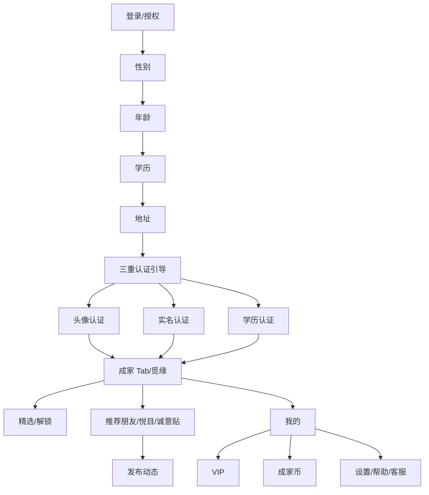
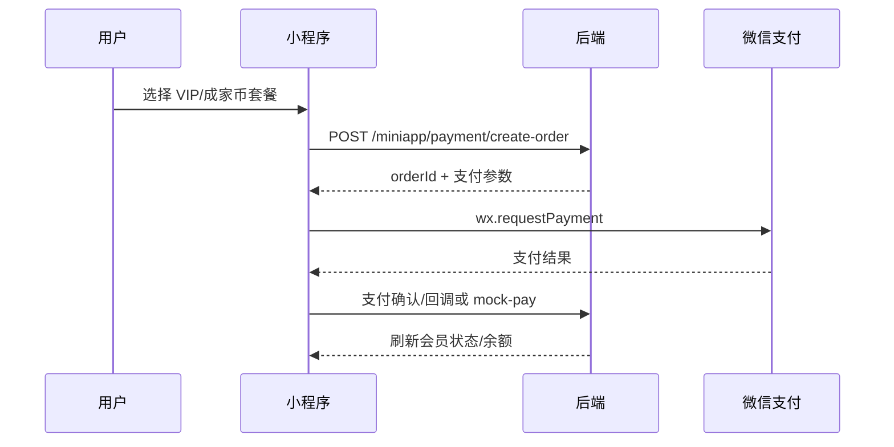

# 小程序蓝湖流程与接口闭环需求文档

> 更新日期：2026-06-09
> 文档目标：从“接口差异清单”改为“蓝湖页面流程 + 当前前端实现 + 后端接口对齐 + 缺口优先级”的闭环文档。
> 静态核对范围：`miniapp/src/pages/`、`miniapp/src/hooks/`、`miniapp/src/services/`、`miniapp/src/app.config.ts`、`backend/src/main/java/com/spacetime/miniapp/controller/`、`miniapp/.lanhu-ref/`。

## 说明

本文档优先回答一个问题：小程序按蓝湖主流程点击时，当前能不能跑通；如果不能，是路由断、接口断、字段不匹配，还是靠 Mock 代偿。

蓝湖与本地切图参照：

| 业务域 | 本地蓝湖参考图 |
| --- | --- |
| 登录资料 | `miniapp/.lanhu-ref/登录/登录.png`、`登录-授权.png`、`登录-性别选择.png`、`登录-年龄选择.png`、`登录-学历.png`、`登录-地址.png` |
| 三重认证 | `miniapp/.lanhu-ref/认证/认证-三重认证.png`、`三重认证-实名认证-身份证.png`、`三重认证-学历认证在校学生.png`、`三重认证-学历认证中国大陆.png`、`上传毕业证或学位证书.png` |
| 我的 | `miniapp/.lanhu-ref/我的/我的.png`、`我的会员开通状态.png`、`我的会员已过期状态.png` |
| 商业化 | `miniapp/.lanhu-ref/会员中心/*`、`miniapp/.lanhu-ref/成家币/*` |
| 推荐朋友/社区 | `miniapp/.lanhu-ref/推荐/推荐-朋友-*`、`miniapp/.lanhu-ref/推荐/推荐-社区.png` |
| 成家/觅缘/精选 | `miniapp/.lanhu-ref/觅缘/*`、`miniapp/.lanhu-ref/精选/*` |

## 语义定义

| 术语 | 含义 |
| --- | --- |
| 可通 | 页面入口存在，点击后进入真实存在的路由，服务函数命中后端真实接口，关闭 Mock 后主链路仍能继续。 |
| Mock 可通 | 页面入口和视觉流程可以跑，数据或提交结果来自本地 Mock；关闭 Mock 或接入真实环境后会断在接口/字段/后端缺口。 |
| 路由阻断 | 页面点击目标路径不存在或路径写成旧版路径。 |
| 接口阻断 | 前端有服务函数，但请求路径、方法、入参或出参与后端 Controller 不一致。 |
| 后端缺口 | 前端或蓝湖流程需要接口，但后端 Controller 当前没有对应能力。 |
| 代偿 | 当前用 `services/mock.ts`、hook 内同步数据、toast 或本地状态模拟后端结果。 |

## 0. 当前结论与优先级

### 0.1 总体结论

| 优先级 | 结论 | 当前影响 | 建议处理 |
| --- | --- | --- | --- |
| P0 | 登录真实接口路径不一致 | `useAuth -> loginByCode` 调 `POST /miniapp/login`，后端实际是 `POST /miniapp/auth/wechat-login`；关闭 Mock 后登录换 token 会失败 | 前端改 `services/auth.ts` 路径，或后端补兼容别名；优先改前端 |
| P0 | 我的页数据纯 Mock，且多处导航旧路径 | 蓝湖“我的”页面能展示，但编辑资料、VIP、成家币、邀请、动态、帮助、设置多处跳到不存在路由 | 先修 `useProfile` 路由，再接 `GET /miniapp/profile/home` |
| P0 | VIP/成家币/支付路径不一致 | 蓝湖商业化页能展示 Mock，但真实支付链路会断 | 前端服务路径改到 `/miniapp/vip/*`、`/miniapp/coin/*`、`/miniapp/payment/create-order` |
| P1 | 推荐朋友/社区路径不一致 | 推荐页视觉已按蓝湖搭建，社区服务函数与后端 `/posts` 不一致 | 前端改 `community.ts`，明确 `postType/topicId/imageUrls` |
| P1 | 推广邀请接口路径不一致 | 邀请好友流程前端调用旧路径，后端已有 `/promotion/invite/*` | 前端改 `promotion.ts` 路径和 bind 入参 |
| P1 | 觅缘、精选、测评缺后端主接口 | 成家/觅缘/精选页面依赖 Mock；不能标为可联调 | 后端补推荐、精选、测评主接口，或前端临时保持 Mock 标记 |
| P2 | 设置/安全/帮助后端已有，前端页面不完整 | “我的”菜单点击会断或未对接 | 修路由后逐项接 `/settings/*`、`/account/*`、`/content/help-docs`、`/feedback` |

### 0.2 当前能通状态

| 链路 | 状态 | 证据 |
| --- | --- | --- |
| 登录蓝湖资料页：授权 -> 性别 -> 年龄 -> 学历 -> 地址 | Mock 可通 | `pages/login/*` 路由存在；`useLogin.submit` 写入 mock token 后 `switchTab('/pages/index/index')` |
| 微信真实登录换 token | 接口阻断 | 前端 `POST /miniapp/login`；后端 `POST /miniapp/auth/wechat-login` |
| 认证中心：状态、实名、学历、头像 | 接口可对齐 | 前端 `services/verification.ts` 与后端 `VerificationController` 路径一致；服务内仍有 Mock 兜底逻辑 |
| 成家 Tab/觅缘主页面 | Mock 可通 | `pages/index/index` 使用 `useMatch` 和 `mockMatchUsers` |
| 立业 Tab/社区页面 | Mock 可通 | `pages/community/index` 页面内 `MOCK_POSTS`，没有调用 `services/community.ts` |
| 推荐 Tab：朋友/社区、觅知音/悦目/诚意贴、发布入口 | Mock 可通 | `pages/recommend/index`、`pages/recommend/post` 存在；推荐页使用本地蓝湖 assets |
| 消息 Tab | 路由可进，业务待对接 | `pages/chat/index` 存在；未见消息服务接口 |
| 我的 Tab | Mock 可展示，菜单多处路由阻断 | `pages/profile/index` 使用 `useProfile`；`useProfile` 跳旧路径 |
| VIP/成家币页面 | 页面可进但入口旧路径阻断 | 真实页面是 `/pages/membership/index`、`/pages/coins/index`；我的页当前跳 `/pages/vip/index`、`/pages/coin/index` |

### 0.3 第一批必须修复

1. `miniapp/src/services/auth.ts`：`POST /miniapp/login` 改为 `POST /miniapp/auth/wechat-login`。
2. `miniapp/src/hooks/useProfile.ts`：修正旧路由，至少把 VIP 和成家币改到真实页面。
3. `miniapp/src/hooks/useProfile.ts`：把我的页数据源从纯 Mock 改为优先 `GET /miniapp/profile/home`，失败时再 Mock 兜底。
4. `miniapp/src/services/payment.ts`：拆分 VIP、成家币、支付路径，避免商业化链路真实环境全断。
5. `miniapp/src/services/community.ts`、`promotion.ts`：改到后端真实路径，并做字段适配。

## 1. 页面/蓝湖稿/路由流程总览

### 1.1 蓝湖主流程图



### 1.2 当前 `app.config.ts` 路由入口

| Tab | 路由 | 当前页面 | 蓝湖状态 | 数据状态 |
| --- | --- | --- | --- | --- |
| 成家 | `pages/index/index` | 觅缘页 | 已按觅缘方向还原 | `useMatch` Mock |
| 立业 | `pages/community/index` | 社区列表 | 仍是普通 Mock 列表，不是推荐-社区蓝湖态 | 页面内 Mock |
| 推荐 | `pages/recommend/index` | 推荐朋友页 | 已按朋友/社区、觅知音/悦目/诚意贴还原 | 页面内 Mock |
| 消息 | `pages/chat/index` | 消息页 | 待核对蓝湖 | 未见服务函数 |
| 我的 | `pages/profile/index` | 我的页 | 已按本地蓝湖图切图/引入 | `useProfile` Mock |

### 1.3 非 Tab 页面入口

| 页面 | 当前路由 | 入口来源 | 当前状态 |
| --- | --- | --- | --- |
| 登录授权 | `pages/login/index` | 未登录进入 | Mock 可通 |
| 登录性别 | `pages/login/gender` | 登录授权下一步 | Mock 可通 |
| 登录年龄 | `pages/login/age` | 性别下一步 | Mock 可通 |
| 登录学历 | `pages/login/education` | 年龄下一步 | Mock 可通 |
| 登录地址 | `pages/login/address` | 学历下一步 | Mock 可通 |
| 三重认证 | `pages/verification/triple` | 认证引导 | 页面可通 |
| 编辑资料 | `pages/profile/edit` | 成家页入口 | 页面存在 |
| 会员中心 | `pages/membership/index` | 应由我的 VIP 入口进入 | 页面存在，入口旧路径 |
| 会员记录 | `pages/membership/records` | 会员中心 | 页面存在 |
| 成家币 | `pages/coins/index` | 应由我的成家币入口进入 | 页面存在，入口旧路径 |
| 成家币明细 | `pages/coins/detail` | 成家币页 | 页面存在 |
| 精选 | `pages/featured/index` | 成家页顶部 Tab | Mock 可通 |
| 推荐发布 | `pages/recommend/post` | 推荐-悦目发布按钮 | 页面存在 |

## 2. 主流程闭环：登录资料 -> 认证 -> 首页/我的

### 2.1 登录资料链路

| 步骤 | 蓝湖页面 | 当前路由/代码 | 前端行为 | 接口状态 | 闭环状态 |
| --- | --- | --- | --- | --- | --- |
| 授权 | 登录、登录-授权 | `pages/login/index` | 协议弹窗，同意后进入性别 | 未调真实登录 | Mock 可通 |
| 性别 | 登录-性别选择 | `pages/login/gender` | 写入 `useLogin` store，跳年龄 | 无接口 | Mock 可通 |
| 年龄 | 登录-年龄选择 | `pages/login/age` | 写入年龄，跳学历 | 无接口 | Mock 可通 |
| 学历 | 登录-学历 | `pages/login/education` | 写入学历，跳地址 | 无接口 | Mock 可通 |
| 地址 | 登录-地址 | `pages/login/address` | 跳 `pages/verification/basic` | 无接口 | Mock 可通 |
| 提交登录资料 | 当前未形成真实提交 | `useLogin.submit` | 写 mock token，`switchTab('/pages/index/index')` | 未接 `profile/init-*` | Mock 可通 |

需要对齐的后端能力：

| 后端接口 | 当前用途判断 | 对接建议 |
| --- | --- | --- |
| `POST /miniapp/auth/wechat-login` | 微信 code 换 token | 替换前端 `/miniapp/login` |
| `GET /miniapp/profile/init-status` | 查询资料初始化进度 | 登录后决定是否进入资料页/认证页 |
| `POST /miniapp/profile/init-save` | 分步保存资料 | 性别、年龄、学历、地址每步可保存 |
| `POST /miniapp/profile/init-complete` | 完成资料初始化 | 地址页完成后调用，再跳认证或首页 |

### 2.2 真实微信登录差异

| 项目 | 当前前端 | 当前后端 | 结论 |
| --- | --- | --- | --- |
| 登录服务 | `miniapp/src/services/auth.ts` | `AuthMiniappController` | 路径不一致 |
| 请求路径 | `POST /miniapp/login` | `POST /miniapp/auth/wechat-login` | 前端需改 |
| 调用者 | `useAuth.login -> Taro.login -> loginByCode` | Controller 已实现 | 可快速修复 |
| 页面登录流程 | `pages/login/*` 目前没有调用 `useAuth.login` | 后端不感知资料步骤 | 需要补资料保存编排 |

### 2.3 认证链路

| 蓝湖页面 | 当前路由 | 前端服务函数 | 后端接口 | 闭环状态 |
| --- | --- | --- | --- | --- |
| 认证-三重认证 | `pages/verification/triple` | 页面导航 | `GET /miniapp/profile/certification-center` 可用于聚合 | 页面可通，聚合未接 |
| 实名认证 | `pages/verification/real-name` | `submitRealNameVerification` | `POST /miniapp/verify/real-name` | 接口可对齐 |
| 学历认证-在校学生 | `pages/verification/education-student` | `submitEducationVerification` | `POST /miniapp/verify/education` | 接口可对齐 |
| 学历认证-中国大陆 | `pages/verification/education-mainland` | `submitEducationVerification` | `POST /miniapp/verify/education` | 接口可对齐 |
| 学信网编码/毕业证编号/上传证书 | 多个 `education-*` 路由 | `submitEducationVerification` | `POST /miniapp/verify/education` | 需要字段适配 |
| 头像链路 | `avatar -> avatar-crop -> avatar-review` | `submitAvatarVerification` | `POST /miniapp/verify/avatar` | 服务存在，页面链路仍偏本地流程 |
| 状态查询 | 认证中心进入/刷新 | `getVerificationStatus` | `GET /miniapp/verify/status` | 接口可对齐 |

当前注意点：

- `miniapp/src/services/verification.ts` 内有 Mock 模式/兜底逻辑，文档不能把它写成“生产已完全联调”。
- 认证接口路径与后端一致，是第一批真实联调里风险最低的模块。
- 蓝湖的“认证顺序提示”“未认证弹窗”需要前端用 `verify/status` 或 `profile/certification-center` 决定是否弹出，不能只靠本地状态。

### 2.4 进入首页/我的后的状态读取

| 页面 | 当前数据来源 | 后端可用接口 | 缺口 |
| --- | --- | --- | --- |
| 成家/觅缘 | `useMatch` -> `mockMatchUsers` | 无 `match/recommend` | 后端缺主接口 |
| 我的 | `useProfile` -> auth store + `services/mock.ts` | `GET /miniapp/profile/home` | 前端未接，字段需适配 |
| 认证中心聚合 | 页面本地状态/服务状态 | `GET /miniapp/profile/certification-center` | 前端未接聚合接口 |
| 资料详情/编辑 | 页面存在 `pages/profile/edit` | `GET /miniapp/profile/detail`、`PATCH /miniapp/profile` | 我的页跳错到 `/pages/profile/edit/index` |

## 3. Tab 主链路：成家、立业、推荐、消息、我的

### 3.1 Tab 链路总表

| Tab | 蓝湖定位 | 当前路由 | 入口是否存在 | 当前主数据 | 后端对齐 | 关闭 Mock 后 |
| --- | --- | --- | --- | --- | --- | --- |
| 成家 | 觅缘/精选/心印测试/理想型 | `pages/index/index` | 是 | `useMatch` Mock | 缺 `match/*`、`featured/*`、`assessment/*` | 觅缘主列表断 |
| 立业 | 社区/事业内容 | `pages/community/index` | 是 | 页面内 `MOCK_POSTS` | 后端有 `/miniapp/community/posts` | 页面仍不调接口 |
| 推荐 | 朋友/社区，觅知音/悦目/诚意贴 | `pages/recommend/index` | 是 | 页面内 Mock + 本地切图 | 可复用 `/community/posts`，但前端未接 | 内容不会真实读写 |
| 消息 | 消息列表/会话 | `pages/chat/index` | 是 | 待确认 | 未见 miniapp 消息 Controller | 业务断 |
| 我的 | 个人中心 | `pages/profile/index` | 是 | `useProfile` Mock | 后端有 profile/vip/coin/settings | 多入口跳旧路径 |

### 3.2 成家 Tab：觅缘/精选

蓝湖参考：

- `miniapp/.lanhu-ref/觅缘/成家-觅缘-信息完善.png`
- `miniapp/.lanhu-ref/觅缘/成家-觅缘-信息未完善.png`
- `miniapp/.lanhu-ref/觅缘/成家-觅缘-yo弹窗.png`
- `miniapp/.lanhu-ref/觅缘/成家-觅缘-三重认证弹窗.png`
- `miniapp/.lanhu-ref/精选/成家-精选.png`
- `miniapp/.lanhu-ref/精选/成家-精选-解锁嘉宾.png`

当前实现：

| 功能 | 当前代码 | 当前行为 | 结论 |
| --- | --- | --- | --- |
| 推荐用户卡片 | `useMatch` | 从 `mockMatchUsers` 取当前用户 | Mock 可通 |
| Yo/悄悄话 | `useMatch` | toast 或本地弹窗，不调用后端 | 后端缺互动接口 |
| 喜欢/收藏 | `useMatch` | toast，不落库 | 后端缺互动接口 |
| 编辑资料入口 | `navigateToProfileEdit` | 跳 `/pages/profile/edit` | 路由存在 |
| 精选入口 | `MatchHeader` | `navigateTo('/pages/featured/index')` | 页面存在 |
| 心印测试/理想型 | `MatchHeader` | toast 功能建设中 | 后端缺口 |

需要后端主接口：

| 业务 | 建议接口 | 当前状态 |
| --- | --- | --- |
| 觅缘推荐列表 | `GET /miniapp/match/recommend?page=&size=` | 后端缺 |
| Yo 打招呼 | `POST /miniapp/match/yo` | 后端缺 |
| 悄悄话 | `POST /miniapp/match/whisper` | 后端缺 |
| 喜欢 | `POST /miniapp/match/like` | 后端缺 |
| 收藏 | `POST /miniapp/match/favorite` | 后端缺 |
| 精选列表 | `GET /miniapp/featured/list` | 后端缺 |
| 精选解锁 | `POST /miniapp/asset/unlock` 可复用 | 后端已有资产解锁，但前端未接 |

### 3.3 立业 Tab：社区

当前 `pages/community/index` 是页面内 Mock 列表，尚未使用 `miniapp/src/services/community.ts`。后端实际已经有完整社区 Controller。

| 行为 | 当前前端服务路径 | 后端真实路径 | 结论 |
| --- | --- | --- | --- |
| 动态列表 | `GET /miniapp/community/feed` | `GET /miniapp/community/posts` | 路径/字段不一致 |
| 发布动态 | `POST /miniapp/community/feed` | `POST /miniapp/community/posts` | 路径/入参不一致 |
| 动态详情 | 无调用 | `GET /miniapp/community/posts/{id}` | 后端已有 |
| 评论列表 | 无调用 | `GET /miniapp/community/posts/{id}/comments` | 后端已有 |
| 发表评论 | 无调用 | `POST /miniapp/community/comments` | 后端已有 |
| 点赞 | 无调用 | `POST /miniapp/community/posts/{id}/like` | 后端已有 |
| 关注 | 无调用 | `POST /miniapp/community/follows/{targetUserId}` | 后端已有 |
| 举报 | 无调用 | `POST /miniapp/community/reports` | 后端已有 |
| 社区配置 | 无调用 | `GET /miniapp/community/config` | 后端已有 |

字段适配要求：

| 前端当前字段 | 后端字段 | 处理建议 |
| --- | --- | --- |
| `nickname` | `authorName` | service 层映射 |
| `avatar` | `authorAvatar` | service 层映射 |
| `userId` | `authorId` | service 层映射 |
| `images` | `imageUrls` | 请求/响应都要映射 |
| 发布缺省字段 | `postType`、`topicId`、`mentionUserIds` | 推荐页“诚意贴”需明确 `postType` |

### 3.4 推荐 Tab：朋友/社区、觅知音/悦目/诚意贴

蓝湖参考：

- `miniapp/.lanhu-ref/推荐/推荐-朋友-悦目-弹窗.png`
- `miniapp/.lanhu-ref/推荐/推荐-朋友-诚意贴.png`
- `miniapp/.lanhu-ref/推荐/推荐-朋友-诚意贴-发布动态.png`
- `miniapp/.lanhu-ref/推荐/推荐-朋友-诚意贴-未认证弹窗.png`
- `miniapp/.lanhu-ref/推荐/推荐-社区.png`

当前实现：

| 流程 | 当前代码 | 路由/动作 | 闭环状态 |
| --- | --- | --- | --- |
| 朋友/社区切换 | `FriendTopBar` | 社区点击 `switchTab('/pages/community/index')` | 路由可通 |
| 觅知音 | `KnowledgeFriends` | 仅静态占位 | Mock 可通，业务未闭环 |
| 悦目 | `JoyFeed` | 静态动态卡片 + 操作弹窗 | Mock 可通 |
| 诚意贴 | `SincerityFeed` | 静态动态卡片 + 未认证弹窗 | Mock 可通 |
| 发布动态 | `FloatingPublishButton` | `navigateTo('/pages/recommend/post')` | 路由可通 |
| 发布落库 | `pages/recommend/post` | 需复核是否接 service | 不应默认可联调 |

推荐页后端对齐建议：

- “悦目”和“诚意贴”本质接近社区动态，可优先复用 `POST /miniapp/community/posts`，用 `postType` 区分。
- “觅知音”需要先明确业务定义：问答、知音匹配、推荐内容，当前没有后端主接口。
- “未认证弹窗”应由 `GET /miniapp/verify/status` 或 `GET /miniapp/profile/certification-center` 驱动。

### 3.5 消息 Tab

| 项目 | 当前状态 |
| --- | --- |
| 路由 | `pages/chat/index` 存在 |
| Tab 图标 | 已使用本地可用图标，避免坏图导致切换丢失 |
| 服务函数 | 未见 `miniapp/src/services/chat*` 或消息接口调用 |
| 后端 Controller | 当前 miniapp controller 列表未见消息会话/消息列表接口 |
| 结论 | 页面入口可进，但消息业务不能标为可联调 |

### 3.6 我的 Tab

蓝湖参考：

- `miniapp/.lanhu-ref/我的/我的.png`
- `miniapp/.lanhu-ref/我的/我的会员开通状态.png`
- `miniapp/.lanhu-ref/我的/我的会员已过期状态.png`

当前实现：

| 区块 | 当前数据来源 | 后端接口 | 闭环状态 |
| --- | --- | --- | --- |
| 头像/昵称/城市/年龄/星座 | `useProfile.buildProfileData` Mock | `GET /miniapp/profile/home`、`GET /miniapp/profile/detail` | 前端未接 |
| 三重认证标签 | Mock 固定 true | `GET /miniapp/profile/certification-center`、`GET /miniapp/verify/status` | 前端未接 |
| 我喜欢的/喜欢我的/最近来访 | Mock 固定数字 | 未见对应统计接口 | 后端缺或待确认 |
| 提升人气按钮 | 本地切图 `boost-button.png` | 待确认商业化接口 | 未闭环 |
| VIP Banner | 本地切图 `vip-banner.png` | `GET /miniapp/vip/status` | 入口旧路径 |
| 成家币卡片 | 本地资产 | `GET /miniapp/coin/balance` | 入口旧路径 |
| 邀请好友卡片 | 本地资产 | `/miniapp/promotion/invite/*` | 前端未接 |
| 我的动态 | 本地菜单 | 可复用 `/community/posts?author=me` 但未见接口参数 | 路由旧路径 |
| 帮助与客服 | 本地菜单 | `GET /miniapp/content/help-docs`、`POST /miniapp/feedback` | 路由旧路径 |
| 设置 | 本地菜单 | `/miniapp/settings/*` | 路由旧路径 |

我的页路由阻断清单：

| 当前点击 | 当前代码路径 | 真实存在路由 | 结论 |
| --- | --- | --- | --- |
| 编辑资料 | `/pages/profile/edit/index` | `/pages/profile/edit` | 需改 |
| VIP | `/pages/vip/index` | `/pages/membership/index` | 需改 |
| 成家币 | `/pages/coin/index` | `/pages/coins/index` | 需改 |
| 邀请好友 | `/pages/invite/index` | 当前无页面 | 路由阻断 |
| 我的动态 | `/pages/moments/my/index` | 当前无页面 | 路由阻断 |
| 帮助与客服 | `/pages/help/index` | 当前无页面 | 路由阻断 |
| 设置 | `/pages/settings/index` | 当前无页面 | 路由阻断 |

## 4. 商业化链路：VIP、成家币、支付、解锁

### 4.1 VIP 会员

蓝湖参考：`miniapp/.lanhu-ref/会员中心/*`。

| 行为 | 当前前端 | 后端真实接口 | 当前状态 | 修复建议 |
| --- | --- | --- | --- | --- |
| 我的页进入会员中心 | `/pages/vip/index` | 页面是 `/pages/membership/index` | 路由阻断 | 改路由 |
| 会员状态 | `useMembership` Mock | `GET /miniapp/vip/status` | 前端未接 | 替换 hook 数据源 |
| 套餐列表 | `GET /miniapp/payment/vip/packages` | `GET /miniapp/vip/packages` | 路径不一致 | 改 service |
| 权益列表 | 无真实调用 | `GET /miniapp/vip/benefits` | 后端已有 | 新增 service |
| 会员记录 | `useMembership` Mock | `GET /miniapp/vip/orders` | 前端未接 | 记录页接真实接口 |
| 支付 | `useMembership.confirmPay` Mock toast | `POST /miniapp/payment/create-order` | 前端未接 | 接创建订单 + 微信支付 |

### 4.2 成家币

蓝湖参考：`miniapp/.lanhu-ref/成家币/成家币.png`、`成家币明细.png`。

| 行为 | 当前前端 | 后端真实接口 | 当前状态 | 修复建议 |
| --- | --- | --- | --- | --- |
| 我的页进入成家币 | `/pages/coin/index` | 页面是 `/pages/coins/index` | 路由阻断 | 改路由 |
| 成家币余额 | `useCoins` Mock | `GET /miniapp/coin/balance` | 前端未接 | 替换 hook 数据源 |
| 套餐列表 | `GET /miniapp/payment/coin/packages` | `GET /miniapp/coin/packages` | 路径不一致 | 改 service |
| 明细流水 | `useCoins` Mock | `GET /miniapp/coin/flows` | 前端未接 | 明细页接真实接口 |
| 充值支付 | `useCoins.purchase` Mock | `POST /miniapp/payment/create-order` | 前端未接 | 接支付链路 |

字段适配：

| 前端字段 | 后端字段 | 说明 |
| --- | --- | --- |
| `amount` | `coinCount` | 套餐币数 |
| `bonus` | `bonusCoinCount` | 赠送币数 |
| `type` | `flowType` | 流水类型 |
| `description` | `bizDesc` | 流水描述 |
| `time` | `createTime` | 流水时间 |
| `balance` | `balanceAfter` | 变更后余额 |

### 4.3 支付

| 行为 | 当前前端 | 后端真实接口 | 闭环状态 |
| --- | --- | --- | --- |
| 创建订单 | `POST /miniapp/payment/order`，入参 `{ packageId, type }` | `POST /miniapp/payment/create-order`，入参 `{ orderType, packageId }` | 路径/入参不一致 |
| 模拟支付 | 前端未调 | `POST /miniapp/payment/mock-pay/{orderId}` | 后端已有，前端未接 |
| 微信支付参数 | 前端期望 `payParams` | 后端返回结构需以 Controller/VO 为准 | 待字段确认 |

支付闭环要求：



当前缺口：后端有创建订单与 mock-pay，但前端 hook 仍是本地成功 toast，未形成真实“订单 -> 支付 -> 状态刷新”闭环。

### 4.4 解锁

| 蓝湖场景 | 当前前端 | 后端能力 | 结论 |
| --- | --- | --- | --- |
| 精选解锁嘉宾 | `useFeatured` 控制解锁弹窗，无接口 | `POST /miniapp/asset/unlock` | 后端可复用，前端未接 |
| 解锁记录/资产汇总 | 无前端调用 | `GET /miniapp/asset/summary`、`GET /miniapp/asset/unlock-records` | 后端已有，前端未接 |

建议第一阶段只对接 `unlockScene + targetUserIds`，并在成功后刷新余额与目标卡片锁定状态。

## 5. 社区/推荐朋友/发布动态

### 5.1 推荐朋友与社区关系

推荐页蓝湖有“朋友/社区”双入口；当前“社区”点击进入 `pages/community/index`。数据层建议统一落到后端社区模块：

| 蓝湖类型 | 建议后端归属 | 必填区分字段 |
| --- | --- | --- |
| 悦目 | 社区动态 | `postType = joy` 或后端枚举 |
| 诚意贴 | 社区动态/诚意贴 | `postType = sincerity` |
| 推荐-社区 | 社区动态 | `postType = community` |
| 觅知音 | 待确认 | 需要独立业务定义 |

### 5.2 发布动态

| 检查项 | 当前状态 |
| --- | --- |
| 页面入口是否存在 | 存在，`pages/recommend/index` 发布按钮跳 `pages/recommend/post` |
| 点击后是否跳真实路由 | 是，`pages/recommend/post` 已在 `app.config.ts` |
| 是否已有服务函数 | 有，`services/community.ts` |
| 服务函数是否命中后端真实接口 | 否，当前 `/community/feed`，后端 `/community/posts` |
| Mock 状态是否有兜底 | 推荐页当前主要为页面内静态/本地状态 |
| 关闭 Mock 后是否断链 | 会断，路径和入参不一致 |

发布接口修正：

| 项目 | 当前前端 | 后端需要 |
| --- | --- | --- |
| 路径 | `POST /miniapp/community/feed` | `POST /miniapp/community/posts` |
| 文本 | `content` | `content` |
| 图片 | `images` | `imageUrls` |
| 类型 | 无 | `postType` |
| 话题 | 无 | `topicId` |
| 提及 | 无 | `mentionUserIds` |

### 5.3 推荐朋友互动

| 行为 | 当前状态 | 后端对接建议 |
| --- | --- | --- |
| 关注/取消关注 | 推荐卡片本地状态 | 复用 `POST /miniapp/community/follows/{targetUserId}` |
| 点赞 | 推荐卡片本地状态 | 复用 `POST /miniapp/community/posts/{id}/like` |
| 评论 | 蓝湖未完整落接口 | 复用 comments 接口 |
| 未认证弹窗 | 页面本地弹窗 | 接 `verify/status` 后判断 |

## 6. 我的页、设置、安全、帮助客服

### 6.1 我的页主数据

我的页要先从“蓝湖视觉已还原”推进到“真实资料状态可闭环”。建议接口聚合：

| 页面字段 | 当前来源 | 建议后端来源 | 是否后端已有 |
| --- | --- | --- | --- |
| 头像/昵称 | auth store + default | `GET /miniapp/profile/home` | 有 |
| 城市/年龄/星座 | Mock | `GET /miniapp/profile/home` 或 `profile/detail` | 有 |
| 三重认证标签 | Mock | `GET /miniapp/profile/certification-center` | 有 |
| VIP 状态 | Mock | `GET /miniapp/vip/status` | 有 |
| 成家币余额 | Mock | `GET /miniapp/coin/balance` | 有 |
| 喜欢/访客统计 | Mock | 待补统计接口或 profile/home 扩展 | 待确认 |
| 提升人气 | 静态按钮 | 待确认推广/曝光接口 | 待确认 |

### 6.2 设置与安全

后端已有能力：

| 场景 | 后端接口 | 前端状态 |
| --- | --- | --- |
| 设置首页 | `GET /miniapp/settings/home` | 我的页入口旧路径，页面缺 |
| 隐私设置 | `GET/PUT /miniapp/settings/privacy` | 页面缺 |
| 通知设置 | `GET/PUT /miniapp/settings/notifications` | 页面缺 |
| 黑名单 | `GET/POST/DELETE /miniapp/settings/blocks/blacklist` | 页面缺 |
| 不看 TA 动态 | `GET/POST/DELETE /miniapp/settings/blocks/hidden-dynamics` | 页面缺 |
| 关键词屏蔽 | `GET/POST/DELETE /miniapp/settings/keyword-blocks` | 页面缺 |
| 注销状态 | `GET /miniapp/account/cancel-status` | 页面缺 |
| 注销申请 | `POST /miniapp/account/cancel` | 页面缺 |
| 撤销注销 | `POST /miniapp/account/cancel/revoke` | 页面缺 |
| 退出登录 | `POST /miniapp/logout` | 前端 store 有 logout，但未调后端 |

### 6.3 帮助与客服

| 场景 | 后端接口 | 前端状态 | 建议 |
| --- | --- | --- | --- |
| 帮助文档 | `GET /miniapp/content/help-docs` | 我的页入口旧路径，页面缺 | 新建帮助页并接接口 |
| 规则/公告 | `GET /miniapp/content/rules`、`GET /miniapp/content/announcements` | 页面缺 | 可作为帮助页子模块 |
| 反馈提交 | `POST /miniapp/feedback` | 页面缺 | 客服/反馈页接入 |

## 7. 前后端接口差异清单

### 7.1 前端需改路径/字段

| 序号 | 模块 | 当前前端调用 | 后端真实接口 | 问题 | 优先级 |
| --- | --- | --- | --- | --- | --- |
| 1 | 登录 | `POST /miniapp/login` | `POST /miniapp/auth/wechat-login` | 路径不一致 | P0 |
| 2 | 我的资料 | `GET /miniapp/user/info` | `GET /miniapp/profile/home` 或 `GET /miniapp/profile/detail` | 路径/出参不同 | P0 |
| 3 | 推荐用户 | `GET /miniapp/match/recommend` | 无 | 后端缺 | P1 |
| 4 | VIP 套餐 | `GET /miniapp/payment/vip/packages` | `GET /miniapp/vip/packages` | 路径不一致 | P0 |
| 5 | 成家币套餐 | `GET /miniapp/payment/coin/packages` | `GET /miniapp/coin/packages` | 路径/字段不一致 | P0 |
| 6 | 创建订单 | `POST /miniapp/payment/order` | `POST /miniapp/payment/create-order` | 路径/入参不一致 | P0 |
| 7 | 邀请记录 | `GET /miniapp/promotion/invites` | `GET /miniapp/promotion/invite/records` | 路径不一致 | P1 |
| 8 | 邀请码 | `GET /miniapp/promotion/invite-code` | `GET /miniapp/promotion/invite/qr-code` | 路径/出参不同 | P1 |
| 9 | 使用邀请码 | `POST /miniapp/promotion/use-code` | `POST /miniapp/promotion/invite/bind` | 路径/入参不同 | P1 |
| 10 | 社区列表 | `GET /miniapp/community/feed` | `GET /miniapp/community/posts` | 路径/字段不同 | P1 |
| 11 | 发布动态 | `POST /miniapp/community/feed` | `POST /miniapp/community/posts` | 路径/入参不同 | P1 |
| 12 | 测评量表 | `GET /miniapp/assessment/scales` | 无 | 后端缺 | P2 |
| 13 | 提交测评 | `POST /miniapp/assessment/submit` | 无 | 后端缺 | P2 |
| 14 | 测评报告 | `GET /miniapp/assessment/report/{id}` | 无 | 后端缺 | P2 |

### 7.2 后端已具备但前端未充分使用

| 模块 | 后端接口 | 当前前端状态 | 对接价值 |
| --- | --- | --- | --- |
| 资料初始化 | `/miniapp/profile/init-status`、`init-save`、`init-complete` | 登录资料页未接 | 让登录资料真实落库 |
| 资料详情/编辑 | `GET /miniapp/profile/detail`、`PATCH /miniapp/profile` | 编辑页未接 | 让编辑资料闭环 |
| 资料访问状态 | `GET /miniapp/profile/access-status` | 未接 | 可用于查看/解锁规则 |
| 认证聚合 | `GET /miniapp/profile/certification-center` | 未接 | 三重认证中心状态 |
| VIP | `/miniapp/vip/packages`、`benefits`、`status`、`orders` | hook 全 Mock | 商业化闭环 |
| 成家币 | `/miniapp/coin/packages`、`balance`、`flows` | hook 全 Mock | 充值与消费闭环 |
| 资产解锁 | `/miniapp/asset/summary`、`unlock`、`unlock-records` | 精选解锁未接 | 解锁嘉宾闭环 |
| 社区 | `/miniapp/community/posts` 等 | 页面/服务未对齐 | 动态内容闭环 |
| 推广邀请 | `/miniapp/promotion/invite/*` | service 旧路径 | 邀请好友闭环 |
| 设置安全 | `/miniapp/settings/*`、`/miniapp/account/*` | 页面缺 | 我的页菜单闭环 |
| 内容帮助 | `/miniapp/content/*`、`/miniapp/feedback` | 页面缺 | 帮助客服闭环 |

### 7.3 后端缺主接口

| 序号 | 业务 | 缺口 | 为什么影响流程 |
| --- | --- | --- | --- |
| 1 | 觅缘推荐 | 推荐用户列表与筛选接口 | 成家 Tab 主页面关闭 Mock 后无数据 |
| 2 | 觅缘互动 | Yo、悄悄话、喜欢、收藏 | 用户操作无法落库，也无法驱动消息/通知 |
| 3 | 精选 | 精选嘉宾列表/Tab 数据 | 精选页只能展示 Mock |
| 4 | 测评 | 量表、提交、报告 | 心印测试不能联调 |
| 5 | 消息 | 会话列表、消息列表、发送消息 | 消息 Tab 只有入口，业务链路缺 |
| 6 | 我的统计 | 喜欢、被喜欢、最近来访 | 我的页核心数字只能 Mock |
| 7 | 提升人气 | 曝光/boost 接口 | 我的页提升人气按钮不能真实生效 |

## 8. Mock 代偿与对接顺序

### 8.1 Mock 代偿清单

| 模块 | Mock 位置 | 当前代偿内容 | 关闭 Mock 后风险 |
| --- | --- | --- | --- |
| 登录资料 | `useLogin` | token、userId、昵称、头像、本地资料步骤 | 无真实 token/资料落库 |
| 我的页 | `useProfile` + `services/mock.ts` | 个人资料、认证、会员、成家币、统计 | 我的页数据为空或接口未调 |
| 觅缘 | `useMatch` + `mockMatchUsers` | 推荐用户、Yo、喜欢、收藏 | 成家 Tab 无用户数据 |
| 会员 | `useMembership` + mock plans/records | 套餐、状态、支付成功 | 会员中心不能真实购买/刷新 |
| 成家币 | `useCoins` + mock packages/flows | 余额、套餐、支付、流水 | 充值与明细不能真实展示 |
| 精选 | `useFeatured` + `mockFeaturedGuests` | 嘉宾列表、弹窗状态 | 精选页无真实列表/解锁状态 |
| 社区 | `pages/community/index` 内 `MOCK_POSTS` | 立业动态列表/点赞 | 动态不读后端 |
| 推荐朋友 | `pages/recommend/index` 页面状态 | 觅知音/悦目/诚意贴卡片与弹窗 | 推荐内容不读写后端 |

### 8.2 对接顺序

```text
第一批：保障登录、我的、认证能闭环
1. 登录路径改为 /miniapp/auth/wechat-login。
2. 登录资料页接 /miniapp/profile/init-status、init-save、init-complete。
3. 我的页路由修正：profile/edit、membership、coins。
4. 我的页接 /miniapp/profile/home，认证状态接 verify/status 或 certification-center。
5. 认证三件套保持 /miniapp/verify/*，补齐页面字段映射。

第二批：保障商业化能闭环
1. VIP 接 /miniapp/vip/status、packages、benefits、orders。
2. 成家币接 /miniapp/coin/balance、packages、flows。
3. 支付接 /miniapp/payment/create-order，确认 payParams 字段。
4. 精选解锁接 /miniapp/asset/unlock，并刷新余额/解锁状态。

第三批：保障内容与推荐能闭环
1. 社区服务改 /miniapp/community/posts，完成字段映射。
2. 推荐朋友发布动态复用 community posts，并明确 postType。
3. 推广邀请改 /miniapp/promotion/invite/*。
4. 后端补 match、featured、assessment、message 主接口。

第四批：完善我的菜单与辅助能力
1. 新增/修正邀请好友、我的动态、帮助客服、设置页面路由。
2. 设置安全接 /miniapp/settings/*、/miniapp/account/*。
3. 帮助客服接 /miniapp/content/help-docs 和 /miniapp/feedback。
```

### 8.3 保障流程能通检查表

| 流程 | 页面入口是否存在 | 点击后真实路由 | 已有服务函数 | 命中后端真实接口 | Mock 兜底 | 关闭 Mock 是否断链 | 结论 |
| --- | --- | --- | --- | --- | --- | --- | --- |
| 登录授权到地址 | 是 | 是 | 部分 | 否 | 是 | 是 | Mock 可通 |
| 微信换 token | 是 | 不涉及 | 是 | 否 | 部分 | 是 | 接口阻断 |
| 三重认证 | 是 | 是 | 是 | 是 | 是 | 否，字段仍需验 | 可优先联调 |
| 成家/觅缘 | 是 | 是 | 有旧 user service | 否 | 是 | 是 | 后端缺口 |
| 精选 | 是 | 是 | 无真实 service | 否 | 是 | 是 | 后端缺口 |
| 立业/社区 | 是 | 是 | 是 | 否 | 是 | 是 | 接口阻断 |
| 推荐朋友 | 是 | 是 | 可复用 community | 否 | 是 | 是 | 接口阻断 |
| 发布动态 | 是 | 是 | 是 | 否 | 部分 | 是 | 接口阻断 |
| 我的主页 | 是 | 是 | 无真实 profile service | 否 | 是 | 是 | Mock 可通 |
| 编辑资料 | 是 | 否，入口旧路径 | 后端有 | 未接 | 否 | 是 | 路由阻断 |
| VIP | 是 | 否，入口旧路径 | 有 payment service | 否 | 是 | 是 | 路由 + 接口阻断 |
| 成家币 | 是 | 否，入口旧路径 | 有 payment service | 否 | 是 | 是 | 路由 + 接口阻断 |
| 邀请好友 | 否 | 否 | 是 | 否 | 否 | 是 | 路由 + 接口阻断 |
| 设置安全 | 否 | 否 | 后端有 | 前端未接 | 否 | 是 | 页面缺口 |
| 帮助客服 | 否 | 否 | 后端有 | 前端未接 | 否 | 是 | 页面缺口 |

### 8.4 本轮文档口径

1. 已实现接口只标后端 Controller 可确认存在的接口，不把 Mock 页面写成可联调。
2. 蓝湖页面已切图/已还原只代表视觉和入口，不代表数据闭环。
3. 优先修“登录真实 token -> 资料落库 -> 认证状态 -> 我的页真实资料”这条主链路。
4. 商业化链路后端能力较完整，当前主要是前端路径、字段和 hook Mock 未替换。
5. 推荐、觅缘、精选、测评、消息是体验主入口，但后端主接口缺口最多，必须明确排期或保留 Mock 标识。
