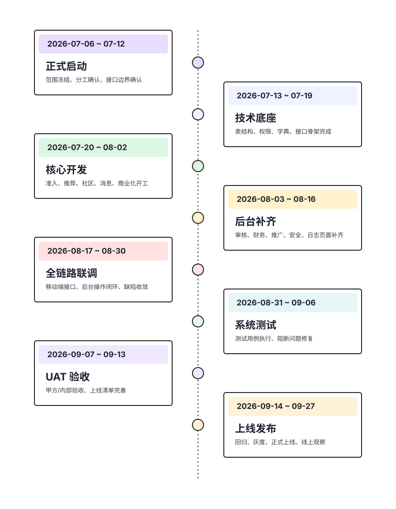

# 成家立业一期项目排期表

> 基于 `docs/需求文档/一期上线目标.md` 整理。
> 正式开发从 `2026-07-06` 开始，按 12 周节奏推进。
> 需求已提前产出，正式需求参考 `docs/需求文档/需求文档-正式版/`。

## 1. 排期假设

1. 一期周期按 12 周规划：`2026-07-06` 至 `2026-09-27`。
2. 需求阶段不从 0 开始，W1 只做范围冻结、技术拆解和联调边界确认。
3. 移动端前端由专人负责，A/B/C 主要负责后端、管理后台和移动端接口支持。
4. 测评、惊鸿测试、灵魂测试等测试/测评相关能力全部不纳入一期。
5. 知音中的觅知音、立业中的职业推荐/推荐职位不纳入一期。
6. 第三方能力如微信登录、支付、实名/学历认证、对象存储等需在 W2 前确认可用。

## 2. 关键时间节点图

## 3. 周排期

| 周期 | 日期 | 阶段 | 主要目标 | A 同学重点 | B 同学重点 | C 同学重点 |
| --- | --- | --- | --- | --- | --- | --- |
| W1 | 07-06 ~ 07-12 | 启动与范围冻结 | 基于正式 PRD 和一期上线目标冻结范围、确认接口边界 | 用户/关系/消息模型梳理 | 社区/商业化/举报模型梳理 | 权限、字典、配置、推广模型梳理 |
| W2 | 07-13 ~ 07-19 | 技术底座 | 完成基础表结构、公共枚举、接口骨架、后台菜单 | 登录、资料、认证接口骨架 | 社区、商业化接口骨架 | 系统管理、权限、字典、配置底座 |
| W3 | 07-20 ~ 07-26 | 核心开发一 | 用户准入、推荐关系、社区内容主流程进入开发 | 资料认证、觅缘、心动 | 信息流、动态、评论、举报 | 运营配置、搜索、我的页配置 |
| W4 | 07-27 ~ 08-02 | 核心开发二 | 消息、知音剩余场景、商业化和推广主流程进入开发 | 私信、通知、邀请响应 | 悦目、诚意贴、VIP/成家币 | 推广邀请、奖励审核、校园代理 |
| W5 | 08-03 ~ 08-09 | 后台补齐一 | 后台核心列表、详情、审核、配置页面补齐 | 用户管理、关系摘要 | 内容审核、社区配置 | 系统管理、运营中心 |
| W6 | 08-10 ~ 08-16 | 后台补齐二 | 财务、推广、用户安全、日志等后台能力补齐 | 消息记录、推荐数据查看 | 财务中心、退款管理 | 推广管理、用户安全设置 |
| W7 | 08-17 ~ 08-23 | 第一轮联调 | 移动端主流程和后台操作闭环首轮打通 | 登录/推荐/消息联调 | 社区/商业化/举报联调 | 配置/推广/我的/搜索联调 |
| W8 | 08-24 ~ 08-30 | 联调收敛 | 核心链路缺陷修复，形成可演示版本 | 主链路问题收敛 | 内容与财务问题收敛 | 配置与推广问题收敛 |
| W9 | 08-31 ~ 09-06 | 系统测试 | 测试用例执行、阻断问题修复、数据初始化检查 | 主链路缺陷修复 | 内容与财务缺陷修复 | 配置与推广缺陷修复 |
| W10 | 09-07 ~ 09-13 | UAT 验收 | 甲方/内部 UAT、验收问题修复、上线清单完善 | UAT 主链路支持 | UAT 内容财务支持 | UAT 配置推广支持 |
| W11 | 09-14 ~ 09-20 | 上线准备 | 回归测试、灰度预案、审核资料、发布脚本确认 | 核心链路上线保障 | 社区/商业化上线保障 | 配置/权限/推广上线保障 |
| W12 | 09-21 ~ 09-27 | 灰度与正式上线 | 灰度发布、线上观察、正式上线和问题兜底 | 线上主链路兜底 | 线上内容财务兜底 | 线上配置推广兜底 |

## 4. 里程碑

| 里程碑 | 时间 | 验收口径 |
| --- | --- | --- |
| 正式开发启动 | 2026-07-06 | 需求基线、一期边界、分工和排期确认 |
| 技术底座完成 | 2026-07-19 | 主要表结构、接口骨架、权限点、数据字典可进入开发 |
| 核心链路开发完成 | 2026-08-16 | 移动端主流程和后台主页面基本可联调 |
| 第一轮全链路联调完成 | 2026-08-30 | 登录、推荐、社区、消息、商业化、推广等关键链路打通 |
| 系统测试完成 | 2026-09-06 | 阻断级问题关闭，剩余问题可进入 UAT |
| UAT 完成 | 2026-09-13 | 验收问题收敛，上线清单基本完成 |
| 上线准备完成 | 2026-09-20 | 回归测试、发布脚本、审核资料和灰度预案完成 |
| 一期上线 | 2026-09-27 | 灰度验证通过，进入正式上线与线上观察 |

## 5. 主要风险

| 风险 | 处理方式 |
| --- | --- |
| AI+兼职协作导致交付节奏不连续 | 每周固定两次联调会，接口和权限点必须提前冻结 |
| 认证、支付、微信订阅消息等第三方能力不可用 | W2 前完成账号、资质、沙箱和回调验证 |
| 社区、消息、举报链路联动复杂 | W3 起边开发边联调，W8 前不新增范围 |
| 推广奖励和成家币流水口径冲突 | W1 统一流水类型和奖励状态 |
| 后台权限点遗漏 | 每个模块在 W2 前提交页面和按钮权限清单 |
