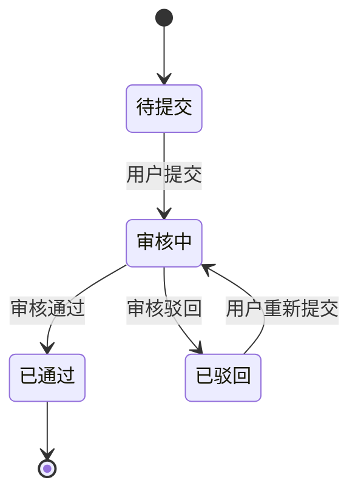

# 全局定义（共享层）- 全项目唯一一份

> **共享层 = 跨 2 个及以上业务模块共用的项目级定义，全项目只此一份。**
> 这里放的是"换个端、换个模块也不变"的东西：项目级术语、跨模块枚举、跨模块状态机、跨模块业务规则、项目级第三方、通用错误码、公共接口约定。
> 同一业务模块内跨管理后台/移动端共用的定义，放在模块 PRD 的"模块专属定义"或模块根目录的"模块公共定义"中，不放本文。
> 全端共性差异（管理后台/移动端的权限原则、UI 通用态、跨模块端文案）放在 `11_模板_全局定义_端专属层.md`；单模块菜单、权限矩阵、端内 UI 状态放模块端内定义；跨端或多页面复用的模块文案放模块公共定义。
>
> ⚠️ 本文件是**空模板**，仅含结构与占位。填写时把 `{{...}}` 替换为真实内容，
> 业务值未拍板前请标注 `[待确认]`，不要把猜测当定论。

| 版本 | 日期 | 修改人 | 变更摘要（**改动须列出受影响的页面 ID**） |
|------|------|--------|----------|
| v0.1 | YYYY-MM-DD | | 初稿 |

---

## 1. 项目术语表（Glossary）

> 跨模块业务名词一次定死。全端统一使用，禁止出现旧称/别名。
> 这是消除口径混乱（同义异名、一词多义）的唯一手段。
> 仅单模块使用的术语使用 `M{{模块号}}-TERM-xxx`，放模块专属定义。

| 术语 ID | 统一术语 | 禁用旧称/别名 | 定义 | 备注 |
|---------|----------|--------------|------|------|
| `GLB-TERM-{{标识}}` | {{统一术语}} | {{禁用别名}} | {{定义}} | |

### 1.1 命名与口径统一

> 易混淆的端/对象称呼在此定死（如"管理后台"不叫"后台管理系统"）。

| 统一口径 | 说明 |
|----------|------|
| {{口径}} | {{说明}} |

---

## 2. 数据字典 & 枚举

> 仅登记跨模块复用的枚举。单模块枚举使用 `M{{模块号}}-ENUM-xxx`，放模块专属定义。
> 每个枚举一张表。停用/改名后历史数据如何展示必须写明。

### 2.1 枚举编写规则

1. 每个枚举必须回答：是否后台可配？可配的话配置路径是什么？
2. 每个枚举必须回答：停用/改名后，历史数据展示用旧值还是新值？
3. 每个枚举必须回答：是否可扩展新值？扩展后是否需要前端发版？
4. 枚举值按 display order 排序，默认值用 **加粗** 标记。

### GLB-ENUM-{{标识}}（{{枚举中文名}}）

- 是否后台可配：{{是 / 否}}，配置路径：{{如有}}
- 停用后历史数据展示：{{保留旧值显示 / 展示"已停用" / 隐藏}}
- 是否可扩展：{{是 / 否}}，扩展方式：{{后台新增 / 需发版}}

| 值（code） | 显示名 | 说明 | 排序 | 是否默认 | 状态 |
|------------|--------|------|------|----------|------|
| {{code}} | {{显示名}} | | 1 | **是** | 启用 / 停用 |

### 2.2 枚举索引

| 枚举 ID | 中文名 | 所属模块 | 是否后台可配 | 备注 |
|---------|--------|----------|-------------|------|
| `GLB-ENUM-{{标识}}` | {{中文名}} | | 是/否 | |

---

## 3. 状态机

> 仅登记跨模块复用的状态机。单模块状态机使用 `M{{模块号}}-SM-xxx`，放模块专属定义。
> 每个有状态的对象一张。必须含：状态清单 + 流转表 + 触发条件 + 副作用。
> **只写顺流程（提交→通过/驳回）= 不合格。** 必须覆盖异常分支。

### 3.1 状态机编写规则

1. 每个状态必须明确"用户能做什么、后台能做什么"
2. 每个流转必须明确"触发条件 + 前置校验 + 副作用（事件/通知/其他对象变更）"
3. 终态不允许回退，除非明确写了回退路径
4. 状态图建议用 mermaid 画，让所有人对状态空间有直观认知

### GLB-SM-{{标识}}（{{对象中文名}}状态机）

**状态清单**

| 状态 code | 显示名 | 含义 | 用户可做什么 | 后台可做什么 | 是否终态 |
|-----------|--------|------|-------------|-------------|----------|
| {{code}} | | | | | 是/否 |

**流转表**

| 起始状态 | 事件/触发 | 目标状态 | 前置条件 | 副作用（事件/通知/其他对象） |
|----------|-----------|----------|----------|------------------------------|
| {{起始}} | {{事件}} | {{目标}} | | `GLB-EVT-xxx` / `GLB-NTF-xxx` |

**状态图（mermaid）**

### 3.2 状态机索引

| 状态机 ID | 对象 | 所属模块 | 备注 |
|-----------|------|----------|------|
| `GLB-SM-{{标识}}` | {{对象}} | | |

---

## 4. 业务规则汇总

> 跨模块的规则在此集中定义。页面规格引用 `GLB-RULE-xxx`，禁止在多处复述同一规则。
> **凡是"在 PRD-A 和 PRD-B 都会出现"的规则，必须放这里，否则必然抄出矛盾。**
> 仅单模块内多页面/多端复用的规则使用 `M{{模块号}}-RULE-xxx`，放模块专属定义。

| 规则 ID | 规则描述 | 涉及模块 | 判定逻辑（伪代码或决策表） | 备注 |
|---------|----------|----------|--------------------------|------|
| `GLB-RULE-{{标识}}` | {{规则描述}} | | {{判定逻辑}} | |

---

## 5. 第三方服务与依赖

> 仅登记项目级或跨模块第三方服务。单模块第三方依赖使用 `M{{模块号}}-SRV-xxx`，放模块专属定义。
> 每个第三方服务写明：用途、接口、降级方案。默认第三方永远可用 = 埋雷。

| 服务 ID | 服务名 | 用途 | 提供方 | 关键接口 | 不可用时的影响 | 降级方案 |
|---------|--------|------|--------|----------|---------------|----------|
| `GLB-SRV-{{标识}}` | {{服务名}} | {{用途}} | | | {{影响}} | {{降级}} |

---

## 6. 配置项清单

> 仅登记跨模块配置项。单模块配置使用 `M{{模块号}}-CFG-xxx`，放模块专属定义。
> 所有后台可配的开关/阈值，在此登记。页面规格引用 `GLB-CFG-xxx`。

| 配置 ID | 配置项 | 默认值 | 类型 | 配置路径 | 修改后是否立即生效 | 高风险（需二次确认） |
|---------|--------|--------|------|----------|-------------------|---------------------|
| `GLB-CFG-{{标识}}` | {{配置项}} | {{默认值}} | int/bool/string | | 是/否 | 是/否 |

---

## 7. 通知与消息模板

> 仅登记跨模块通知/短信/微信订阅消息模板。单模块通知使用 `M{{模块号}}-NTF-xxx`，放模块专属定义。
> 页面规格引用 `GLB-NTF-xxx` 或 `M{{模块号}}-NTF-xxx`，禁止复述模板内容。

| 通知 ID | 触发事件 | 渠道 | 标题/模板 | 内容/变量 | 是否后台可配 | 备注 |
|---------|----------|------|-----------|-----------|-------------|------|
| `GLB-NTF-{{标识}}` | `GLB-EVT-xxx` | 站内/短信/微信订阅 | {{标题}} | {{含变量的内容}} | 是/否 | |

---

## 8. 错误码表

| 错误码 ID | HTTP code | 业务 code | 含义 | 用户提示文案 | 是否可重试 |
|-----------|-----------|-----------|------|--------------|-----------|
| `GLB-ERR-{{n}}` | | | {{含义}} | {{提示}} | 是/否 |

---

## 9. 接口前缀与公共约定

> 一次性定死，避免 PRD/技术方案/测试/前端各写各的。本表同时覆盖后台与移动端两端的前缀。

| 项 | 约定 |
|----|------|
| 移动端接口前缀 | {{如 /miniapp/api/v1/...}} |
| 后台接口前缀 | {{如 /admin/api/v1/...}} |
| 鉴权方式 | {{token / session，有效期，续期策略}} |
| 分页约定 | {{请求参数 + 响应结构}} |
| 时间格式 | {{传输格式 + 展示格式}} |
| 时区约定 | {{服务端时区 + 展示时区 + 年龄计算时区}} |
| 金额单位 | {{传输单位 + 展示单位}} |
| 文件上传限制 | {{大小 + 格式}} |
| 验证码规则 | {{位数 + 有效期 + 重发间隔}} |
