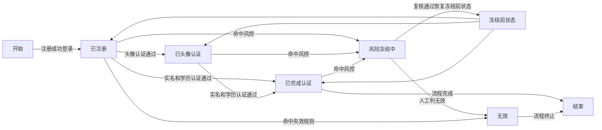
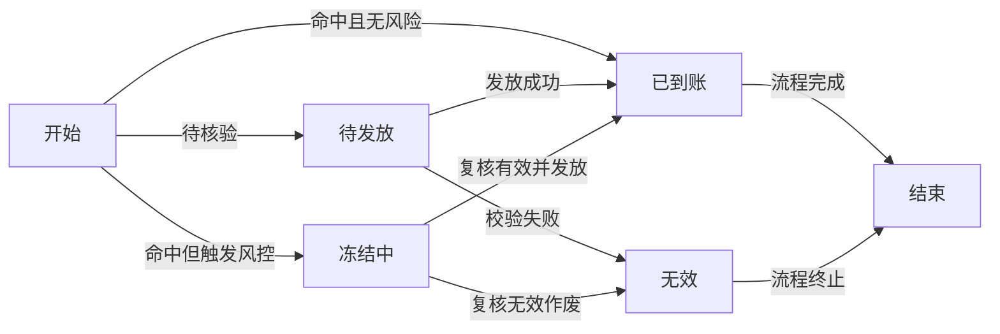

# PRD-07 模块公共定义 - 推广裂变与邀请奖励

> 本文件是 PRD-07 的模块定义层，统一登记仅 PRD-07 使用、但跨移动端/管理后台/多页面复用的术语、枚举、状态机、规则、配置、通知、事件、错误码与接口约定。
> 页面规格引用本文 `M07-*` ID，禁止把 PRD-07 专属定义写入全局共享层。
> 跨 2 个及以上业务模块复用的项目级定义仍放 `../全局定义/共享层_项目级.md`，例如 `GLB-TERM-cheng-coin`。

| 版本 | 日期 | 修改人 | 变更摘要（改动须列出受影响的页面 ID） |
|------|------|--------|----------|
| 版本01 | 2026-06-24 | Codex | 版本 01：按最终确认口径收敛 |

---

## 1. 模块术语表

| 术语 ID | 统一术语 | 定义 | 备注 |
|---------|----------|------|------|
| `M07-TERM-inviter` | 邀请人 | 已注册的普通小程序用户，生成个人邀请二维码邀请新用户 | 角色 `Inviter` |
| `M07-TERM-invitee` | 被邀请人 | 通过普通用户或校园代理二维码进入小程序的新用户 | 角色 `Invitee` |
| `M07-TERM-campus-agent` | 校园代理 | 后台录入与管理的合作代理人，以奖金/佣金结算，不走普通用户发币逻辑 | 角色 `CampusAgent` |
| `M07-TERM-success-invite` | 成功邀请 | 关系有效且达到后台配置的成功统计节点后，计为一次成功邀请 | 普通+代理统一取同一后台统计口径 |
| `M07-TERM-auth-complete` | 认证完成 | 实名认证 + 学历认证均完成，用于 PRD-07 认证完成奖励 | 头像认证归入资料完善奖励 |

### 1.1 引用的全局术语

| 全局术语 ID | 统一术语 | 使用场景 |
|-------------|----------|----------|
| `GLB-TERM-cheng-coin` | 千寻币 | 邀请奖励金额、千寻币流水、奖励到账通知 |

### 1.2 命名与口径统一

| 统一口径 | 说明 |
|----------|------|
| 成功邀请口径 | 普通用户与校园代理一致，均以后台推广规则配置的成功统计节点为准；可选节点与 5 类奖励事件一致，首版不在文档写死默认节点 |
| 奖励币名称 | 正式文档统一 `千寻币`；术语引用 `GLB-TERM-cheng-coin` |
| 渠道归属优先级 | 同一新用户只归属一个来源；注册前同时命中普通邀请与校园代理来源时，永远渠道优先，详见 `M07-RULE-invite-attribution` |

---

## 2. 模块枚举

### M07-ENUM-invite-source（邀请来源类型）

- 是否后台可配：否（系统固定）
- 停用后历史数据展示：保留旧值显示
- 是否可扩展：否

| 值（code） | 显示名 | 说明 | 排序 | 是否默认 | 状态 |
|------------|--------|------|------|----------|------|
| `normal_user` | 普通用户 | 由已注册普通用户生成二维码 | 1 | **是** | 启用 |
| `campus_agent` | 校园代理 | 由后台校园代理生成二维码 | 2 | 否 | 启用 |

### M07-ENUM-invite-relation-status（邀请关系状态）

- 是否后台可配：否
- 停用后历史数据展示：保留旧值显示
- 是否可扩展：否
- 说明：本枚举同时驱动状态机 `M07-SM-invite-relation`

| 值（code） | 显示名 | 说明 | 排序 | 是否默认 | 状态 |
|------------|--------|------|------|----------|------|
| `registered` | 已注册 | 被邀请人首次注册并成功登录，关系建立 | 1 | **是** | 启用 |
| `profile_completed` | 已完成资料完善 | 被邀请人头像认证通过 | 2 | 否 | 启用 |
| `verify_success` | 已完成认证 | 被邀请人实名认证 + 学历认证均完成 | 3 | 否 | 启用 |
| `frozen` | 风险冻结中 | 命中风控，待人工复核 | 4 | 否 | 启用 |
| `invalid` | 无效 | 命中失效规则或被人工判无效 | 5 | 否 | 启用 |

### M07-ENUM-invite-reward-event（奖励事件类型）

- 是否后台可配：是（启用与金额可配），配置路径：`ADM-07-PAGE-promo-rule-config`（推广规则配置页-普通用户奖励 Tab）
- 停用后历史数据展示：保留旧值显示
- 是否可扩展：否（首版固定 5 类）
- 说明：本枚举只定义事件全集；是否启用、金额、阶梯均无默认值，由 `M07-CFG-invite-reward-event-enable` 等配置项决定。

| 值（code） | 显示名 | 说明 | 排序 | 是否默认 | 状态 |
|------------|--------|------|------|----------|------|
| `register_login_reward` | 注册成功登录奖励 | 被邀请人首次注册并成功登录后发放，资产流水类型 `invite_register_reward` | 1 | 否 | 启用 |
| `profile_complete_reward` | 资料完善奖励 | 被邀请人头像认证通过后发放，流水类型 `invite_profile_reward` | 2 | 否 | 启用 |
| `verify_complete_reward` | 认证完成奖励 | 被邀请人实名认证通过 + 学历认证通过后发放，流水类型 `invite_verify_reward` | 3 | 否 | 启用 |
| `first_vip_reward` | 首次会员奖励 | 被邀请人首次充值成为会员后发放，流水类型 `invite_first_vip_reward` | 4 | 否 | 启用 |
| `first_coin_recharge_reward` | 首次充值奖励 | 被邀请人首次充值千寻币后发放，流水类型 `invite_first_coin_reward` | 5 | 否 | 启用 |

### M07-ENUM-invite-reward-status（奖励状态）

- 是否后台可配：否
- 停用后历史数据展示：保留旧值显示
- 是否可扩展：否
- 说明：驱动状态机 `M07-SM-invite-reward`

| 值（code） | 显示名 | 说明 | 排序 | 是否默认 | 状态 |
|------------|--------|------|------|----------|------|
| `pending` | 待发放 | 触发条件命中，等待发放或核验 | 1 | **是** | 启用 |
| `success` | 已到账 | 奖励已发放并写入千寻币流水 | 2 | 否 | 启用 |
| `frozen` | 冻结中 | 命中风控，待人工复核 | 3 | 否 | 启用 |
| `invalid` | 无效 | 不满足规则或被人工作废 | 4 | 否 | 启用 |

### M07-ENUM-agent-coop-status（代理合作状态）

- 是否后台可配：否（由代理状态操作驱动）
- 停用后历史数据展示：保留旧值显示
- 是否可扩展：否

| 值（code） | 显示名 | 说明 | 排序 | 是否默认 | 状态 |
|------------|--------|------|------|----------|------|
| `normal` | 正常推广 | 代理正常获客与计奖 | 1 | **是** | 启用 |
| `paused` | 暂停推广 | 暂停计奖，新用户仍可进入小程序 | 2 | 否 | 启用 |
| `terminated` | 终止合作 | 终止合作，是否计奖按规则 | 3 | 否 | 启用 |

### M07-ENUM-agent-bonus-status（代理奖金状态）

- 是否后台可配：否
- 停用后历史数据展示：保留旧值显示
- 是否可扩展：否

| 值（code） | 显示名 | 说明 | 排序 | 是否默认 | 状态 |
|------------|--------|------|------|----------|------|
| `pending_settlement` | 待结算 | 奖金已生成，等待结算 | 1 | **是** | 启用 |
| `confirmed` | 已确认 | 已确认应发放 | 2 | 否 | 启用 |
| `paid` | 已发放 | 线下已发放 | 3 | 否 | 启用 |
| `cancelled` | 已取消 | 作废，不发放 | 4 | 否 | 启用 |

### M07-ENUM-settlement-status（奖金结算状态）

- 是否后台可配：否
- 停用后历史数据展示：保留旧值显示
- 是否可扩展：否

| 值（code） | 显示名 | 说明 | 排序 | 是否默认 | 状态 |
|------------|--------|------|------|----------|------|
| `unsettled` | 待结算 | 结算单已生成，未结算 | 1 | **是** | 启用 |
| `confirmed` | 已确认 | 已确认结算金额 | 2 | 否 | 启用 |
| `paid` | 已发放 | 线下已发放完成 | 3 | 否 | 启用 |

### M07-ENUM-risk-hit-reason（风控命中原因）

- 是否后台可配：否
- 停用后历史数据展示：保留旧值显示
- 是否可扩展：是（风控阈值/规则条件可在后台配置；新增原因 code 需发版补枚举）

| 值（code） | 显示名 | 说明 | 排序 | 是否默认 | 状态 |
|------------|--------|------|------|----------|------|
| `same_device` | 同设备批量注册 | 同设备超阈值注册 | 1 | 否 | 启用 |
| `same_phone` | 同手机号异常 | 同手机号重复邀请异常 | 2 | 否 | 启用 |
| `self_invite` | 自邀嫌疑 | 邀请人与被邀请人疑似同一人 | 3 | 否 | 启用 |
| `same_payment` | 同支付账号异常 | 同支付账号反复命中 | 4 | 否 | 启用 |
| `same_identity` | 同实名信息 | 同一身份证/实名信息命中重复关系 | 5 | 否 | 启用 |
| `manual_rule` | 命中人工规则 | 后台人工判定异常 | 6 | 否 | 启用 |

### 2.x 枚举索引

| 枚举 ID | 中文名 | 是否后台可配 | 备注 |
|---------|--------|-------------|------|
| `M07-ENUM-invite-source` | 邀请来源类型 | 否 | |
| `M07-ENUM-invite-relation-status` | 邀请关系状态 | 否 | |
| `M07-ENUM-invite-reward-event` | 奖励事件类型 | 部分 | 启用/金额可配 |
| `M07-ENUM-invite-reward-status` | 奖励状态 | 否 | |
| `M07-ENUM-agent-coop-status` | 代理合作状态 | 否 | |
| `M07-ENUM-agent-bonus-status` | 代理奖金状态 | 否 | |
| `M07-ENUM-settlement-status` | 奖金结算状态 | 否 | |
| `M07-ENUM-risk-hit-reason` | 风控命中原因 | 否 | 可发版扩展 |

---

## 3. 模块状态机

### M07-SM-invite-relation（邀请关系状态机）

**状态清单**

| 状态 code | 显示名 | 含义 | 用户可做什么 | 后台可做什么 | 是否终态 |
|-----------|--------|------|-------------|-------------|----------|
| `registered` | 已注册 | 关系已建立 | 查看邀请记录 | 查看 | 否 |
| `profile_completed` | 已头像认证 | 被邀请人头像认证通过，可触发资料完善奖励 | 查看 | 查看 | 否 |
| `verify_success` | 已完成认证 | 实名认证、学历认证均通过，可触发认证完成奖励 | 查看 | 查看 | 否 |
| `frozen` | 风险冻结中 | 命中风控待复核 | 查看提示 | 解冻/判无效 | 否 |
| `invalid` | 无效 | 关系作废 | 查看无效提示 | 查看 | 是 |

**流转表**

| 起始状态 | 事件/触发 | 目标状态 | 前置条件 | 副作用（事件/通知/其他对象） |
|----------|-----------|----------|----------|------------------------------|
| （无） | 被邀请人首次注册成功登录 | `registered` | 携带有效来源、被邀请人为新用户、未命中失效规则 | `M07-EVT-invite-bind`，触发 `register_login_reward` |
| `registered` | 被邀请人头像认证通过 | `profile_completed` | 头像认证状态=通过 | 触发 `profile_complete_reward` |
| `registered`/`profile_completed` | 被邀请人实名认证 + 学历认证均通过 | `verify_success` | 认证完成 | 触发 `verify_complete_reward`；若后台成功统计口径选择认证完成，则计入成功邀请人数与阶梯 |
| 任意非终态 | 命中风控 | `frozen` | 命中 `M07-RULE-invite-antifraud` | 关联奖励转 `frozen`，发 `M07-NTF-invite-reward-frozen` |
| `frozen` | 人工复核通过 | 复核前状态 | 风控人工确认有效 | 关联冻结奖励恢复发放 |
| `frozen` | 人工判无效 | `invalid` | 风控人工确认无效 | 关联奖励转 `invalid`，发 `M07-NTF-invite-reward-invalid` |
| 任意非终态 | 命中失效规则/人工判无效 | `invalid` | `M07-RULE-invite-invalid` | 不计奖，发 `M07-NTF-invite-reward-invalid` |

**状态图（mermaid）**

### M07-SM-invite-reward（邀请奖励状态机）

**状态清单**

| 状态 code | 显示名 | 含义 | 用户可做什么 | 后台可做什么 | 是否终态 |
|-----------|--------|------|-------------|-------------|----------|
| `pending` | 待发放 | 等待发放或核验 | 查看 | 查看 | 否 |
| `success` | 已到账 | 已写入千寻币流水 | 查看流水 | 查看 | 是 |
| `frozen` | 冻结中 | 命中风控待复核 | 查看冻结提示 | 确认发放/作废 | 否 |
| `invalid` | 无效 | 已作废 | 查看无效提示 | 查看 | 是 |

**流转表**

| 起始状态 | 事件/触发 | 目标状态 | 前置条件 | 副作用 |
|----------|-----------|----------|----------|--------|
| （无） | 触发条件命中且未命中风控 | `success` | 满足对应奖励事件且未触发风控 | 写千寻币流水，发 `M07-NTF-invite-reward-arrive`，埋点 `invite_reward_arrive` |
| （无） | 触发条件命中但命中风控 | `frozen` | 命中 `M07-RULE-invite-antifraud` | 发 `M07-NTF-invite-reward-frozen`，埋点 `invite_reward_frozen` |
| `pending` | 系统发放成功 | `success` | — | 写流水 + 通知 |
| `frozen` | 人工确认有效并发放 | `success` | 风控人工确认 | 写流水 `invite_risk_release` + 通知，记录操作日志 |
| `frozen` | 人工确认无效并作废 | `invalid` | 风控人工确认 | 发 `M07-NTF-invite-reward-invalid`，记录操作日志 |
| `pending` | 不满足规则 | `invalid` | 校验失败 | 发 `M07-NTF-invite-reward-invalid` |

**状态图（mermaid）**

### M07-SM-agent-coop（代理合作状态机）

**状态清单**

| 状态 code | 显示名 | 含义 | 用户可做什么 | 后台可做什么 | 是否终态 |
|-----------|--------|------|-------------|-------------|----------|
| `normal` | 正常推广 | 正常获客与计奖 | — | 暂停/终止/编辑 | 否 |
| `paused` | 暂停推广 | 暂停计奖 | — | 恢复/终止 | 否 |
| `terminated` | 终止合作 | 终止合作 | — | 查看 | 是 |

**流转表**

| 起始状态 | 事件/触发 | 目标状态 | 前置条件 | 副作用 |
|----------|-----------|----------|----------|--------|
| `normal` | 后台暂停 | `paused` | 渠道运营/超管权限 | 记录审计日志；新用户仍可进入小程序，按规则决定是否计奖 |
| `paused` | 后台恢复 | `normal` | 同上 | 记录审计日志 |
| `normal`/`paused` | 后台终止 | `terminated` | 同上，二次确认 | 记录审计日志；停止计奖 |

### M07-SM-agent-bonus（代理奖金状态机）

| 状态 code | 显示名 | 流转 | 终态 |
|-----------|--------|------|------|
| `pending_settlement` | 待结算 | -> confirmed / cancelled | 否 |
| `confirmed` | 已确认 | -> paid / cancelled | 否 |
| `paid` | 已发放 | 终态 | 是 |
| `cancelled` | 已取消 | 终态 | 是 |

### M07-SM-agent-settlement（代理结算单状态机）

| 状态 code | 显示名 | 流转 | 终态 |
|-----------|--------|------|------|
| `unsettled` | 待结算 | -> confirmed | 否 |
| `confirmed` | 已确认 | -> paid | 否 |
| `paid` | 已发放 | 终态 | 是 |

### 3.x 状态机索引

| 状态机 ID | 对象 | 备注 |
|-----------|------|------|
| `M07-SM-invite-relation` | 邀请关系 | |
| `M07-SM-invite-reward` | 邀请奖励 | |
| `M07-SM-agent-coop` | 代理合作状态 | |
| `M07-SM-agent-bonus` | 代理奖金 | |
| `M07-SM-agent-settlement` | 代理结算单 | |

---

## 4. 模块业务规则汇总

| 规则 ID | 规则描述 | 涉及模块/端 | 判定逻辑（伪代码/决策表） | 备注 |
|---------|----------|-------------|--------------------------|------|
| `M07-RULE-invite-bind` | 邀请关系绑定 | 07/01 | 携带 inviterId/qrCode/agentCode 进入 -> 记录注册前来源池；若从未注册，在首次注册成功登录后建立关系；若已注册，不建立 | 仅首登绑定 |
| `M07-RULE-invite-uniqueness` | 关系唯一性 | 07 | 一个新用户只绑定一个来源；绑定后不被后续来源覆盖；普通与代理不重复计奖 | |
| `M07-RULE-invite-attribution` | 渠道归属优先级 | 07 | 注册前来源池中只要命中过校园代理二维码/agentCode，即归代理渠道；普通码与代理码同时命中或先后命中时均渠道优先；关系建立后不再被新来源覆盖 | 永远渠道优先 |
| `M07-RULE-invite-success` | 成功邀请统计口径 | 07/01/04 | 普通用户与校园代理共用后台配置的成功统计节点；可选节点：注册成功登录、资料完善、认证完成、首次会员、首次充值；未配置时不展示成功邀请/阶梯进度 | 后台可配，不写死默认节点 |
| `M07-RULE-invite-ladder` | 阶梯奖励 | 07 | 按累计成功邀请人数配置阶梯；档位区间、币数、启用状态均无默认值，由线上运营在后台后期配置；人数口径取 `M07-RULE-invite-success` | 后台可配，不写死档位 |
| `M07-RULE-invite-invalid` | 关系失效 | 07 | 满足任一：被邀请人非新用户 / 邀请人=被邀请人 / 命中设备·手机号·UnionId 反作弊 / 后台判异常 -> 关系无效不计奖 | |
| `M07-RULE-invite-antifraud` | 反作弊风控 | 07 | 命中任一：自邀 / 老用户重复注册 / 同手机号重复 / 同设备批量 / 同实名信息重复 / 同支付账号异常 -> 奖励冻结待人工复核 | 阈值见配置项 |
| `M07-RULE-invite-reward-antifraud-flow` | 防刷发奖策略 | 07/04 | 资格判定 -> 幂等去重 -> 强风险冻结 -> 单日上限超出不发放；每个被邀请人只绑定一个来源，奖励按 `relationId+eventType` 唯一发放，支付类奖励只认 PRD-04 支付成功回调并按 `userId+eventType` 幂等 | M07-03 已确认 |
| `M07-RULE-invite-daily-cap` | 单日奖励上限 | 07 | 单邀请人单日累计奖励 > `M07-CFG-invite-daily-cap` -> 超出部分不发放、不进入人工冻结队列；强风控命中仍进入冻结 | 后台可配 |
| `M07-RULE-agent-paid-attribution` | 代理付费归因 | 07/04 | 用户通过代理二维码建立关系后，首次成为会员、首次充值千寻币继续归因给原代理；关系永久有效；是否结算与金额由后台代理奖励规则配置；不做续费、复购、长期消费分成 | A07-06 已确认 |
| `M07-RULE-agent-settlement-generate` | 代理结算单生成 | 07 | 系统结算任务按结算周期汇总代理奖金记录，生成待结算结算单；结算单号系统生成；页面不提供手动生成入口；同代理同周期按唯一键防重复 | 后台任务，无页面入口 |
| `M07-RULE-invite-relation-validity` | 邀请关系有效期 | 07 | 普通邀请关系与代理推广关系永久有效；奖励事件完成后关系通常无实际作用，但后续新增奖励事件仍可复用归因 | 永久有效 |

---

## 5. 模块第三方服务与依赖

| 服务 ID | 服务名 | 用途 | 提供方 | 关键接口 | 不可用时的影响 | 降级方案 |
|---------|--------|------|--------|----------|---------------|----------|
| `M07-SRV-wx-qrcode` | 微信小程序码 | 生成普通用户/代理专属二维码 | 微信开放平台 | wxacode.getUnlimited | 无法实时生成二维码 | 缓存已生成二维码；失败时提示稍后重试，不阻塞页面其余区块 |
| `M07-SRV-wx-share` | 微信分享能力 | 调起微信分享给好友 | 微信小程序 | onShareAppMessage | 无法调起分享 | 降级为展示二维码图片供保存转发 |

---

## 6. 模块配置项清单

| 配置 ID | 配置项 | 默认值 | 类型 | 配置路径 | 修改后是否立即生效 | 高风险（需二次确认） |
|---------|--------|--------|------|----------|-------------------|---------------------|
| `M07-CFG-invite-reward-event-enable` | 5 类普通奖励事件启用状态 | 无默认值 | json/bool×5 | `ADM-07-PAGE-promo-rule-config` - 普通用户奖励 Tab | 是 | 否 |
| `M07-CFG-invite-reward-register` | 注册成功登录奖励币数 | 无默认值 | int | `ADM-07-PAGE-promo-rule-config` - 普通用户奖励 Tab | 是 | 否 |
| `M07-CFG-invite-reward-profile` | 资料完善奖励币数 | 无默认值 | int | `ADM-07-PAGE-promo-rule-config` - 普通用户奖励 Tab | 是 | 否 |
| `M07-CFG-invite-reward-verify` | 认证完成奖励币数 | 无默认值 | int | `ADM-07-PAGE-promo-rule-config` - 普通用户奖励 Tab | 是 | 否 |
| `M07-CFG-invite-reward-first-vip` | 首次会员奖励币数 | 无默认值 | int | `ADM-07-PAGE-promo-rule-config` - 普通用户奖励 Tab | 是 | 否 |
| `M07-CFG-invite-reward-first-coin` | 首次充值奖励币数 | 无默认值 | int | `ADM-07-PAGE-promo-rule-config` - 普通用户奖励 Tab | 是 | 否 |
| `M07-CFG-invite-success-metric` | 成功邀请统计节点 | 无默认值 | enum | `ADM-07-PAGE-promo-rule-config` - 普通用户奖励 Tab | 是 | 是 |
| `M07-CFG-invite-reward-mode` | 普通奖励方式 | 无默认值 | enum | `ADM-07-PAGE-promo-rule-config` - 普通用户奖励 Tab | 是 | 否 |
| `M07-CFG-invite-reward-cap` | 普通奖励上限 | 无默认值 | int | `ADM-07-PAGE-promo-rule-config` - 普通用户奖励 Tab | 是 | 是 |
| `M07-CFG-invite-reward-effective-window` | 普通奖励生效/失效时间 | 无默认值 | json/datetime | `ADM-07-PAGE-promo-rule-config` - 普通用户奖励 Tab | 是 | 否 |
| `M07-CFG-invite-ladder` | 阶梯奖励配置 | 无默认值 | json | `ADM-07-PAGE-promo-rule-config` - 普通用户奖励 Tab | 是 | 否 |
| `M07-CFG-agent-bonus-rules` | 代理奖金规则组与 5 类奖金事件配置 | 无默认值 | json | `ADM-07-PAGE-promo-rule-config` - 代理奖励 Tab | 是 | 是 |
| `M07-CFG-invite-daily-cap` | 单日奖励上限 | 无默认值 | int | `ADM-07-PAGE-promo-rule-config` - 风控参数 Tab | 是 | 是 |
| `M07-CFG-invite-device-threshold` | 同设备邀请阈值 | 无默认值 | int | `ADM-07-PAGE-promo-rule-config` - 风控参数 Tab | 是 | 是 |
| `M07-CFG-invite-phone-threshold` | 同手机号异常阈值 | 无默认值 | int | `ADM-07-PAGE-promo-rule-config` - 风控参数 Tab | 是 | 是 |
| `M07-CFG-invite-payment-threshold` | 同支付账号异常阈值 | 无默认值 | int | `ADM-07-PAGE-promo-rule-config` - 风控参数 Tab | 是 | 是 |
| `M07-CFG-invite-freeze-switch` | 冻结开关 | 开 | bool | `ADM-07-PAGE-promo-rule-config` - 风控参数 Tab | 是 | 是 |
| `M07-CFG-invite-review-switch` | 人工复核开关 | 开 | bool | `ADM-07-PAGE-promo-rule-config` - 风控参数 Tab | 是 | 是 |
| `M07-CFG-invite-relation-expire` | 普通邀请关系有效期 | 永久有效 | enum/permanent | `ADM-07-PAGE-promo-rule-config` - 关系有效期 Tab | 是 | 否 |
| `M07-CFG-agent-relation-expire` | 代理推广关系有效期 | 永久有效 | enum/permanent | `ADM-07-PAGE-promo-rule-config` - 关系有效期 Tab | 是 | 否 |

---

## 7. 模块通知与消息模板

> `M07-NTF-*` 与 `M07-TXT-*` 使用同一配置入口：`ADM-GLB-PAGE-copy-message-center`（运营中心 → 文案与消息中心 → 推广裂变分组）。PRD-07 不新增单独通知模板配置页。

| 通知 ID | 触发事件 | 渠道 | 标题/模板 | 内容/变量 | 是否后台可配 | 备注 |
|---------|----------|------|-----------|-----------|-------------|------|
| `M07-NTF-invite-reward-arrive` | `M07-EVT-invite-reward-success` | 站内/微信订阅 | 邀请成功奖励到账 | 你邀请的好友{nickname}已{event}，奖励{amount}千寻币已到账 | 是 | |
| `M07-NTF-invite-ladder-upgrade` | `M07-EVT-invite-ladder-upgrade` | 站内 | 阶梯奖励升级提醒 | 你已成功邀请{count}位同学，奖励档位升级 | 是 | count 取后台成功统计口径 |
| `M07-NTF-invite-reward-frozen` | `M07-EVT-invite-reward-frozen` | 站内 | 邀请奖励冻结提醒 | 奖励正在核验中，请稍后查看 | 是 | |
| `M07-NTF-invite-reward-invalid` | `M07-EVT-invite-reward-invalid` | 站内 | 邀请奖励无效提醒 | 该邀请未满足活动规则，未计入奖励 | 是 | |

---

## 8. 模块文案 key 表

> `M07-TXT-*` 是 PRD-07 模块级文案事实源。后台配置页面为 `ADM-GLB-PAGE-copy-message-center`（运营中心 → 文案与消息中心，路由 `/admin/operation/copy-message-center`），在该页使用「推广裂变」分组配置 `M07-TXT-*` 与 `M07-NTF-*`。移动端只消费并渲染，不写死文案。该入口复用总体后台 `3.5.4 文案与消息中心` 能力，不归属 PRD-06 认证与安全设置。

| 文案 ID | 默认文案 | 所属场景 | 后台可配 | 使用端 |
|---------|----------|----------|----------|--------|
| `M07-TXT-invite-entry` | 推荐给好友 | 我的页入口主文案 | 是 | APP |
| `M07-TXT-invite-entry-sub` | 免费获得千寻币 | 我的页入口副文案 | 是 | APP |
| `M07-TXT-invite-home-title` | 邀请好友得千寻币 | 邀请首页标题 | 是 | APP/ADM 配置 |
| `M07-TXT-invite-home-subtitle` | 邀请好友完成活动任务，千寻币奖励到账 | 邀请首页副标题 | 是 | APP/ADM 配置 |
| `M07-TXT-invite-reward-frozen` | 奖励正在核验中，请稍后查看 | 冻结提示 | 是 | APP |
| `M07-TXT-invite-reward-invalid` | 该邀请未满足活动规则，未计入奖励 | 无效提示 | 是 | APP |
| `M07-TXT-invite-share-fallback` | 请保存二维码分享给好友 | 分享降级 | 是 | APP |
| `M07-TXT-invite-ladder-desc` | 阶梯奖励说明文案 | 阶梯说明 | 是 | APP/ADM 配置 |
| `M07-TXT-invite-rules-page` | 活动规则页文案 | 规则页 | 是 | APP/ADM 配置 |
| `M07-TXT-invite-success-def` | 邀请成功口径说明文案 | 规则页 | 是 | APP/ADM 配置 |
| `M07-TXT-agent-recruit` | 校园代理招募文案 | 代理招募（预留） | 是 | ADM 配置 |

---

## 9. 模块事件清单

| 事件 ID | 含义 | 触发时机 | 消费方 |
|---------|------|----------|--------|
| `M07-EVT-invite-bind` | 邀请关系绑定 | 被邀请人首次注册成功登录建立关系 | 奖励发放、代理统计、埋点 |
| `M07-EVT-invite-reward-success` | 邀请奖励到账 | 奖励发放成功 | 通知、资产流水 |
| `M07-EVT-invite-reward-frozen` | 邀请奖励冻结 | 命中风控 | 通知、冻结队列 |
| `M07-EVT-invite-reward-invalid` | 邀请奖励无效 | 关系/奖励判无效 | 通知 |
| `M07-EVT-invite-ladder-upgrade` | 阶梯升级 | 按后台成功统计口径计算的人数跨档 | 通知 |

---

## 10. 资产流水类型（归属 PRD-04 千寻币流水）

| 流水类型 code | 说明 | 关联奖励事件 |
|---------------|------|-------------|
| `invite_register_reward` | 注册成功登录奖励到账 | `register_login_reward` |
| `invite_profile_reward` | 资料完善奖励到账 | `profile_complete_reward` |
| `invite_verify_reward` | 认证完成奖励到账 | `verify_complete_reward` |
| `invite_first_vip_reward` | 首次会员奖励到账 | `first_vip_reward` |
| `invite_first_coin_reward` | 首次充值奖励到账 | `first_coin_recharge_reward` |
| `invite_risk_release` | 风控冻结复核通过后释放到账 | 冻结复核 |

---

## 11. 模块错误码表

| 错误码 ID | HTTP code | 业务 code | 含义 | 用户提示文案 | 是否可重试 |
|-----------|-----------|-----------|------|--------------|-----------|
| `M07-ERR-7001` | 400 | 70001 | 邀请来源参数无效 | 邀请链接无效 | 否 |
| `M07-ERR-7002` | 409 | 70002 | 被邀请人非新用户，不可绑定 | 该用户已注册，无法建立邀请关系 | 否 |
| `M07-ERR-7003` | 409 | 70003 | 关系已绑定，不可覆盖 | 邀请关系已存在 | 否 |
| `M07-ERR-7004` | 403 | 70004 | 自邀请不计奖 | 不能邀请自己 | 否 |
| `M07-ERR-7005` | 429 | 70005 | 命中风控/超出单日上限 | 奖励正在核验中，请稍后查看 | 否 |
| `M07-ERR-7006` | 502 | 70006 | 二维码生成失败 | 二维码生成失败，请稍后重试 | 是 |

---

## 12. 模块接口前缀与公共约定

| 项 | 约定 |
|----|------|
| 移动端推广接口前缀 | `/api/promotion/invite/...` |
| 后台推广接口前缀 | `/admin/api/promotion/...`（沿用后台统一前缀） |
| 奖励金额单位 | 千寻币（整数枚），与 PRD-04 资产口径一致 |
| 移动端脱敏约定 | 手机号 `138****1234`、昵称按 PRD-06 脱敏规则 |
| 管理后台导出约定 | 具备对应菜单/导出权限时，推广导出字段包含手机号及已采集/后续补充的收款相关字段且不脱敏；首版代理个人收款/税务/发票流程不采集，导出操作必须记审计日志 |

### 12.1 移动端接口草案

| 方法 | 路径 | 说明 |
|------|------|------|
| GET | `/api/promotion/invite/home` | 邀请首页数据（进度/奖励/二维码摘要） |
| GET | `/api/promotion/invite/rules` | 活动规则文案 |
| GET | `/api/promotion/invite/records` | 邀请记录列表（支持状态筛选分页） |
| POST | `/api/promotion/invite/share-log` | 分享埋点上报 |
| POST | `/api/promotion/invite/bind` | 绑定邀请关系 |
| GET | `/api/promotion/invite/qr-code` | 获取普通用户二维码信息 |
| GET | `/api/promotion/invite/qr-source` | 解析二维码来源 |
