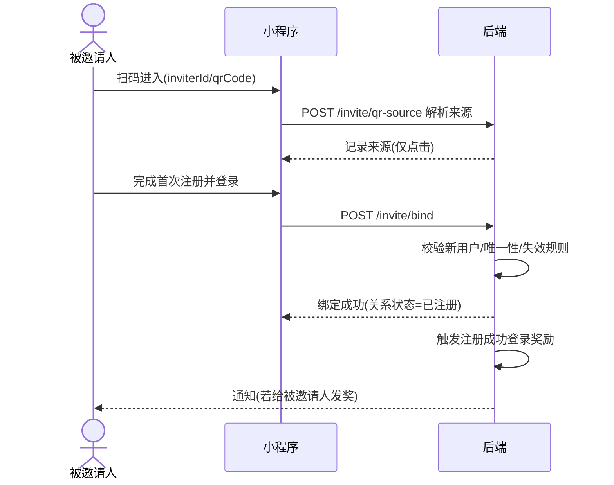

# 模块 PRD - 移动端-07 推广裂变与邀请奖励

> 第二层入口文档。本文件只做模块总览 + 范围 + 边界 + 流程 + 数据 + 依赖 + 页面清单。
> 页面细节见 `../页面规格/`（第 10 节）；PRD-07 模块公共定义见 `../../PRD-07_模块公共定义.md`；项目级全局定义见 `../../../全局定义/共享层_项目级.md` 与 `../../../全局定义/端专属层_移动端.md`；APP-07 端内定义见 `../APP-07_端内定义.md`。

| 版本 | 日期 | 修改人 | 变更摘要 |
|------|------|--------|----------|
| 版本01 | 2026-06-24 | Codex | 版本 01：按最终确认口径收敛 |

---

## 1. 模块目标

承接小程序前期拉新裂变需求，首版纳入正式范围。目标不是短期盈利，而是快速做注册增长与基础活跃增长。模块分两条业务线：普通用户邀请裂变（分享 → 注册登录/头像认证/实名+学历/首次会员/首次充值等节点按后台规则发千寻币 → 成功邀请统计节点由后台配置）、校园代理推广承接（仅做来源识别与统计入口，奖金走后台线下结算）。

**用户故事：** 作为已注册的普通用户，我想把小程序分享给同学并在他们完成活动规则要求的节点后拿到千寻币奖励，以便基本免费体验核心玩法。

**核心指标：** 邀请分享率、成功邀请数（按后台配置统计节点）、被邀请人注册转化率。

### 1.1 已确认结论（来自 M07 问题清单）

| 编号 | 结论 | 文档落点 |
|------|------|----------|
| M07-01 | PRD-07 纳入首版；入口在 `我的-推荐给好友`；页面参考 `/Users/外快/homeproject/homeformobile/src/views/InviteFriends.vue` 的推荐给好友模块结构 | APP-07-RULE-entry、`APP-07-PAGE-invite-home` |
| M07-02 | 奖励按后台邀请规则配置，共 5 类：注册成功登录奖励、资料完善奖励、认证完成奖励、首次会员奖励、首次充值奖励 | `M07-ENUM-invite-reward-event` |
| M07-03 | 防刷策略已确认：资格校验、幂等去重、强风险冻结、单日上限超出不发放；支付类奖励只认 PRD-04 支付成功回调 | `M07-RULE-invite-reward-antifraud-flow` / `M07-RULE-invite-daily-cap` |
| M07-04 | 普通邀请和校园代理同时命中时永远渠道优先 | `M07-RULE-invite-attribution` |
| M07-05 | 邀请关系永久有效；奖励完成后通常无实际作用，除非后续新增奖励事件 | `M07-RULE-invite-relation-validity` |
| M07-06 | 阶梯档位与具体币数无默认值，由线上运营后期在后台配置 | `M07-CFG-invite-ladder` |
| M07-07 | 校园代理奖金首版不涉及个人收款信息、税务、发票；只记录邀请记录/推广记录 | 边界与后台结算 PRD |
| M07-08 | 邀请页“千寻币能干嘛”对齐 PRD-04，本模块不单独定死用途 | `APP-07-PAGE-invite-home` |

---

## 2. 用户与角色

| 角色 | 在本模块中做什么 | 引用全局角色/术语 |
|------|------------------|-------------------|
| 邀请人 | 生成个人二维码、分享、查看进度与记录 | `M07-TERM-inviter` |
| 被邀请人 | 扫码进入、注册、完成头像认证/实名认证/学历认证/首次会员/首次充值等奖励节点 | `M07-TERM-invitee` |
| 校园代理 | 后台管理，移动端仅做来源识别（用户无感知） | `M07-TERM-campus-agent` |

---

## 3. 关键业务流程

### 3.1 普通用户邀请裂变主流程

```
入口：邀请人在「我的-推荐给好友」生成个人二维码 → 分享给同学
正常路径：
  1. 被邀请人扫码（携带 inviterId/qrCode）进入小程序 → 记录来源（仅点击，不建关系）
  2. 被邀请人首次注册并成功登录 → 建立邀请关系（M07-RULE-invite-bind），关系状态=已注册（M07-ENUM-invite-relation-status）
     → 若后台启用且金额已配置，触发注册成功登录奖励
  3. 被邀请人头像认证通过 → 关系状态=已完成资料完善 → 若后台启用且金额已配置，触发资料完善奖励
  4. 被邀请人实名认证 + 学历认证通过 → 关系状态=已完成认证 → 若后台启用且金额已配置，触发认证完成奖励
     → 若后台成功统计节点选择“认证完成”，计入成功邀请人数与阶梯统计
  5. 被邀请人首次充值成为会员 → 触发首次会员奖励（若后台启用且金额已配置）
  6. 被邀请人首次充值千寻币 → 触发首次充值奖励（若后台启用且金额已配置）
分支：注册前来源池命中校园代理二维码/agentCode → 永远归代理渠道，不给普通邀请人发币（M07-RULE-invite-attribution）
异常：
  - 被邀请人非新用户/自邀/命中失效规则 → 关系状态=无效，不计奖（M07-ERR-7002/7004）
  - 命中风控 → 奖励状态=冻结中，待后台人工复核（M07-RULE-invite-antifraud）
  - 超单日上限 → 超出部分不发放、不进入人工冻结队列；强风控命中仍转冻结（M07-CFG-invite-daily-cap）
出口：奖励到账写千寻币流水 + 通知中心推送
```

### 3.2 邀请关系绑定时序



---

## 4. 核心数据模型

### 4.1 实体清单

| 实体 | 表名（建议） | 说明 | 所属模块 | 关键字段 |
|------|-------------|------|----------|----------|
| 邀请关系 | `promo_invite_relation` | 邀请人与被邀请人的绑定关系 | 07 | inviterId, inviteeId, sourceType, status, bindTime |
| 邀请奖励流水 | `promo_invite_reward` | 各事件触发的奖励记录 | 07 | relationId, eventType, amount, status, arriveTime |
| 邀请来源记录 | `promo_invite_source_log` | 扫码点击来源记录 | 07 | inviteeOpenId, sourceType, inviterId/qrCode, clickTime |
| 千寻币流水 | `asset_coin_flow` | 奖励到账写入 | 04 | userId, type(invite_*_reward), amount |
| 支付事件 | PRD-04 资产/订单 | 首次会员、首次充值千寻币奖励触发依据 | 04 | userId, orderType, paidTime, firstPaidFlag |

### 4.2 实体关系

```
邀请关系 1──N 邀请奖励流水
邀请人(用户) 1──N 邀请关系
被邀请人(用户) 1──1 邀请关系（唯一来源）
```

### 4.3 跨模块字段引用

| 本模块使用字段 | 来源模块 | 来源实体 | 若来源模块未上线如何处理 |
|---------------|----------|----------|-------------------------|
| 资料完善/认证完成状态 | 01 用户准入 | 用户认证 | 必须依赖，认证模块为前置 |
| 千寻币余额/流水 | 04 商业化 | 资产中心 | 必须依赖，奖励到账写流水 |
| 首次会员/首次充值事件 | 04 商业化 | 订单/支付流水 | 未上线时对应奖励事件隐藏或不可启用 |
| 被邀请人脱敏昵称/手机号 | 06 我的页 | 用户资料 | 脱敏展示 |

---

## 5. 范围（本期要做）

| 需求 ID | 能力 | 优先级 | 关联页面 ID | 备注 |
|---------|------|--------|-------------|------|
| `APP-07-RULE-entry` | 我的页「推荐给好友」入口 + 活动通知卡片入口 | P0 | `APP-07-PAGE-invite-home` | |
| `APP-07-RULE-home` | 邀请首页：活动区/进度区/二维码区/记录区/规则区 | P0 | `APP-07-PAGE-invite-home` | |
| `APP-07-RULE-qrcode` | 生成普通用户二维码 + 保存图片 | P0 | `APP-07-PAGE-invite-home` | `M07-SRV-wx-qrcode` |
| `APP-07-RULE-share` | 调起微信分享 | P0 | `APP-07-PAGE-invite-home` | `M07-SRV-wx-share` |
| `APP-07-RULE-bind` | 扫码来源识别 + 邀请关系绑定 | P0 | — | `M07-RULE-invite-bind` |
| `APP-07-RULE-five-rewards` | 5 类邀请奖励触发与到账展示 | P0 | `APP-07-PAGE-invite-home` / `APP-07-PAGE-invite-records` | 金额、启用状态均由后台规则配置 |
| `APP-07-RULE-records` | 邀请记录页（筛选/状态展示） | P0 | `APP-07-PAGE-invite-records` | |
| `APP-07-RULE-rules` | 活动规则页 | P1 | `APP-07-PAGE-invite-rules` | |
| `APP-07-RULE-reward-notify` | 奖励到账/冻结/无效通知 | P0 | — | `M07-NTF-invite-*` |
| `APP-07-RULE-agent-source` | 校园代理二维码来源承接（用户无感知） | P1 | — | `M07-RULE-invite-attribution` |

---

## 6. 边界（本期不做）

| 不做的能力 | 原因 | 本期处理方式 | 后续计划 |
|------------|------|--------------|----------|
| 独立代理商移动端工作台 | 代理走后台管理 | 隐藏 | 后续按需 |
| 提现钱包 | 不涉及现金 | 隐藏 | — |
| 复杂多级分销体系 | 前期只做单层裂变 | 隐藏 | — |
| 线下合同流转 | 后台/线下处理 | 隐藏 | — |
| 自动打款 | 代理奖金线下结算 | 隐藏 | — |
| 代理个人收款信息、税务、发票 | 首版不涉及 | 不采集、不展示、不导出 | 后续如接自动打款/财务结算再补 PRD |
| 续费/复购/长期消费分成 | 首版不做复杂分销 | 隐藏 | 后续如做需另补 PRD |

---

## 7. 跨模块依赖

| 依赖项 | 依赖的模块/服务 | 依赖内容 | 若未就绪/不可用时的兜底 | 阻塞级别 |
|--------|----------------|----------|------------------------|---------|
| 资料完善/认证完成 | PRD-01 用户准入 | 资料完善奖励、认证完成奖励与成功统计节点判定 | 认证为前置模块，必须先就绪 | 阻塞 |
| 千寻币资产 | PRD-04 商业化 | 奖励到账写流水 | 必须就绪 | 阻塞 |
| 通知中心 / 文案与消息中心 | PRD-03 消息通知 / `ADM-GLB-PAGE-copy-message-center` | 到账/冻结/无效通知、活动页文案、分享降级文案 | 通知失败不阻塞奖励到账，重试；文案获取失败走页面兜底 | 非阻塞 |
| 微信小程序码 | `M07-SRV-wx-qrcode` | 生成二维码 | 失败重试，不阻塞页面其余区块 | 非阻塞 |
| 微信分享 | `M07-SRV-wx-share` | 调起分享 | 降级为保存二维码图片 | 非阻塞 |
| 后台推广配置 | ADM-07 | 奖励启用状态、奖励金额、阶梯、成功统计节点、风控参数 | 必须就绪 | 阻塞 |
| 推荐给好友 demo | `/Users/外快/homeproject/homeformobile/src/views/InviteFriends.vue` | 入口标题、活动页结构、邀请进度/奖励/分享按钮参考 | 仅作结构参考，不采用 demo 固定币数 | 非阻塞 |

---

## 8. 改动影响面

| 影响对象 | 影响方式 | 是否需要同步修改 | 负责人 |
|----------|----------|-----------------|--------|
| 我的页服务区 | 新增「推荐给好友」入口 | 是 | — |
| `ADM-GLB-PAGE-copy-message-center` 文案与消息中心 | 新增裂变活动卡片、APP-07 文案 key 与 4 类奖励通知模板 | 是 | 归属运营中心，不新增 APP-07/ADM-07 专属文案配置页 |
| 千寻币资产流水 | 新增 5 类 invite_* 流水类型（注册、资料完善、认证完成、首次会员、首次充值） | 是 | — |
| 首登/注册流程 | 注册成功登录后触发邀请绑定 | 是 | — |

---

## 9. 非功能性需求

### 9.1 权限

| 本模块涉及的权限项 | 已在全局矩阵中定义？ | 若不是，在此补充 |
|-------------------|---------------------|-----------------|
| 邀请功能需已登录 | 否 | 未登录点击入口 → 引导登录 |

### 9.2 安全与合规

- **敏感字段清单及处理：**

| 字段 | 加密存储 | 脱敏规则 | 留存时长 | 注销后处理 | 是否可导出 |
|------|---------|----------|----------|-----------|-----------|
| 被邀请人手机号 | 是 | `138****1234` | 随账号 | 匿名化 | 否（移动端） |
| 被邀请人昵称 | 否 | 按 PRD-06 脱敏 | 随账号 | 匿名化 | 否 |

- 邀请记录仅展示脱敏信息，不暴露被邀请人完整手机号。

### 9.3 性能

- 邀请首页加载 < 500ms；邀请记录分页默认 20 条/页。
- 二维码异步生成，不阻塞首屏其余区块渲染。

### 9.4 并发与幂等

| 需幂等的操作 | 并发场景 | 幂等方案建议 |
|-------------|----------|-------------|
| 邀请关系绑定 | 弱网重提、多次进入 | (inviteeId) 唯一键，已绑定直接返回成功 |
| 奖励发放 | 同事件重复触发 | (relationId + eventType) 唯一键，避免重复发币 |
| 分享埋点上报 | 重复点击 | 允许重复，仅计数 |

### 9.5 埋点

| 埋点事件 | 触发时机 | 关键参数 |
|----------|----------|----------|
| `invite_home_show` | 邀请首页曝光 | userId |
| `invite_rules_show` | 规则页曝光 | userId |
| `invite_record_show` | 记录页曝光 | userId |
| `invite_share_click` | 点击分享 | userId, channel |
| `invite_share_success` | 分享成功 | userId, channel |
| `invite_bind_success` | 绑定成功 | inviterId, inviteeId |
| `invite_reward_arrive` | 奖励到账 | rewardId, eventType, amount |
| `invite_reward_invalid` | 奖励无效 | rewardId |
| `invite_reward_frozen` | 奖励冻结 | rewardId |

---

## 10. 页面清单

| 页面 ID | 页面名 | 页面规格文件 | 对应设计稿链接 | 对应后台页面 | 优先级 |
|---------|--------|--------------|---------------|---------------|--------|
| `APP-07-PAGE-invite-home` | 推荐给好友（邀请首页） | `../页面规格/APP-07-PAGE-invite-home_推荐给好友页.md` | 待补 | `ADM-07-PAGE-promo-rule-config` + `ADM-GLB-PAGE-copy-message-center` | P0 |
| `APP-07-PAGE-invite-rules` | 活动规则页 | `../页面规格/APP-07-PAGE-invite-rules_活动规则页.md` | 待补 | `ADM-07-PAGE-promo-rule-config` + `ADM-GLB-PAGE-copy-message-center` | P1 |
| `APP-07-PAGE-invite-records` | 邀请记录页 | `../页面规格/APP-07-PAGE-invite-records_邀请记录页.md` | 待补 | `ADM-07-PAGE-invite-relation-list` + `ADM-GLB-PAGE-copy-message-center` | P0 |

---

## 11. 上线 / 迁移 / 回滚

| 项 | 说明 |
|----|------|
| 存量数据如何处理 | 上线前无邀请关系，无存量；老用户无来源不建关系 |
| 老版本客户端兼容 | 入口为新增，老版本不展示，无强制升级 |
| 新增必填字段后老用户兼容 | 不涉及用户必填字段 |
| 灰度策略 | 可按用户百分比灰度放量邀请入口 |
| 回滚策略 | 关闭入口即可；已发放奖励不可逆，回滚仅停发新奖励 |
| 数据迁移脚本 | 新增表，无需迁移，无需停服 |
