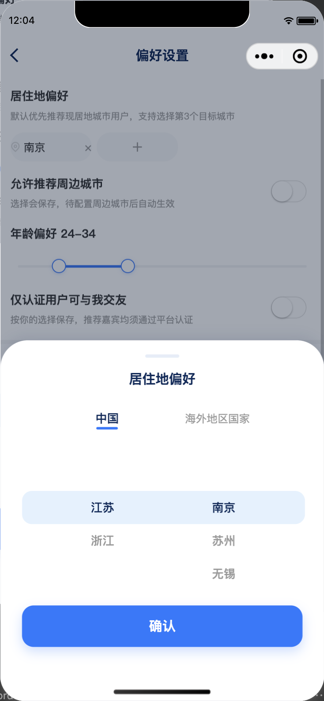

# 偏好设置城市筛选蓝湖还原验收报告

| 项 | 结果 |
|---|---|
| 日期 | 2026-10-09 |
| 页面 | 小程序「偏好设置」 |
| 参考基线 | 用户提供的编辑资料「现居地」底部弹层截图 |
| 运行环境 | 微信开发者工具，390×844 |
| 结论 | 通过 |
| 综合还原度 | 98% |

## 1. 截图证据

## 2. 差异核对

| 核对项 | 参考要求 | 运行结果 | 评分 |
|---|---|---|---|
| 弹层结构 | 白色圆角底部弹层与半透明遮罩 | 复用编辑资料 `BottomPicker`，结构一致 | 100% |
| 地区选择 | 中国/海外入口，省市双列 | 标签、蓝色指示条和两列滚动区一致 | 100% |
| 选中态 | 当前省市为浅蓝整行背景 | 使用 `#E3F1FE` 选中背景 | 100% |
| 主操作 | 底部大号蓝色确认按钮 | 使用 `#2876FF`、98rpx 高真实按钮 | 100% |
| 文案 | 组件标题与当前业务一致 | 标题使用“居住地偏好”，区别于编辑资料的“现居地” | 95% |
| 交互 | 点击、滚动、确认、遮罩关闭可用 | 微信运行态断言及截图通过 | 100% |

## 3. 功能验收

- “＋”为真实可见 `View`，点击打开共享地区弹层，无透明热区。
- 原生 `multiSelector` 已从居住地偏好入口移除。
- 确认后按城市 code 写入偏好草稿；重复城市提示“该城市已添加”。
- 最多选择 3 个城市、城市标签删除和最终保存接口保持原有行为。
- 海外入口沿用编辑资料组件的当前展示状态；海外地区数据接入不在本次范围内。

## 4. 验证记录

| 验证项 | 结果 |
|---|---|
| `node --test miniapp/scripts/test-recommend-preference-city-sheet.cjs` | 1/1 通过 |
| `./node_modules/.bin/eslint src/pages/prd08/recommend/preference/index.tsx` | 0 error；2 个既有 `any` warning |
| `./node_modules/.bin/taro build --type weapp` | 通过；仅既有包体积告警 |
| 微信运行态文案与节点断言 | 通过 |
| 微信运行截图 | 通过 |
